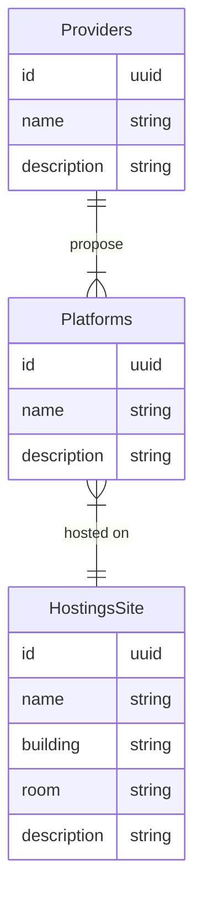

# Référentiel d'Hébergement Normalisé

Ce document décrit les modifications apportées pour implémenter un référentiel normalisé de sites et de solutions d'hébergement.

## Structure du modèle de données

Le modèle de données a été étendu pour inclure :

- Un **fournisseur** (Provider) qui peut proposer plusieurs types d'hébergement
- Chaque **type d'hébergement** (Platform) est associé à plusieurs sites
- Un **site d'hébergement** (HostingSite) peut héberger plusieurs types d'hébergement

### Modèle Entity-Relationship



## Modifications apportées

1. **Schéma Prisma** : Ajout de nouveaux modèles dans `prisma/schema/hosting.prisma`
   - Provider
   - Platform
   - HostingSite
   - Modification du modèle Hosting pour ajouter une référence à Platform

2. **Entités, DTOs, et Repos** : Création de classes pour chaque nouveau modèle
   - Entités dans `src/{provider|platform|hosting-site}/entities/`
   - DTOs dans `src/{provider|platform|hosting-site}/dto/`
   - Interfaces de repository dans `src/{provider|platform|hosting-site}/infrastructure/repository/`
   - Implémentations des repositories

3. **Services et Contrôleurs** : Création des services et contrôleurs REST pour chaque nouveau modèle
   - Modules NestJS configurés pour injecter les dépendances
   - API RESTful exposées pour la gestion des entités

4. **Migration des données** : Script pour convertir les données existantes
   - Extraction des fournisseurs, plateformes et sites uniques
   - Création des entités normalisées
   - Mise à jour des références dans la table Hosting

## Processus de déploiement

### Étape 1 : Sauvegarder la base de données

```bash
# Effectuer une sauvegarde de la base de données
pg_dump -U postgres -d referentiel > backup_before_migration.sql
```

### Étape 2 : Appliquer les migrations Prisma

```bash
# Générer et appliquer les migrations
npx prisma migrate dev --name add_hosting_normalization
```

### Étape 3 : Exécuter le script de migration des données

```bash
# Exécuter le script de migration des données
npm run migrate:hosting
```

### Étape 4 : Vérification

Après la migration, vérifier que :

1. Les données sont correctement migrées
2. Les APIs fonctionnent comme prévu
3. L'application frontend affiche correctement les informations

### Étape 5 : Future migration (à planifier)

Une fois la migration stabilisée et validée, on pourra :

1. Supprimer les champs legacy de la table Hosting
2. Mettre à jour les références frontend pour utiliser uniquement les nouvelles entités

## API Endpoints

### Providers

- `GET /providers` - Liste tous les fournisseurs
- `GET /providers/:id` - Obtient un fournisseur par son ID
- `POST /providers` - Crée un nouveau fournisseur
- `PATCH /providers/:id` - Met à jour un fournisseur existant
- `DELETE /providers/:id` - Supprime un fournisseur

### Platforms

- `GET /platforms` - Liste toutes les plateformes
- `GET /platforms/:id` - Obtient une plateforme par son ID
- `GET /platforms/provider/:providerId` - Liste les plateformes d'un fournisseur
- `GET /platforms/hosting-site/:hostingSiteId` - Liste les plateformes d'un site
- `POST /platforms` - Crée une nouvelle plateforme
- `PATCH /platforms/:id` - Met à jour une plateforme existante
- `DELETE /platforms/:id` - Supprime une plateforme

### HostingSites

- `GET /hosting-sites` - Liste tous les sites d'hébergement
- `GET /hosting-sites/:id` - Obtient un site d'hébergement par son ID
- `POST /hosting-sites` - Crée un nouveau site d'hébergement
- `PATCH /hosting-sites/:id` - Met à jour un site d'hébergement existant
- `DELETE /hosting-sites/:id` - Supprime un site d'hébergement
