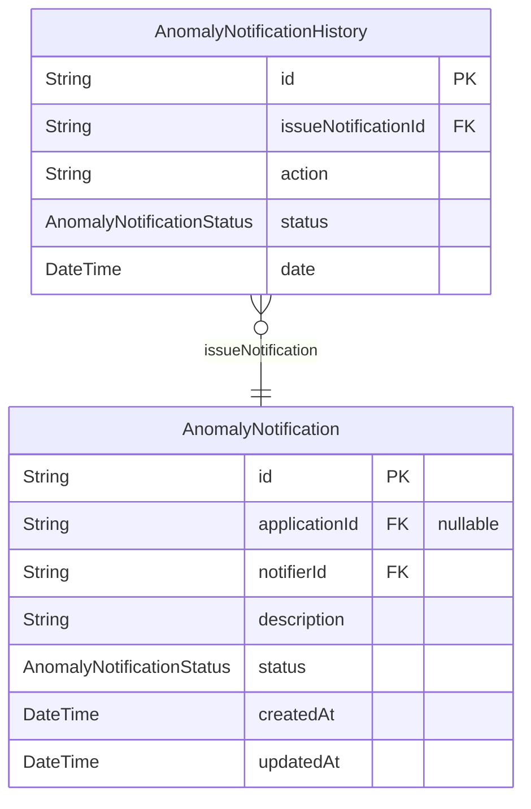
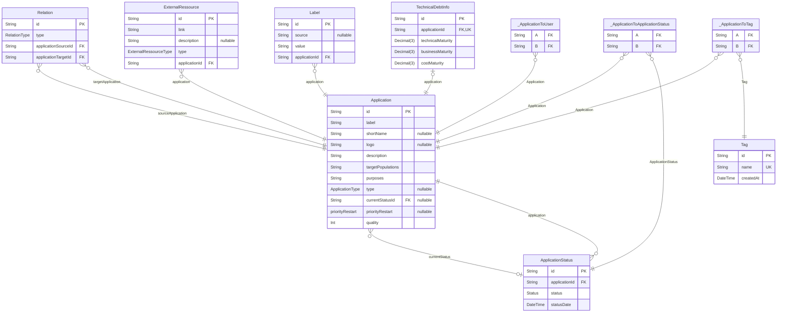
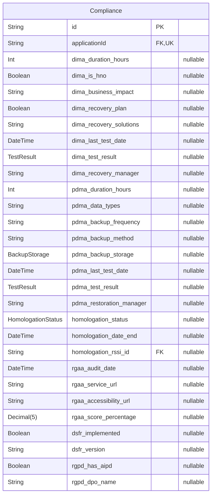
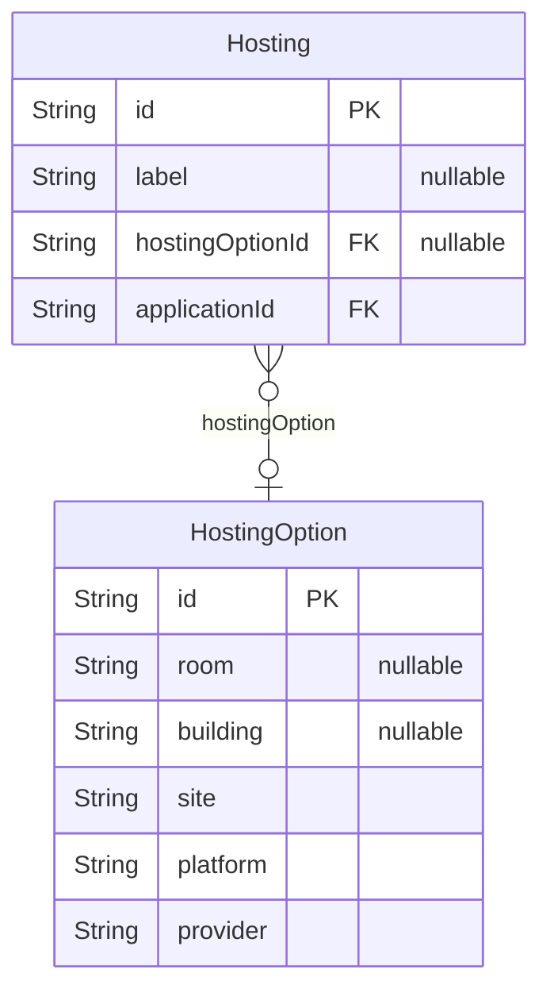
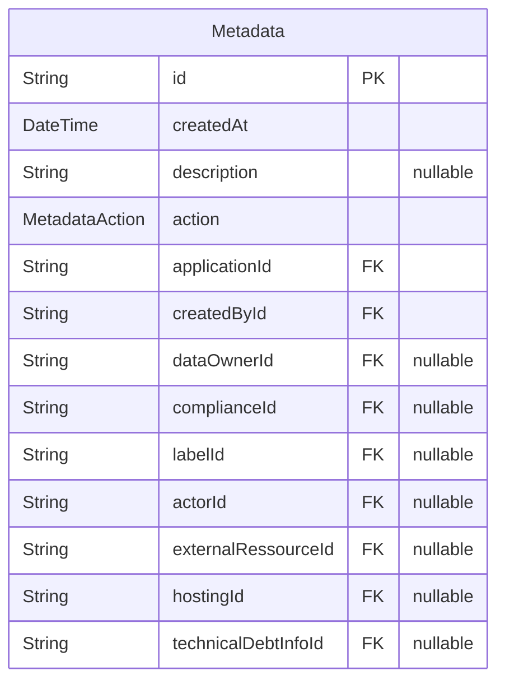
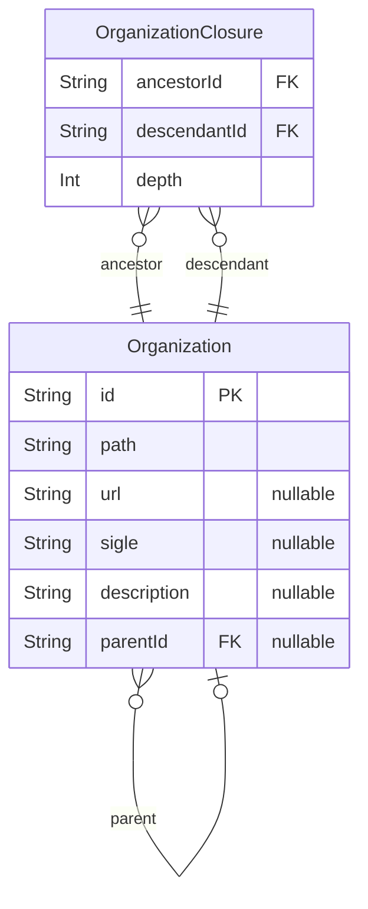
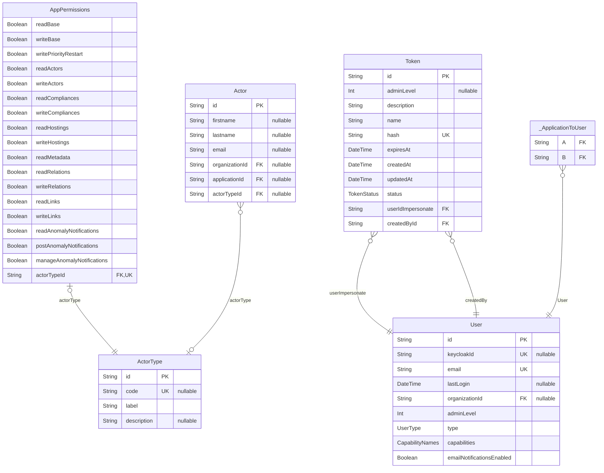
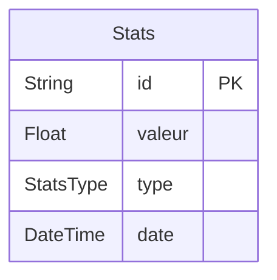

# Documentation Référentiel des Applications

> Generated by [`prisma-markdown`](https://github.com/samchon/prisma-markdown)

- [Signalements](#signalements)
- [Applications](#applications)
- [Compliance](#compliance)
- [Hosting](#hosting)
- [Metadata](#metadata)
- [Organizations](#organizations)
- [Users](#users)
- [Statistics](#statistics)

## Signalements

### `AnomalyNotification`

Problème ou anomalie signalée pour une fiche application.
Suit les signalements de la création à la résolution.

Properties as follows:

- `id`: Identifiant unique
- `applicationId`: Identifiant de la fiche application affectée
- `notifierId`: Identifiant de l'utilisateur qui a fait le signalement
- `description`: Description du problème signalé
- `status`: Statut actuel du signalement
- `createdAt`: Quand le signalement a été créé
- `updatedAt`: Quand le signalement a été mis à jour pour la dernière fois

### `AnomalyNotificationHistory`

Enregistrement historique des changements d'une notification de signalement.
Suit les transitions de statut et les actions prises.

Properties as follows:

- `id`: Identifiant unique
- `issueNotificationId`: Identifiant de la notification de signalement associée
- `action`: Action prise
- `status`: Statut après l'action
- `date`: Quand cette action s'est produite

## Applications

### `Application`

Application représente une application logicielle suivie dans le référentiel des applications.
C'est l'entité centrale qui relie toutes les autres informations.

Properties as follows:

- `id`: Identifiant unique de l'application
- `label`: Nom complet de l'application
- `shortName`: Nom court ou acronyme de l'application
- `logo`: URL du logo de l'application
- `description`: Description détaillée du but de l'application
- `targetPopulations`: Populations cibles utilisatrices de cette application
- `purposes`: Finalités métier servies par cette application
- `type`: Type/catégorie de l'application (métier, service, etc.)
- `currentStatusId`:
- `priorityRestart`: Niveau de priorité pour les opérations de redémarrage
- `quality`: Score de qualité de la fiche de l' application

### `ApplicationStatus`

Suit l'historique des statuts d'une application.
Chaque enregistrement représente un événement de changement de statut.

Properties as follows:

- `id`: Identifiant unique pour cet enregistrement de statut
- `applicationId`: Identifiant de l'application associée
- `status`: La valeur du statut à ce moment
- `statusDate`: Quand ce statut a été défini

### `Relation`

Définit les relations entre applications.
Exemples : dépendances, remplacements, flux de données

Properties as follows:

- `id`: Identifiant unique pour cette relation
- `type`: Le type de relation (dépendance, remplacement, etc.)
- `applicationSourceId`: Identifiant de l'application source dans cette relation
- `applicationTargetId`: Identifiant de l'application cible dans cette relation

### `ExternalRessource`

Lien vers une ressource externe pour une application.
Peut être de la documentation, du monitoring, des métriques, etc.

Properties as follows:

- `id`: Identifiant unique
- `link`: URL vers la ressource externe
- `description`: Description de ce qu'est cette ressource
- `type`: Type de ressource externe
- `applicationId`:

### `Label`

Label/étiquette attaché à une application.

Properties as follows:

- `id`: Identifiant unique
- `source`: Système source qui a fourni ce label
- `value`: Valeur du label
- `applicationId`:

### `Tag`

Tag pour catégoriser les applications.
Les tags sont globaux et peuvent être partagés entre applications.

Properties as follows:

- `id`: Identifiant unique
- `name`: Nom du tag (doit être unique)
- `createdAt`: Quand ce tag a été créé

### `TechnicalDebtInfo`

Évaluation de la dette technique pour une application.
Suit les niveaux de maturité à travers différentes dimensions.

Properties as follows:

- `id`: Identifiant unique
- `applicationId`:
- `technicalMaturity`: Score de maturité technique (0-1)
- `businessMaturity`: Score de maturité métier (0-1)
- `costMaturity`: Score de maturité des coûts (0-1)

### `_ApplicationToUser`

Pair relationship table between [Application](#Application) and [User](#User)

Properties as follows:

- `A`:
- `B`:

### `_ApplicationToApplicationStatus`

Pair relationship table between [Application](#Application) and [ApplicationStatus](#ApplicationStatus)

Properties as follows:

- `A`:
- `B`:

### `_ApplicationToTag`

Pair relationship table between [Application](#Application) and [Tag](#Tag)

Properties as follows:

- `A`:
- `B`:

## Compliance

### `Compliance`

Informations de conformité pour une application.
Suit l'état de conformité DIMA, PDMA, homologation, RGAA, DSFR et RGPD.

Properties as follows:

- `id`: Identifiant unique
- `applicationId`: Identifiant de l'application
- `dima_duration_hours`: DIMA : Délai d'Indisponibilité Maximale Admissible en heures
- `dima_is_hno`: DIMA : Si c'est un service en heures non ouvrées
- `dima_business_impact`: DIMA : Description de l'impact métier
- `dima_recovery_plan`: DIMA : Si un plan de reprise existe
- `dima_recovery_solutions`: DIMA : Solutions de reprise disponibles
- `dima_last_test_date`: DIMA : Date du dernier test de reprise
- `dima_test_result`: DIMA : Résultat du dernier test de reprise
- `dima_recovery_manager`: DIMA : Personne responsable de la reprise
- `pdma_duration_hours`: PDMA : Perte de données maximale admissible (PDMA)
- `pdma_data_types`: PDMA : Types de données sauvegardées
- `pdma_backup_frequency`: PDMA : Fréquence des sauvegardes
- `pdma_backup_method`: PDMA : Méthode utilisée pour les sauvegardes
- `pdma_backup_storage`: PDMA : Où les sauvegardes sont stockées
- `pdma_last_test_date`: PDMA : Date du dernier test de restauration
- `pdma_test_result`: PDMA : Résultat du dernier test de restauration
- `pdma_restoration_manager`: PDMA : Personne responsable de la restauration
- `homologation_status`: Statut d'homologation
- `homologation_date_end`: Date de fin d'homologation
- `homologation_rssi_id`: Identifiant du RSSI (Responsable de la Sécurité des Systèmes d'Information) pour l'homologation
- `rgaa_audit_date`: RGAA : Date de l'audit d'accessibilité
- `rgaa_service_url`: RGAA : URL du service
- `rgaa_accessibility_url`: RGAA : URL de la déclaration d'accessibilité
- `rgaa_score_percentage`: RGAA : Score d'accessibilité en pourcentage
- `dsfr_implemented`: DSFR : Si le Système de Design de l'État est implémenté
- `dsfr_version`: DSFR : Version du Système de Design de l'État utilisée
- `rgpd_has_aipd`: RGPD : Si une Analyse d'Impact sur la Protection des Données existe
- `rgpd_dpo_name`: RGPD : Nom du Délégué à la Protection des Données

## Hosting

### `HostingOption`

Modèle de configuration d'hébergement.
Définit les options d'hébergement disponibles (plateforme, fournisseur, emplacement).

Properties as follows:

- `id`: Identifiant unique
- `room`: Emplacement salle/rack
- `building`: Bâtiment où est hébergé
- `site`: Emplacement site/datacenter
- `platform`: Plateforme/technologie utilisée
- `provider`: Nom du fournisseur d'hébergement

### `Hosting`

Instance d'hébergement spécifique pour une application.
Lie une application à une option d'hébergement.

Properties as follows:

- `id`: Identifiant unique
- `label`: Label personnalisé pour cette instance d'hébergement
- `hostingOptionId`:
- `applicationId`:

## Metadata

### `Metadata`

Entrée des metadata pour les changements apportés aux entités.
Enregistre qui a fait les changements et quand les changements ont été faits.

Properties as follows:

- `id`: Identifiant unique
- `createdAt`: Quand cette entrée de métadonnée a été créée
- `description`: Description ou raison optionnelle du changement
- `action`: Type d'action (ajout, mise à jour, suppression)
- `applicationId`:
- `createdById`:
- `dataOwnerId`:
- `complianceId`:
- `labelId`:
- `actorId`:
- `externalRessourceId`:
- `hostingId`:
- `technicalDebtInfoId`:

## Organizations

### `Organization`

Unité organisationnelle (département, service, etc.).
Forme une structure arborescente hiérarchique.

Properties as follows:

- `id`: Identifiant unique
- `path`: Chemin complet dans la hiérarchie (ex: "/MI/DNUM/SG")
- `url`: URL du site web pour cette organisation
- `sigle`: Acronyme ou nom court
- `description`: Description complète de l'organisation
- `parentId`:

### `OrganizationClosure`

Table de fermeture pour des requêtes hiérarchiques efficaces.
Stocke toutes les relations ancêtre-descendant avec la profondeur.

Properties as follows:

- `ancestorId`:
- `descendantId`:
- `depth`: Distance entre ancêtre et descendant (0 = même nœud)

## Users

### `AppPermissions`

Permissions accordées à un type d'acteur.
Définit quelles actions les acteurs de ce type peuvent effectuer.

Properties as follows:

- `readBase`: Peut lire les informations de base de l'application
- `writeBase`: Peut écrire les informations de base de l'application
- `writePriorityRestart`: Peut mettre à jour les paramètres de priorité de redémarrage
- `readActors`: Peut lire les informations des acteurs
- `writeActors`: Peut écrire les informations des acteurs
- `readCompliances`: Peut lire les informations de conformité
- `writeCompliances`: Peut écrire les informations de conformité
- `readHostings`: Peut lire les informations d'hébergement
- `writeHostings`: Peut écrire les informations d'hébergement
- `readMetadata`: Peut lire les métadonnées
- `readRelations`: Peut lire les relations d'application
- `writeRelations`: Peut écrire les relations d'application
- `readLinks`: Peut lire les liens externes
- `writeLinks`: Peut écrire les liens externes
- `readAnomalyNotifications`: Peut lire les notifications d'anomalies
- `postAnomalyNotifications`: Peut créer des notifications d'anomalies
- `manageAnomalyNotifications`: Peut gérer (mettre à jour/supprimer) les notifications d'anomalies
- `actorTypeId`:

### `Token`

Token API pour l'accès programmatique.
Permet aux comptes de service ou à l'automatisation d'accéder à l'API.

Properties as follows:

- `id`: Identifiant unique
- `adminLevel`: Niveau admin accordé à ce token
- `description`: Description de l'utilité de ce token
- `name`: Nom lisible pour ce token
- `hash`: Valeur de token hachée pour l'authentification
- `expiresAt`: Quand ce token expire
- `createdAt`: Quand ce token a été créé
- `updatedAt`: Quand ce token a été mis à jour pour la dernière fois
- `status`: Statut actuel du token
- `userIdImpersonate`:
- `createdById`:

### `User`

Compte utilisateur dans le référentiel des applications.
Peut être soit un utilisateur humain soit un compte de service.

Properties as follows:

- `id`: Identifiant unique
- `keycloakId`: Identifiant SSO Keycloak
- `email`: Adresse email de l'utilisateur
- `lastLogin`: Horodatage de la dernière connexion
- `organizationId`: Id de l'organisation à laquelle l'utilisateur appartient
- `adminLevel`: Niveau de permission admin de 0 à 30
- `type`: Type de compte utilisateur (humain ou bot)
- `capabilities`: Capacités spéciales accordées à cet utilisateur
- `emailNotificationsEnabled`: Si les notifications par email sont activées

### `Actor`

Personne ou entité impliquée avec une application.
Peut avoir différents rôles définis par ActorType.

Properties as follows:

- `id`: Identifiant unique
- `firstname`: Prénom de l'acteur
- `lastname`: Nom de l'acteur
- `email`: Email de contact
- `organizationId`: id de l'organisation
- `applicationId`: id de l'application dont l'utilisateur est acteur
- `actorTypeId`: id du type de cet acteur

### `ActorType`

Définit les différents rôles que les acteurs peuvent avoir.

### Codes des acteurs possibles

| Code                      | Rôle / Description                                           |
| :------------------------ | :----------------------------------------------------------- |
| **MOA**                   | Maîtrise d’Ouvrage (MOA)                                     |
| **MOE**                   | Maîtrise d’Œuvre (MOE)                                       |
| **RSSI**                  | Responsable de la Sécurité des Systèmes d’Information (RSSI) |
| **ArchitecteApplicatif**  | Architecte applicatif                                        |
| **ArchitecteTechnique**   | Architecte technique                                         |
| **TMA**                   | Tierce Maintenance Applicative (TMA)                         |
| **Exploitation**          | Responsable d'exploitation opérationnel                      |
| **RSIMM**                 | Responsables des SI Métier et de la Modernisation (RSIMM)    |
| **CPD**                   | Correspondant à la protection des données (CPD)              |
| **OrganismeBeneficiaire** | Correspondant Stratégique Métier (CSM)                       |
| **ProductOwner**          | Product Owner (PO)                                           |
| **ProductManager**        | Product Manager (PM)                                         |
| **Hebergement**           | Responsable de l'hébergement                                 |
| **Autre**                 | Autre                                                        |

Properties as follows:

- `id`: Identifiant unique
- `code`: Code court pour le rôle
- `label`: Nom d'affichage du rôle
- `description`: Description des responsabilités de ce rôle

### `_ApplicationToUser`

Pair relationship table between [Application](#Application) and [User](#User)

Properties as follows:

- `A`:
- `B`:

## Statistics

### `Stats`

Point de données statistiques.
Stocke les métriques agrégées au fil du temps.

Properties as follows:

- `id`: Identifiant unique
- `valeur`: Valeur numérique de cette statistique
- `type`: Type de statistique
- `date`: Date à laquelle cette statistique s'applique
