# Documentation Référentiel des Applications

> Generated by [`prisma-markdown`](https://github.com/samchon/prisma-markdown)

- [Applications](#applications)
- [BusinessDivision](#businessdivision)
- [Compliance](#compliance)
- [DataCatalog](#datacatalog)
- [Hosting](#hosting)
- [Labels](#labels)
- [Metadata](#metadata)
- [Notifications](#notifications)
- [Organizations](#organizations)
- [Users](#users)
- [Signalements](#signalements)
- [Statistics](#statistics)
- [Technology](#technology)
- [default](#default)

## Applications

```mermaid
erDiagram
"Application" {
  String id PK
  String label
  String(255) shortName "nullable"
  String logo "nullable"
  String description
  String targetPopulations
  String purposes
  ApplicationType type "nullable"
  String currentStatusId FK "nullable"
  priorityRestart priorityRestart "nullable"
  Int quality "nullable"
}
"ApplicationStatus" {
  String id PK
  String applicationId FK
  Status status
  DateTime statusDate "nullable"
  String version "nullable"
}
"Relation" {
  String id PK
  RelationType type
  String applicationSourceId FK
  String applicationTargetId FK
  String mediationServiceId FK "nullable"
}
"ApplicationView" {
  String id PK
  DateTime createdAt
  String userId FK
  String applicationId FK
}
"CorrelationSuggestion" {
  String id PK
  String applicationSourceId FK
  String applicationTargetId FK
  Float score
  Json signals
  CorrelationSuggestionStatus status
  DateTime createdAt
  String reviewedById FK "nullable"
  DateTime reviewedAt "nullable"
}
"ExternalRessource" {
  String id PK
  String link
  String description "nullable"
  ExternalRessourceType type
  String applicationId FK
}
"Label" {
  String id PK
  String(255) value
  String labelSourceId FK "nullable"
  String applicationId FK
}
"MditCampaign" {
  String id PK
  Int year UK
  String label "nullable"
  Boolean isActive
  DateTime createdAt
}
"Tag" {
  String id PK
  String(100) name UK
  DateTime createdAt
}
"TechnicalDebtInfo" {
  String id PK
  String applicationId FK
  Decimal(3) technicalMaturity "nullable"
  Decimal(3) businessMaturity "nullable"
  Decimal(3) costContainment "nullable"
  Int millesime
  DateTime createdAt
}
"_ApplicationToUser" {
  String A FK
  String B FK
}
"_ApplicationToApplicationStatus" {
  String A FK
  String B FK
}
"_ApplicationToTag" {
  String A FK
  String B FK
}
"_ApplicationToDataDescription" {
  String A FK
  String B FK
}
"_ApplicationToBusinessDivision" {
  String A FK
  String B FK
}
"_DataDescriptionToTag" {
  String A FK
  String B FK
}
"Application" }o--o| "ApplicationStatus" : currentStatus
"ApplicationStatus" }o--|| "Application" : application
"Relation" }o--|| "Application" : sourceApplication
"Relation" }o--|| "Application" : targetApplication
"Relation" }o--o| "Application" : mediationService
"ApplicationView" }o--|| "Application" : application
"CorrelationSuggestion" }o--|| "Application" : sourceApplication
"CorrelationSuggestion" }o--|| "Application" : targetApplication
"ExternalRessource" }o--|| "Application" : application
"Label" }o--|| "Application" : application
"TechnicalDebtInfo" }o--|| "Application" : application
"_ApplicationToUser" }o--|| "Application" : Application
"_ApplicationToApplicationStatus" }o--|| "Application" : Application
"_ApplicationToApplicationStatus" }o--|| "ApplicationStatus" : ApplicationStatus
"_ApplicationToTag" }o--|| "Application" : Application
"_ApplicationToTag" }o--|| "Tag" : Tag
"_ApplicationToDataDescription" }o--|| "Application" : Application
"_ApplicationToBusinessDivision" }o--|| "Application" : Application
"_DataDescriptionToTag" }o--|| "Tag" : Tag
```

### `Application`

Application représente une application logicielle suivie dans le référentiel des applications.
C'est l'entité centrale qui relie toutes les autres informations.

Properties as follows:

- `id`: Identifiant unique de l'application
- `label`: Nom complet de l'application
- `shortName`: Nom court ou acronyme de l'application
- `logo`: URL du logo de l'application
- `description`: Description détaillée du but de l'application
- `targetPopulations`: Populations cibles utilisatrices de cette application
- `purposes`: Finalités métier servies par cette application
- `type`: Type/catégorie de l'application (métier, service, etc.)
- `currentStatusId`:
- `priorityRestart`: Niveau de priorité pour les opérations de redémarrage
- `quality`: Score de qualité de la fiche de l'application (null si l'application est décommissionnée ou supprimée)

### `ApplicationStatus`

Suit l'historique des statuts d'une application.
Chaque enregistrement représente un événement de changement de statut.

Properties as follows:

- `id`: Identifiant unique pour cet enregistrement de statut
- `applicationId`: Identifiant de l'application associée
- `status`: La valeur du statut à ce moment
- `statusDate`: Quand ce statut a été défini
- `version`: La version du statut

### `Relation`

Définit les relations entre applications.
Exemples : dépendances, remplacements, flux de données

Properties as follows:

- `id`: Identifiant unique pour cette relation
- `type`: Le type de relation (dépendance, remplacement, etc.)
- `applicationSourceId`: Identifiant de l'application source dans cette relation
- `applicationTargetId`: Identifiant de l'application cible dans cette relation
- `mediationServiceId`: Identifiant du service de médiation (nullable si relation directe)

### `ApplicationView`

Log de consultation des applications

Properties as follows:

- `id`: Identifiant unique du log de consultation
- `createdAt`: Quand ce log a été créé
- `userId`: Identifiant de l'utilisateur qui a consulté dans ce log
- `applicationId`: Identifiant de l'application consultée

### `CorrelationSuggestion`

Suggestion de corrélation entre deux applications, produite par le moteur
de détection automatique (#2281). Une suggestion attend une revue humaine :
aucune relation n'est créée tant qu'elle n'est pas acceptée.

La paire (source, cible) est symétrique : elle est stockée en ordre
canonique (applicationSourceId < applicationTargetId, ordre lexicographique,
cf. normalizeCorrelationPair) pour que la contrainte d'unicité empêche le
doublon A→B / B→A.

Properties as follows:

- `id`: Identifiant unique de la suggestion
- `applicationSourceId`: Identifiant de la première application de la paire (ordre canonique)
- `applicationTargetId`: Identifiant de la seconde application de la paire (ordre canonique)
- `score`: Score pondéré de la suggestion (plus il est élevé, plus la corrélation est probable)
- `signals`: Détail des signaux ayant matché (similarité de nom, données partagées, acteurs communs)
- `status`: Statut du cycle de revue de la suggestion
- `createdAt`: Quand la suggestion a été créée par le moteur
- `reviewedById`: Identifiant de l'utilisateur ayant revu la suggestion (null tant que PENDING)
- `reviewedAt`: Quand la suggestion a été revue (null tant que PENDING)

### `ExternalRessource`

Lien vers une ressource externe pour une application.
Peut être de la documentation, du monitoring, des métriques, etc.

Properties as follows:

- `id`: Identifiant unique
- `link`: URL vers la ressource externe
- `description`: Description de ce qu'est cette ressource
- `type`: Type de ressource externe
- `applicationId`:

### `Label`

Label/étiquette attaché à une application.

Properties as follows:

- `id`: Identifiant unique
- `value`: Valeur du label
- `labelSourceId`:
- `applicationId`:

### `MditCampaign`

Campagne annuelle de dette IT (millésime), gérée par l'administration.
Les évaluations de dette (`TechnicalDebtInfo.millesime`) se rattachent à
l'année d'une campagne.

Properties as follows:

- `id`: Identifiant unique
- `year`: Année de la campagne (millésime), unique
- `label`: Libellé optionnel de la campagne
- `isActive`: Campagne active : présentée dans le sélecteur de campagne
- `createdAt`: Date de création

### `Tag`

Tag pour catégoriser les applications.
Les tags sont globaux et peuvent être partagés entre applications.

Properties as follows:

- `id`: Identifiant unique
- `name`: Nom du tag (doit être unique)
- `createdAt`: Quand ce tag a été créé

### `TechnicalDebtInfo`

Évaluation de la dette technique pour une application.
Suit les niveaux de maturité à travers différentes dimensions.

Properties as follows:

- `id`: Identifiant unique
- `applicationId`:
- `technicalMaturity`: Score de maturité technique (1-5). `null` = non noté (valeurs < 1 migrées vers `null`).
- `businessMaturity`: Score de maturité métier (1-5). `null` = non noté (valeurs < 1 migrées vers `null`).
- `costContainment`: Score de maîtrise des coûts (1-5). `null` = non noté (valeurs < 1 migrées vers `null`).
- `millesime`: Millésime (année) de la campagne dette IT à laquelle se rattache l'évaluation
- `createdAt`: Date de création de l'évaluation

### `_ApplicationToUser`

Pair relationship table between [Application](#Application) and [User](#User)

Properties as follows:

- `A`:
- `B`:

### `_ApplicationToApplicationStatus`

Pair relationship table between [Application](#Application) and [ApplicationStatus](#ApplicationStatus)

Properties as follows:

- `A`:
- `B`:

### `_ApplicationToTag`

Pair relationship table between [Application](#Application) and [Tag](#Tag)

Properties as follows:

- `A`:
- `B`:

### `_ApplicationToDataDescription`

Pair relationship table between [Application](#Application) and [DataDescription](#DataDescription)

Properties as follows:

- `A`:
- `B`:

### `_ApplicationToBusinessDivision`

Pair relationship table between [Application](#Application) and [BusinessDivision](#BusinessDivision)

Properties as follows:

- `A`:
- `B`:

### `_DataDescriptionToTag`

Pair relationship table between [DataDescription](#DataDescription) and [Tag](#Tag)

Properties as follows:

- `A`:
- `B`:

## BusinessDivision

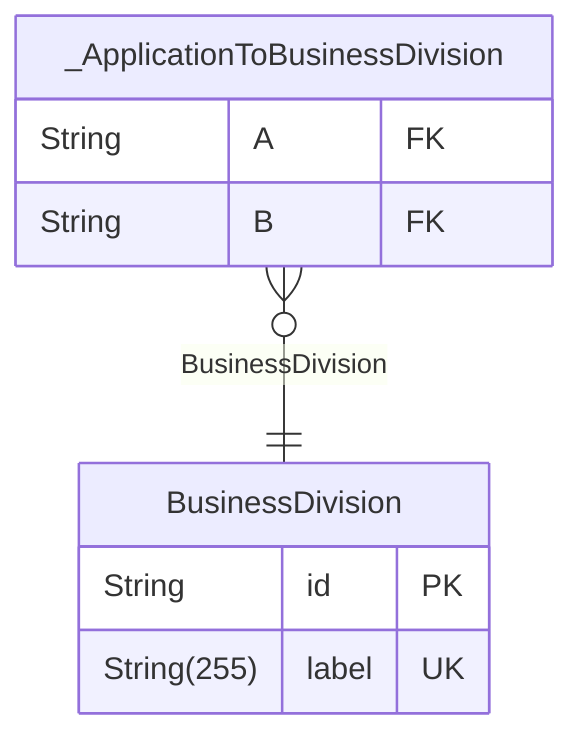

### `BusinessDivision`

Direction metier MOA

Properties as follows:

- `id`: Identifiant unique
- `label`: Label de la direction metier MOA

### `_ApplicationToBusinessDivision`

Pair relationship table between [Application](#Application) and [BusinessDivision](#BusinessDivision)

Properties as follows:

- `A`:
- `B`:

## Compliance

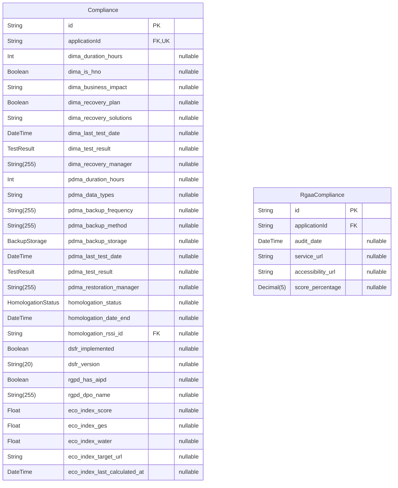

### `Compliance`

Informations de conformité pour une application.
Suit l'état de conformité DIMA, PDMA, homologation, RGAA, DSFR et RGPD.

Properties as follows:

- `id`: Identifiant unique
- `applicationId`: Identifiant de l'application
- `dima_duration_hours`: DIMA : Délai d'Indisponibilité Maximale Admissible en heures
- `dima_is_hno`: DIMA : Si c'est un service en heures non ouvrées
- `dima_business_impact`: DIMA : Description de l'impact métier
- `dima_recovery_plan`: DIMA : Si un plan de reprise existe
- `dima_recovery_solutions`: DIMA : Solutions de reprise disponibles
- `dima_last_test_date`: DIMA : Date du dernier test de reprise
- `dima_test_result`: DIMA : Résultat du dernier test de reprise
- `dima_recovery_manager`: DIMA : Personne responsable de la reprise
- `pdma_duration_hours`: PDMA : Perte de données maximale admissible (PDMA)
- `pdma_data_types`: PDMA : Types de données sauvegardées
- `pdma_backup_frequency`: PDMA : Fréquence des sauvegardes
- `pdma_backup_method`: PDMA : Méthode utilisée pour les sauvegardes
- `pdma_backup_storage`: PDMA : Où les sauvegardes sont stockées
- `pdma_last_test_date`: PDMA : Date du dernier test de restauration
- `pdma_test_result`: PDMA : Résultat du dernier test de restauration
- `pdma_restoration_manager`: PDMA : Personne responsable de la restauration
- `homologation_status`: Statut d'homologation
- `homologation_date_end`: Date de fin d'homologation
- `homologation_rssi_id`: Identifiant du RSSI (Responsable de la Sécurité des Systèmes d'Information) pour l'homologation
- `dsfr_implemented`: DSFR : Si le Système de Design de l'État est implémenté
- `dsfr_version`: DSFR : Version du Système de Design de l'État utilisée
- `rgpd_has_aipd`: RGPD : Si une Analyse d'Impact sur la Protection des Données existe
- `rgpd_dpo_name`: RGPD : Nom du Délégué à la Protection des Données
- `eco_index_score`: EcoIndex : Score global (0-100)
- `eco_index_ges`: EcoIndex : Émissions de gaz à effet de serre (gCO2e)
- `eco_index_water`: EcoIndex : Consommation d'eau (centilitres)
- `eco_index_target_url`: EcoIndex : URL cible utilisée pour le calcul
- `eco_index_last_calculated_at`: EcoIndex : Date du dernier calcul

### `RgaaCompliance`

Conformité RGAA (Référentiel général d'amélioration de l'accessibilité) pour un site web donné.
Une application peut avoir 0 à N conformités RGAA, une par URL de service.

Properties as follows:

- `id`: Identifiant unique
- `applicationId`: Identifiant de l'application
- `audit_date`: RGAA : Date de l'audit d'accessibilité
- `service_url`: RGAA : URL du service audité
- `accessibility_url`: RGAA : URL de la déclaration d'accessibilité
- `score_percentage`: RGAA : Score d'accessibilité en pourcentage (0-100)

## DataCatalog

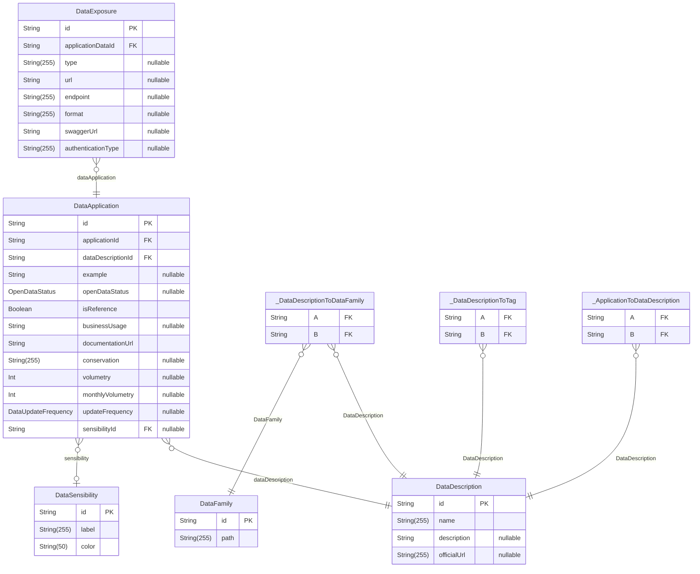

### `DataFamily`

Famille de données, utilisée pour regrouper les descriptions de données.

Properties as follows:

- `id`: Identifiant unique
- `path`: Chemin hiérarchique de la famille (ex: "Identité / Etat civil")

### `DataSensibility`

Niveau de sensibilité d'une donnée.
Définit le label affiché et la couleur associée dans l'interface.

Properties as follows:

- `id`: Identifiant unique
- `label`: Libellé du niveau de sensibilité
- `color`: Couleur hexadécimale associée (ex: "#FF0000")

### `DataDescription`

Description générique d'une donnée. Provient d'une ou plusieurs applications sources sur RefApp
(les applications qui produisent/possèdent cette donnée) et peut ensuite être réutilisée par
d'autres applications (voir `DataApplication`, qui représente cet usage).

Properties as follows:

- `id`: Identifiant unique
- `name`: Nom de la donnée
- `description`: Description détaillée
- `officialUrl`: URL vers la source officielle de la donnée

### `DataApplication`

Utilisation d'une donnée dans le contexte d'une application spécifique.
Enrichit la description générique avec des informations propres à l'usage applicatif.

Properties as follows:

- `id`: Identifiant unique
- `applicationId`: Identifiant de l'application concernée
- `dataDescriptionId`: Identifiant de la description de donnée associée
- `example`: Exemple de valeur de la donnée
- `openDataStatus`: Statut d'exposition en open data
- `isReference`: Indique si cette donnée est une donnée de référence (source de vérité)
- `businessUsage`: Description de l'usage métier de la donnée
- `documentationUrl`: Liste des URLs de documentation associées
- `conservation`: Durée de conservation de la donnée
- `volumetry`: Volume total estimé (nombre d'enregistrements)
- `monthlyVolumetry`: Volume mensuel estimé (nombre d'enregistrements par mois)
- `updateFrequency`: Fréquence de mise à jour de la donnée
- `sensibilityId`: Identifiant du niveau de sensibilité

### `DataExposure`

Mode d'exposition d'une donnée applicative (API REST, fichier, flux, etc.).

Properties as follows:

- `id`: Identifiant unique
- `applicationDataId`: Identifiant de l'utilisation applicative parente
- `type`: Type d'exposition (ex: API, Fichier, Flux)
- `url`: URL d'accès à la donnée
- `endpoint`: Point de terminaison technique
- `format`: Format des données échangées (ex: JSON, CSV, XML)
- `swaggerUrl`: URL de la documentation Swagger/OpenAPI
- `authenticationType`: Type d'authentification requis (ex: OAuth2, API Key)

### `_DataDescriptionToDataFamily`

Pair relationship table between [DataDescription](#DataDescription) and [DataFamily](#DataFamily)

Properties as follows:

- `A`:
- `B`:

### `_DataDescriptionToTag`

Pair relationship table between [DataDescription](#DataDescription) and [Tag](#Tag)

Properties as follows:

- `A`:
- `B`:

### `_ApplicationToDataDescription`

Pair relationship table between [Application](#Application) and [DataDescription](#DataDescription)

Properties as follows:

- `A`:
- `B`:

## Hosting

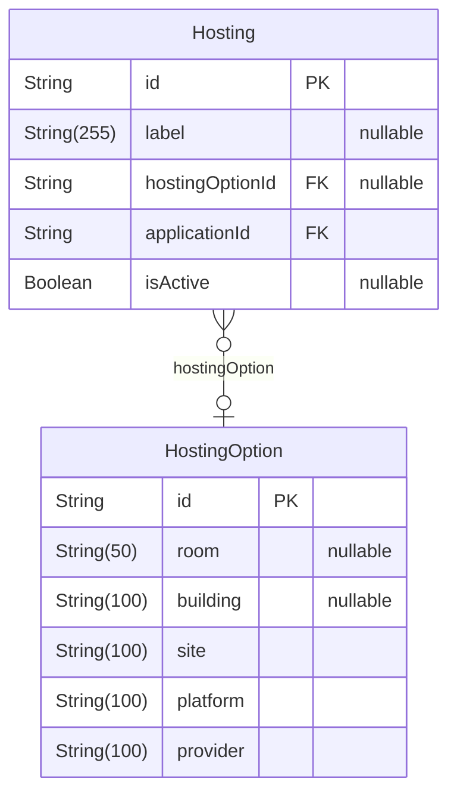

### `HostingOption`

Modèle de configuration d'hébergement.
Définit les options d'hébergement disponibles (plateforme, fournisseur, emplacement).

Properties as follows:

- `id`: Identifiant unique
- `room`: Emplacement salle/rack
- `building`: Bâtiment où est hébergé
- `site`: Emplacement site/datacenter
- `platform`: Plateforme/technologie utilisée
- `provider`: Nom du fournisseur d'hébergement

### `Hosting`

Instance d'hébergement spécifique pour une application.
Lie une application à une option d'hébergement.

Properties as follows:

- `id`: Identifiant unique
- `label`: Label personnalisé pour cette instance d'hébergement
- `hostingOptionId`:
- `applicationId`:
- `isActive`: Indique si ce site d'hébergement est actif

## Labels

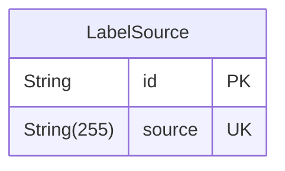

### `LabelSource`

sources qui fournissent des libellés alternatifs.
Les sources sont globales et peuvent être partagées entre libellés alternatifs.

Properties as follows:

- `id`: Identifiant unique
- `source`: Nom unique du système source

## Metadata

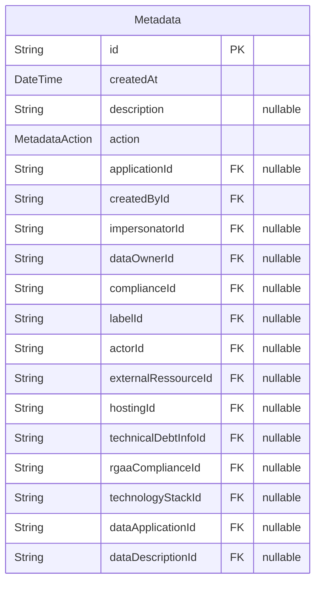

### `Metadata`

Entrée des metadata pour les changements apportés aux entités.
Enregistre qui a fait les changements et quand les changements ont été faits.

Properties as follows:

- `id`: Identifiant unique
- `createdAt`: Quand cette entrée de métadonnée a été créée
- `description`: Description ou raison optionnelle du changement
- `action`: Type d'action (ajout, mise à jour, suppression)
- `applicationId`:
- `createdById`:
- `impersonatorId`:
- `dataOwnerId`:
- `complianceId`:
- `labelId`:
- `actorId`:
- `externalRessourceId`:
- `hostingId`:
- `technicalDebtInfoId`:
- `rgaaComplianceId`:
- `technologyStackId`:
- `dataApplicationId`:
- `dataDescriptionId`:

## Notifications

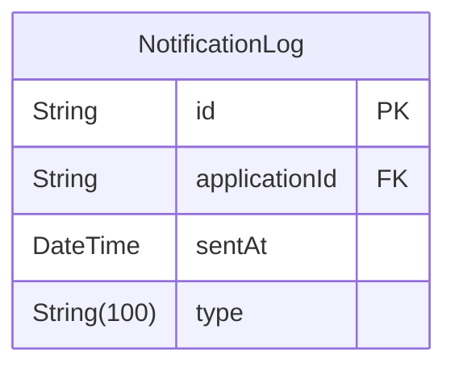

### `NotificationLog`

Journal des notifications de rappel de validation envoyées aux responsables d'application.
Utilisé pour limiter la fréquence des envois (anti-spam).

Properties as follows:

- `id`: Identifiant unique
- `applicationId`: Identifiant de l'application concernée
- `sentAt`: Date d'envoi de la notification
- `type`: Type de notification envoyée

## Organizations

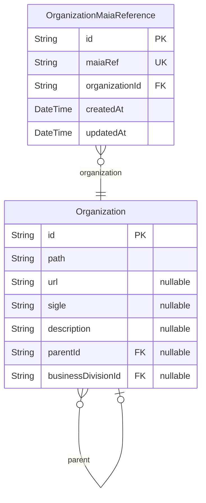

### `Organization`

Unité organisationnelle (département, service, etc.).
Forme une structure arborescente hiérarchique.

Properties as follows:

- `id`: Identifiant unique
- `path`: Chemin complet dans la hiérarchie (ex: "/MI/DNUM/SG")
- `url`: URL du site web pour cette organisation
- `sigle`: Acronyme ou nom court
- `description`: Description complète de l'organisation
- `parentId`:
- `businessDivisionId`: Identifiant de la direction metier MOA de l'organisation

### `OrganizationMaiaReference`

Table d'override pour la consolidation des organisations MAIA.

Système "override-only": permettre aux administrateurs de rediriger manuellement
certains chemins MAIA reçus de MAIA vers une organisation locale consolidée.
Par exemple: rediriger "MI/DNUM/SDID" et "MI/DNUM/SDAN" vers l'org "MI/DNUM".

Comportement de la synchronisation MAIA:

1. Check si le chemin MAIA figure dans cette table → utiliser l'organisation override
2. Sinon, check si une org locale existe avec ce chemin exact → l'utiliser
3. Sinon, créer une org locale avec ce chemin

Properties as follows:

- `id`: Identifiant unique
- `maiaRef`: Chemin MAIA à rediriger (ex: "MI/DNUM/SDID" ou "MI/DNUM/SDAN")
- `organizationId`: Organisation locale cible (l'override destination)
- `createdAt`: Timestamp de création (par l'admin)
- `updatedAt`: Timestamp de mise à jour (par l'admin)

## Users

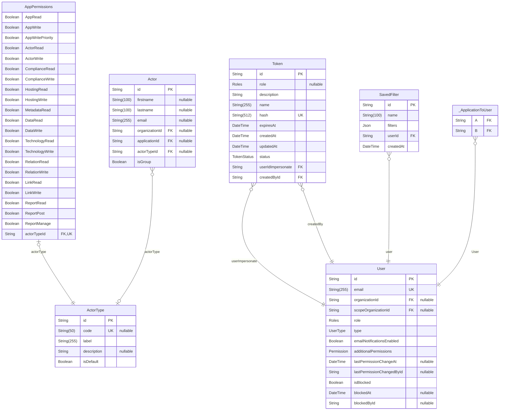

### `AppPermissions`

Permissions accordées à un type d'acteur.
Définit quelles actions les acteurs de ce type peuvent effectuer.

Properties as follows:

- `AppRead`: Peut lire les informations de base de l'application
- `AppWrite`: Peut écrire les informations de base de l'application
- `AppWritePriority`: Peut mettre à jour les paramètres de priorité de redémarrage
- `ActorRead`: Peut lire les informations des acteurs
- `ActorWrite`: Peut écrire les informations des acteurs
- `ComplianceRead`: Peut lire les informations de conformité
- `ComplianceWrite`: Peut écrire les informations de conformité
- `HostingRead`: Peut lire les informations d'hébergement
- `HostingWrite`: Peut écrire les informations d'hébergement
- `MetadataRead`: Peut lire les métadonnées
- `DataRead`: Peut lire les données de l'application (onglet Données)
- `DataWrite`:
- `TechnologyRead`: Peut lire la stack technique (onglet Technologies) — ouvert à tous par défaut
- `TechnologyWrite`: Peut modifier la stack technique — réservé par défaut
- `RelationRead`: Peut lire les relations d'application
- `RelationWrite`: Peut écrire les relations d'application
- `LinkRead`: Peut lire les liens externes
- `LinkWrite`: Peut écrire les liens externes
- `ReportRead`: Peut lire les signalements
- `ReportPost`: Peut créer des signalements
- `ReportManage`: Peut gérer (mettre à jour/supprimer) les signalements
- `actorTypeId`:

### `Token`

Token API pour l'accès programmatique.
Permet aux comptes de service ou à l'automatisation d'accéder à l'API.

Properties as follows:

- `id`: Identifiant unique
- `role`: Role accordé à ce token
- `description`: Description de l'utilité de ce token
- `name`: Nom lisible pour ce token
- `hash`: Valeur de token hachée pour l'authentification
- `expiresAt`: Quand ce token expire
- `createdAt`: Quand ce token a été créé
- `updatedAt`: Quand ce token a été mis à jour pour la dernière fois
- `status`: Statut actuel du token
- `userIdImpersonate`:
- `createdById`:

### `User`

Compte utilisateur dans le référentiel des applications.
Peut être soit un utilisateur humain soit un compte de service.

Properties as follows:

- `id`: Identifiant unique
- `email`: Adresse email de l'utilisateur
- `organizationId`: Id de l'organisation à laquelle l'utilisateur appartient
- `scopeOrganizationId`: Id de l'organisation de scope de l'utilisateur (pour les permissions basées sur le scope organisationnel)
- `role`: Groupement de permissions par defaut
- `type`: Type de compte utilisateur (humain ou bot)
- `emailNotificationsEnabled`: Si les notifications par email sont activées
- `additionalPermissions`: Permissions supplémentaire (ancien capabilities)
- `lastPermissionChangeAt`
  > Date de la dernière modification des droits (rôle/permissions) de cet utilisateur.
  > Dénormalisé depuis UserPermissionLog pour permettre le tri côté base (liste admin).
- `lastPermissionChangedById`
  > Utilisateur ayant effectué cette dernière modification. Pas de jointure explicite
  > (mêmes raisons que UserPermissionLog.changedById : éviter les soucis de cascade).
- `isBlocked`
  > Si l'accès de cet utilisateur est bloqué (ex : a quitté l'organisation). Un utilisateur
  > bloqué est rejeté par le SSO à l'authentification, quel que soit son moyen d'accès (JWT ou token API).
- `blockedAt`: Date à laquelle l'utilisateur a été bloqué
- `blockedById`
  > Administrateur ayant bloqué cet utilisateur. Pas de jointure explicite
  > (mêmes raisons que UserPermissionLog.changedById : éviter les soucis de cascade).

### `SavedFilter`

Filtre de recherche d'applications sauvegardé par un utilisateur, pour être réappliqué
plus tard depuis l'onglet applications sans ressaisir chaque critère (#2279).

Properties as follows:

- `id`: Identifiant unique
- `name`: Nom donné par l'utilisateur à ce filtre, unique parmi ses propres filtres
- `filters`: Filtres sérialisés (mêmes clés que la query de recherche d'applications)
- `userId`: Utilisateur propriétaire de ce filtre
- `createdAt`: Date de création

### `Actor`

Personne ou entité impliquée avec une application.
Peut avoir différents rôles définis par ActorType.

Properties as follows:

- `id`: Identifiant unique
- `firstname`: Prénom de l'acteur
- `lastname`: Nom de l'acteur
- `email`: Email de contact
- `organizationId`: id de l'organisation
- `applicationId`: id de l'application dont l'utilisateur est acteur
- `actorTypeId`: id du type de cet acteur
- `isGroup`: Indique si l'acteur est un groupe ou une personne physique

### `ActorType`

Définit les différents rôles que les acteurs peuvent avoir.

### Codes des acteurs possibles

| Code                      | Rôle / Description                                            |
| :------------------------ | :------------------------------------------------------------ |
| **MOA**                   | Maîtrise d’Ouvrage (MOA)                                      |
| **MOE**                   | Maîtrise d’Œuvre (MOE)                                        |
| **RSSI**                  | Responsable de la Sécurité des Systèmes d’Information (RSSI)  |
| **ArchitecteApplicatif**  | Architecte applicatif                                         |
| **ArchitecteTechnique**   | Architecte technique                                          |
| **TMA**                   | Tierce Maintenance Applicative (TMA)                          |
| **Exploitation**          | Responsable d'exploitation opérationnel                       |
| **RSIMM**                 | Responsables des SI Métier et de la Modernisation (RSIMM)     |
| **CPD**                   | Correspondant à la protection des données (CPD)               |
| **OrganismeBeneficiaire** | Correspondant Stratégique Métier (CSM)                        |
| **ProductOwner**          | Product Owner (PO)                                            |
| **ProductManager**        | Product Manager (PM)                                          |
| **Hebergement**           | Responsable de l'hébergement                                  |
| **Autre**                 | Autre                                                         |
| **Createur**              | Utilisateur ayant créé l'application, assigné automatiquement |

Properties as follows:

- `id`: Identifiant unique
- `code`: Code court pour le rôle
- `label`: Nom d'affichage du rôle
- `description`: Description des responsabilités de ce rôle
- `isDefault`
  > Type d'acteur système représentant les droits par défaut d'un utilisateur qui n'est
  > acteur d'aucune application (fallback dans CheckPermissions.getUserAppPermissions).
  > Non assignable à un Actor réel : exclu du select de création/édition d'acteur côté front,
  > mais ses droits restent 100% pilotés par la matrice AppPermissions comme tout autre type.
  > Un seul type d'acteur doit porter `isDefault: true` (garanti par le seed, pas par une
  > contrainte DB).

### `_ApplicationToUser`

Pair relationship table between [Application](#Application) and [User](#User)

Properties as follows:

- `A`:
- `B`:

## Signalements

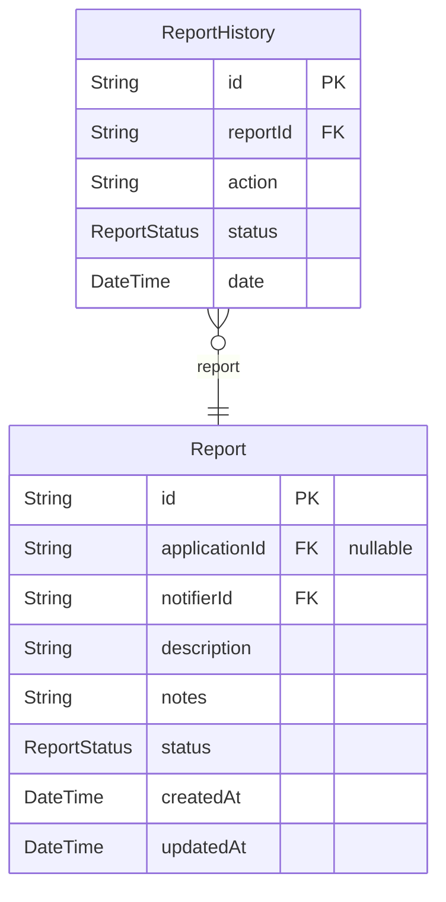

### `Report`

Problème ou anomalie signalée pour une fiche application.
Suit les signalements de la création à la résolution.

Properties as follows:

- `id`: Identifiant unique
- `applicationId`: Identifiant de la fiche application affectée
- `notifierId`: Identifiant de l'utilisateur qui a fait le signalement
- `description`: Description du problème signalé
- `notes`:
- `status`: Statut actuel du signalement
- `createdAt`: Quand le signalement a été créé
- `updatedAt`: Quand le signalement a été mis à jour pour la dernière fois

### `ReportHistory`

Enregistrement historique des changements d'un signalement.
Suit les transitions de statut et les actions prises.

Properties as follows:

- `id`: Identifiant unique
- `reportId`: Identifiant du signalement associé
- `action`: Action prise
- `status`: Statut après l'action
- `date`: Quand cette action s'est produite

## Statistics

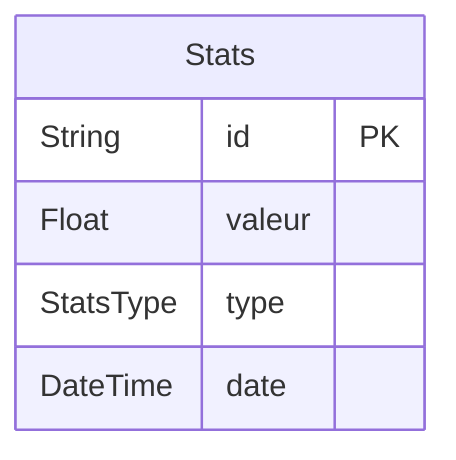

### `Stats`

Point de données statistiques.
Stocke les métriques agrégées au fil du temps.

Properties as follows:

- `id`: Identifiant unique
- `valeur`: Valeur numérique de cette statistique
- `type`: Type de statistique
- `date`: Date à laquelle cette statistique s'applique

## Technology

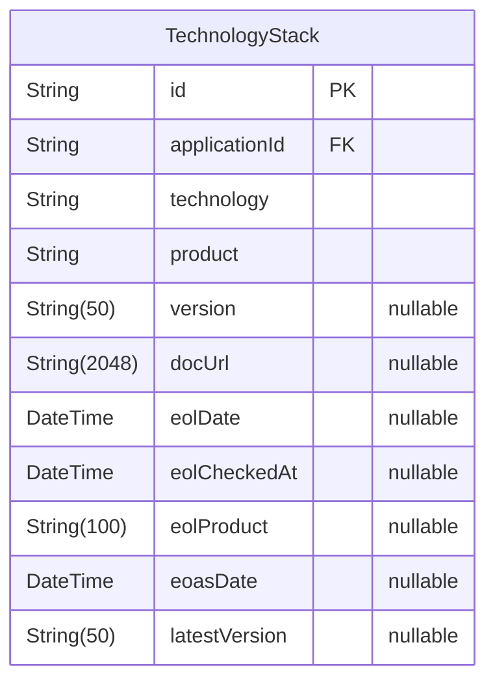

### `TechnologyStack`

Élément de la stack technique d'une application (technologie + version).
Une application peut référencer 0 à N technologies, une par technologie.
Les champs de fin de vie (eolDate / eolCheckedAt) sont prévus pour une
intégration ultérieure de https://endoflife.date (cf. #1099).

Properties as follows:

- `id`: Identifiant unique
- `applicationId`: Identifiant de l'application
- `technology`: Famille / catégorie de technologie (ex. « Base de données », « Langage »)
- `product`: Produit concret (ex. « PostgreSQL », « Node.js ») — sert à résoudre la fin de vie
- `version`: Version utilisée (ex. « 20.11 »)
- `docUrl`: Lien documentaire (URL) associé au produit
- `eolDate`: Date de fin de support/vie de la version (renseignée via endoflife.date)
- `eolCheckedAt`: Date de dernière vérification du statut de fin de vie
- `eolProduct`: Slug produit endoflife.date résolu (null + eolCheckedAt renseigné = produit non suivi)
- `eoasDate`: Date de fin de support actif de la version (renseignée via endoflife.date)
- `latestVersion`: Dernière version publiée du cycle correspondant (renseignée via endoflife.date)

## default

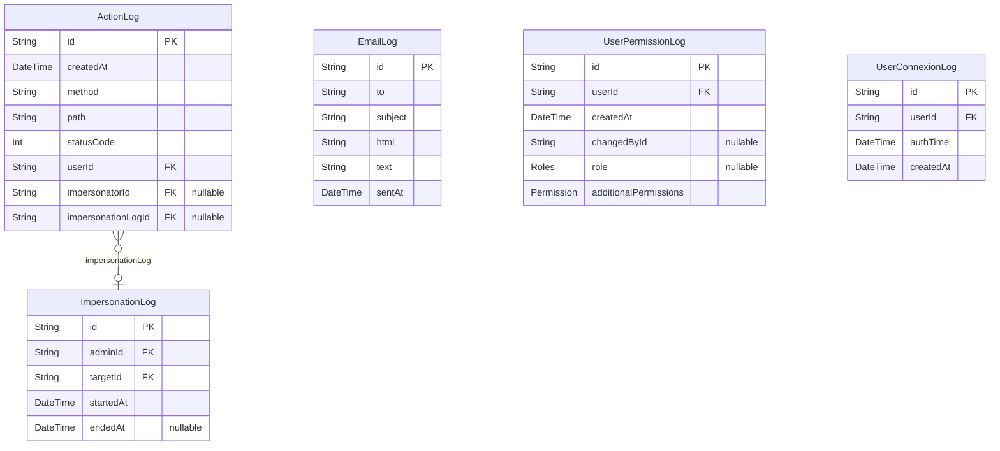

### `ActionLog`

Journal centralisé des actions (#2224) : une entrée par requête HTTP
mutante (POST/PATCH/PUT/DELETE), écrite automatiquement par
l'ActionLogMiddleware, sans intervention des services métier.
Trace l'identité effective ET l'administrateur réel lorsque l'action est
faite sous impersonation, avec rattachement à la session.

Properties as follows:

- `id`:
- `createdAt`:
- `method`: Méthode HTTP de la requête
- `path`: Chemin de la requête (sans query string)
- `statusCode`: Code de statut HTTP renvoyé (y compris les refus 4xx)
- `userId`: Identité effective de la requête (la cible en cas d'impersonation)
- `impersonatorId`: Administrateur réel lorsque l'action a été faite sous impersonation
- `impersonationLogId`: Session d'impersonation à laquelle l'action se rattache

### `EmailLog`

Historique des e-mails effectivement envoyés par le système, consultable par les administrateurs.

Properties as follows:

- `id`: Identifiant unique
- `to`: Destinataire(s) de l'e-mail
- `subject`: Objet de l'e-mail
- `html`: Contenu HTML complet de l'e-mail envoyé
- `text`: Contenu texte de l'e-mail envoyé
- `sentAt`: Date et heure d'envoi

### `UserPermissionLog`

Ce modèle enregistre les changements de permissions des utilisateurs, y compris qui a effectué le changement et quand il a eu lieu.

Properties as follows:

- `id`:
- `userId`:
- `createdAt`:
- `changedById`: Pas de jointure explicite pour éviter les problèmes de suppression en cascade, on stocke juste l'ID de l'utilisateur qui a effectué le changement
- `role`:
- `additionalPermissions`:

### `UserConnexionLog`

Ce modèle enregistre les connexions des utilisateurs, avec une entrée par utilisateur par jour.

Properties as follows:

- `id`:
- `userId`:
- `authTime`:
- `createdAt`:

### `ImpersonationLog`

Journal des sessions d'impersonation : trace quel administrateur s'est fait
passer pour quel utilisateur, et sur quelle période.

Properties as follows:

- `id`:
- `adminId`: Administrateur réel à l'origine de l'impersonation
- `targetId`: Utilisateur cible impersonné
- `startedAt`: Début de la session d'impersonation
- `endedAt`: Fin de la session d'impersonation (null tant qu'elle est active)
