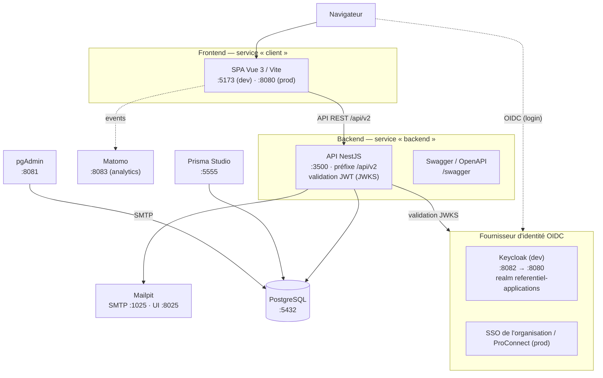

# Architecture

Le **Référentiel des Applications** (RefApp) est l'application de la DNUM-MI (ministère de l'Intérieur) destinée à cataloguer et gérer les métadonnées des applications du ministère (réécriture du service historique « CANEL »). Cette page décrit l'architecture technique : organisation du monorepo, pile logicielle, composants exécutés, chaîne d'authentification et découpage du code backend et frontend.

## Sommaire

- [Vue d'ensemble](#vue-densemble)
- [Pile technique](#pile-technique)
- [Diagramme de composants](#diagramme-de-composants)
- [Authentification OIDC](#authentification-oidc)
- [Préfixe API et documentation Swagger](#préfixe-api-et-documentation-swagger)
- [Modules backend](#modules-backend)
- [Organisation du frontend](#organisation-du-frontend)
- [Pour aller plus loin](#pour-aller-plus-loin)

## Vue d'ensemble

Le dépôt est un **monorepo** géré avec **pnpm** (`pnpm@10.14.0`, voir `package.json`). Il regroupe le backend, le frontend, la configuration d'authentification et l'orchestration de conteneurs.

```text
referentiel-applications/
├── backend/              # API NestJS + Prisma (PostgreSQL) — point d'entrée src/main.ts
│   ├── src/              # modules métier et transverses
│   └── prisma/           # schéma Prisma éclaté par domaine + migrations
├── frontend/             # SPA Vue 3 (Vite, Pinia, DSFR + PrimeVue) — point d'entrée src/main.ts
│   ├── src/              # views, components, stores, api/client généré…
│   └── openapi/          # swagger.yaml partagé (produit par le backend)
├── keycloak/             # realm OIDC pour le fournisseur d'identité local (dev)
├── docs/                 # documentation projet (dont cette page)
├── docker-compose.yml    # stack de développement
├── docker-compose.prod.yml / .ci.yml / .matomo.yml
└── package.json          # racine du monorepo (lint, format, husky, gen)
```

Le monorepo n'utilise pas de workspaces pnpm formels : `backend/` (package `server`) et `frontend/` (package `client`) ont chacun leur propre `package.json` et leurs scripts. La racine ne porte que l'outillage transverse (ESLint, Prettier, Husky, commitlint, et le script `gen` de régénération du client API).

## Pile technique

Pile confirmée depuis les trois `package.json` (racine, `backend/`, `frontend/`).

| Couche                      | Technologie                                                                          |
| :-------------------------- | :----------------------------------------------------------------------------------- |
| **Runtime**                 | Node.js ≥ 20.19 (`engines`)                                                          |
| **Gestionnaire de paquets** | pnpm 10.14                                                                           |
| **Backend**                 | NestJS 10 (`@nestjs/core` 10.4) + TypeScript 5.9                                     |
| **ORM / base**              | Prisma 6.3 (`@prisma/client`, `nestjs-prisma`) + PostgreSQL (`pg`)                   |
| **Validation**              | class-validator + class-transformer, validation globale stricte                      |
| **Documentation API**       | `@nestjs/swagger` 7 (OpenAPI 2.0)                                                    |
| **Sécurité backend**        | helmet, `@nestjs/passport` + `passport-jwt`, `jose`, `jwks-rsa`, `@nestjs/throttler` |
| **Journalisation**          | `nestjs-pino` / `pino-http`                                                          |
| **Tâches planifiées**       | `@nestjs/schedule`                                                                   |
| **Export / divers**         | `exceljs`, `ecoindex`, `nodemailer`, `commander` (CLI d'admin)                       |
| **Frontend**                | Vue 3.5 + Vite 7 + TypeScript 5.8                                                    |
| **État / routage**          | Pinia 3, Vue Router 4                                                                |
| **Design system**           | DSFR (`@gouvfr/dsfr`, `@gouvminint/vue-dsfr`) + PrimeVue 4                           |
| **Client HTTP / API**       | axios, client généré via `@hey-api/openapi-ts`                                       |
| **Auth frontend**           | `oidc-client-ts` 3                                                                   |
| **Visualisation**           | `d3`, `chart.js`, `mermaid`                                                          |
| **Analytics**               | `vue-matomo` (Matomo)                                                                |
| **Tests**                   | Backend : Jest. Frontend : Vitest + Playwright (`@axe-core/playwright` pour l'a11y)  |
| **Mail (dev)**              | Mailpit                                                                              |
| **Conteneurisation**        | Docker Compose                                                                       |

## Diagramme de composants

Le diagramme reflète les services réels de `docker-compose.yml` (dev) et de `docker-compose.matomo.yml`. Dans la stack de développement, le frontend appelle directement le **backend**, qui assure la validation des jetons JWT (voir ci-dessous).



> Précisions sur la chaîne réseau et l'authentification :
>
> - **Fournisseur d'identité OIDC** : l'authentification est un **OIDC standard (Authorization Code Flow), agnostique du fournisseur**, piloté par variables d'environnement (`OIDC_JWKS_URL`, `OIDC_CONFIG_URL`, `OIDC_CLIENT_ID`). **En développement**, le fournisseur est un **Keycloak local** (service `keycloak`, realm fourni dans `keycloak/`). **En production**, l'application s'interface avec le **fournisseur d'identité (SSO) de l'organisation** via ces mêmes variables.
> - **Validation des jetons** : elle est faite **dans le backend** (`AuthMiddleware`, signature vérifiée via le JWKS du fournisseur). Dans la stack de développement, le service `client` (Vite, `:5173`) appelle directement le `backend` (`:3500`).
> - `prisma-studio` (`:5555`) et `pgadmin` (`:8081`) sont des outils de dev branchés sur PostgreSQL. **Matomo** (`:8083`) est dans un compose séparé (`docker-compose.matomo.yml`, avec sa base MariaDB).

## Authentification OIDC

L'authentification repose sur un **OIDC standard (Authorization Code Flow) et agnostique du fournisseur**, configuré par variables d'environnement (`OIDC_JWKS_URL`, `OIDC_CONFIG_URL`, `OIDC_CLIENT_ID`). Le code ne fige aucun fournisseur en dur : **en développement**, le fournisseur OIDC est un **Keycloak local** (realm `referentiel-applications` fourni dans `keycloak/`) ; **en production**, l'application s'interface avec le **fournisseur d'identité (SSO) de l'organisation** via ces mêmes variables.

- Côté **frontend**, la connexion est gérée par `oidc-client-ts` (voir `frontend/src/services/authentication.ts`) : flux _authorization code_, récupération du jeton, puis appels API porteurs du `Bearer`. L'autorité OIDC et le `client_id` sont récupérés dynamiquement auprès du backend, donc indépendants du fournisseur.
- Côté **backend**, l'`AuthMiddleware` (`backend/src/middlewares/auth.middleware.ts`, enregistré dans `app.module.ts`) protège toutes les routes sauf `/health-check`, `/swagger/**`, la racine et `/config`. C'est lui qui **valide le jeton** (signature vérifiée via le JWKS du fournisseur), à l'aide de `passport-jwt` / `jose` / `jwks-rsa`.

> **Piège connu — contexte HTTPS obligatoire.** La librairie OIDC côté navigateur exige un _secure context_ (HTTPS). Un frontend ou une API servis en HTTP cassent l'authentification (boucles de redirection 302, 401 intermittents). Veiller à servir l'application en HTTPS hors `localhost`.

Le détail des rôles, des trois couches de permissions et de leur implémentation est documenté dans [./06-permissions-et-securite.md](./06-permissions-et-securite.md).

## Préfixe API et documentation Swagger

Toutes les routes du backend sont exposées sous le **préfixe global `/api/v2`**, défini dans `backend/src/main.ts` :

- `backend/src/main.ts:13` — `const globalPrefix = "/api/v2";`
- `backend/src/main.ts:20` — `app.setGlobalPrefix(globalPrefix);`

`main.ts` configure également helmet, le CORS (origines issues de `ALLOWED_ORIGINS`), la validation globale stricte (`setupGlobalValidation`) et **Swagger** via `setupSwagger` (`backend/src/swagger-config.ts`). La documentation OpenAPI (titre « API Référentiel Applications », version 2.0) déclare deux schémas de sécurité : OAuth2 (OIDC) et clé d'API par en-tête. Le `swagger.yaml` ainsi produit alimente la génération du client API du frontend (script `pnpm gen`).

Le détail des endpoints figure dans [./05-api.md](./05-api.md).

## Modules backend

Point d'entrée : `backend/src/main.ts` → `backend/src/app.module.ts`. Modules métier réellement importés dans `AppModule` (et présents dans `backend/src/`) :

- **Cœur applicatif** : `applications`, `relationship` (relations inter-applications), `statuses`, `metadatas` (audit transverse).
- **Acteurs & organisations** : `actor`, `actorType`, `organizations`, `organization-maia-references`, `business-division`, `user`, `permissions`.
- **Conformité & qualité** : `compliances`, `rgaa`, `technical-debt-info`, `stats`, `technology` (stack technique et fins de vie via endoflife.date : onglet de fiche, vue transverse `GET /technologies/end-of-life`, cron de recalcul et cron d'alertes).
- **Hébergement & catalogue** : `hostings`, `hosting-option`, `data-catalog`.
- **Métadonnées de fiche** : `labels`, `label-source`, `tag`, `links`, `product`.
- **Signalements & notifications** : `report`, `email`.
- **Technique / supervision** : `health` (`@nestjs/terminus`), `token`.

Modules et dossiers transverses : `prisma` (service `@Global()`), `config`, `common` (dont `BaseService`), `middlewares` (`AuthMiddleware`), `logger`, `services`, `utils`, `cmd` (CLI d'admin via `commander`). `ScheduleModule` (tâches planifiées) est chargé au niveau de `AppModule`.

Les conventions et patterns (structure d'un module, `BaseService`, repositories, recalcul de l'IQ, guards de permissions) sont décrits dans [./08-architecture-backend.md](./08-architecture-backend.md).

## Organisation du frontend

Point d'entrée : `frontend/src/main.ts` → `App.vue` (Vue 3, `<script setup lang="ts">`). `main.ts` enregistre notamment Pinia, Vue Router, le design system DSFR/PrimeVue et `vue-matomo`. Dossiers de `frontend/src/` :

- **`views/`** : pages routées (`HomePage`, `ApplicationSearchPage`, `ApplicationPage`, `CreateApplicationPage`, `AdminPage`, `MetadataPage`, `AccessibilityPage`…).
- **`components/`** : composants réutilisables (auto-importés, ainsi que les composants `Dsfr*`).
- **`stores/`** : stores Pinia en _setup syntax_ (`applicationStore`, `userStore`, `organizationStore`, `relationStore`, `reportStore`, `statisticsStore`, `toasterStore`…).
- **`router/`** : configuration des routes (`meta.requiresAuth/requiresAdmin/title`, objet `routeNames`).
- **`api/`** + **`client/`** : couche d'accès API ; `client/` est **généré** depuis l'OpenAPI (`pnpm gen`) et ne doit pas être édité à la main.
- **`composables/`**, **`services/`** (dont `authentication.ts`), **`models/`**, **`types/`**, **`chart/`** (d3 / chart.js / mermaid), **`constants/`**, **`utils/`**.

Les conventions frontend (auto-imports, stores, gestion des permissions et des appels API générés) sont détaillées dans [./09-architecture-frontend.md](./09-architecture-frontend.md).

## Pour aller plus loin

- **Démarrage local** (ports, commandes Docker Compose, scripts pnpm) : [./03-demarrage.md](./03-demarrage.md).
- **Modèle de données** (entité centrale `Application`, schéma Prisma par domaine) : [./04-modele-de-donnees.md](./04-modele-de-donnees.md).
- **API** (endpoints, conventions REST) : [./05-api.md](./05-api.md).
- **Permissions et sécurité** (rôles, trois couches, OIDC en détail) : [./06-permissions-et-securite.md](./06-permissions-et-securite.md).
- **Architecture backend** : [./08-architecture-backend.md](./08-architecture-backend.md) — **frontend** : [./09-architecture-frontend.md](./09-architecture-frontend.md).
- **Exploitation, déploiement et CI** : [./12-exploitation-deploiement.md](./12-exploitation-deploiement.md).
