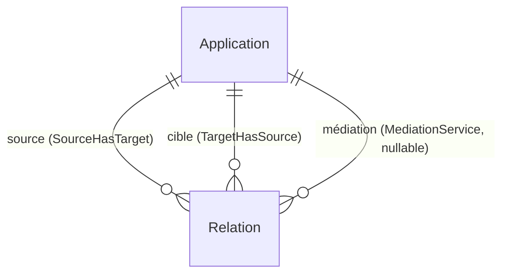
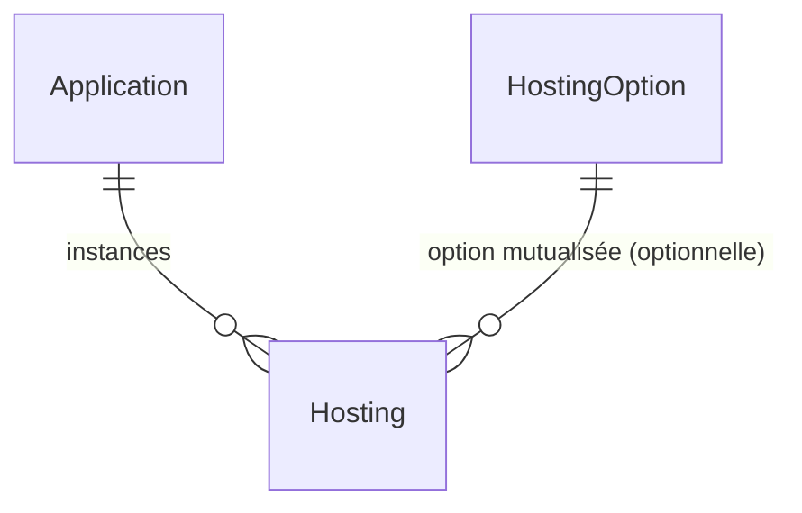
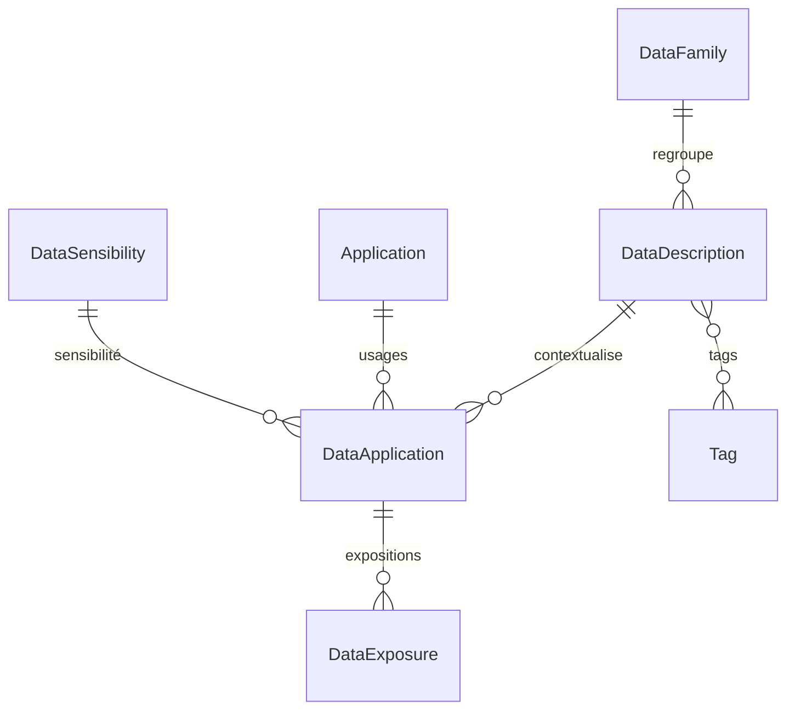
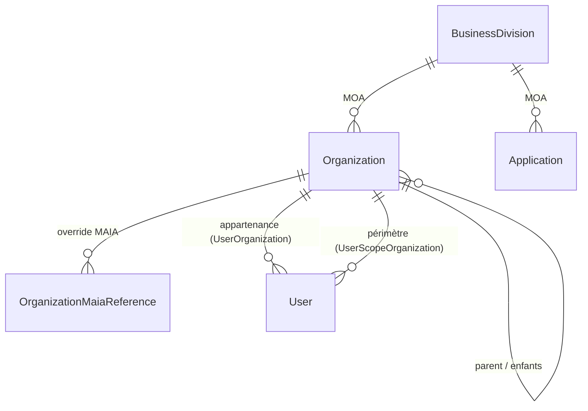

# Modèle de données

Cette page décrit le modèle de données du **Référentiel des Applications (RefApp)**, tel qu'il est défini dans le schéma Prisma du backend. Le schéma est **éclaté par domaine** dans le répertoire `backend/prisma/schema/`, chaque fichier `*.prisma` regroupant les entités d'un même domaine fonctionnel.

L'entité centrale est l'**Application** : presque toutes les autres entités gravitent autour d'elle, soit par rattachement direct (acteurs, conformités, hébergements, données…), soit par des structures transverses (audit `Metadata`, organisations). Le présent document a été rédigé en lisant et en vérifiant chaque entité, relation et énumération directement dans les fichiers `backend/prisma/schema/*.prisma`.

> Les permissions et la sécurité ne sont pas détaillées ici : se reporter à [Permissions et sécurité](./06-permissions-et-securite.md). Les fonctionnalités applicatives sont décrites dans [Fonctionnalités](./07-fonctionnalites.md), l'architecture backend dans [Architecture backend](./08-architecture-backend.md) et l'accessibilité (RGAA) dans [Accessibilité RGAA](./10-accessibilite-rgaa.md).

## Sommaire

- [1. Vue d'ensemble par domaine](#1-vue-densemble-par-domaine)
- [2. Cartographie fichier de schéma → entités](#2-cartographie-fichier-de-schéma--entités)
- [3. Application, entité centrale](#3-application-entité-centrale)
- [4. Cycle de vie et statuts](#4-cycle-de-vie-et-statuts)
- [5. Relations inter-applications](#5-relations-inter-applications)
- [6. Acteurs](#6-acteurs)
- [7. Conformités](#7-conformités)
- [8. Hébergement](#8-hébergement)
- [9. Catalogue de données](#9-catalogue-de-données)
- [10. Labels, tags et ressources externes](#10-labels-tags-et-ressources-externes)
- [11. Dette technique](#11-dette-technique)
- [12. Audit : Metadata](#12-audit--metadata)
- [13. Organisations](#13-organisations)
- [14. Points structurants](#14-points-structurants)

## 1. Vue d'ensemble par domaine

Le modèle s'organise en grands domaines, chacun matérialisé par un ou plusieurs fichiers de schéma. La figure ci-dessous donne une vue d'ensemble simplifiée des entités principales et de leurs liens.

Pour le diagramme entité-relation complet (tous les champs, toutes les relations) :

Les domaines sont les suivants :

- **Applications** : l'application elle-même, son historique de statut, ses relations inter-applications, ses consultations (`applications.prisma`).
- **Conformités** : axes DIMA, PDMA, homologation SSI, DSFR, RGPD et EcoIndex (`compliance.prisma`), ainsi que la conformité RGAA traitée à part (`rgaa-compliance.prisma`).
- **Hébergement** : options d'hébergement mutualisées et instances rattachées aux applications (`hosting.prisma`).
- **Catalogue de données** : familles, descriptions génériques, usages applicatifs, expositions et niveaux de sensibilité (`data.prisma`).
- **Utilisateurs et acteurs** : comptes utilisateurs, acteurs métier/techniques et leurs types (`users.prisma`).
- **Organisations** : arborescence des structures et table d'override MAIA (`organization.prisma`), directions métier MOA (`business-division.prisma`).
- **Audit** : journal transverse des modifications (`metadata.prisma`) et journal centralisé des actions HTTP mutantes (`action-log.prisma`, écrit par l'`ActionLogMiddleware` avec l'identité effective, l'éventuel impersonator réel et la session `ImpersonationLog` associée).
- **Labels et tags** : étiquetage et catégorisation (`labels.prisma`, `tag.prisma`).
- **Ressources externes** (`externals.prisma`), **dette technique** (`technical-debt-info.prisma`), **signalements** (`report.prisma`), **journaux de notification** (`notification-log.prisma`), **notifications in-app** (`notification.prisma`, cloche du header — #2280), **permissions** (`permissions.prisma`), **tokens** (`token.prisma`), **journaux utilisateur** (`user-log.prisma`) et **statistiques** (`stats.prisma`).

## 2. Cartographie fichier de schéma → entités

| Fichier de schéma            | Entités principales (modèles / vues)                                                  | Énumérations                                                   |
| :--------------------------- | :------------------------------------------------------------------------------------ | :------------------------------------------------------------- |
| `applications.prisma`        | `Application`, `ApplicationStatus`, `Relation`, `ApplicationView`                     | `RelationType`, `priorityRestart`, `Status`, `ApplicationType` |
| `correlation.prisma`         | `CorrelationSuggestion`                                                               | `CorrelationSuggestionStatus`                                  |
| `compliance.prisma`          | `Compliance`                                                                          | `TestResult`, `BackupStorage`, `HomologationStatus`            |
| `rgaa-compliance.prisma`     | `RgaaCompliance`                                                                      | —                                                              |
| `hosting.prisma`             | `HostingOption`, `Hosting`                                                            | `Nature`                                                       |
| `data.prisma`                | `DataFamily`, `DataSensibility`, `DataDescription`, `DataApplication`, `DataExposure` | `DataUpdateFrequency`, `OpenDataStatus`                        |
| `users.prisma`               | `User`, `Actor`, `ActorType`, `SavedFilter`                                           | `Roles`, `UserType`, `CapabilityNames`                         |
| `organization.prisma`        | `Organization`, `OrganizationMaiaReference`                                           | —                                                              |
| `business-division.prisma`   | `BusinessDivision`                                                                    | —                                                              |
| `metadata.prisma`            | `Metadata`                                                                            | `MetadataAction`                                               |
| `labels.prisma`              | `LabelSource`, `Label`                                                                | —                                                              |
| `tag.prisma`                 | `Tag`                                                                                 | —                                                              |
| `externals.prisma`           | `ExternalRessource`                                                                   | `ExternalRessourceType`                                        |
| `technical-debt-info.prisma` | `TechnicalDebtInfo`                                                                   | —                                                              |
| `technology.prisma`          | `TechnologyStack`                                                                     | `TechnologyEolSource`                                          |
| `report.prisma`              | `Report`, `ReportHistory`                                                             | `ReportStatus`                                                 |
| `notification-log.prisma`    | `NotificationLog`                                                                     | —                                                              |
| `notification.prisma`        | `Notification`                                                                        | `NotificationType`                                             |
| `permissions.prisma`         | `AppPermissions`                                                                      | `Permission`                                                   |
| `schema.prisma`              | configuration (generators, datasource)                                                | —                                                              |

> Les fichiers `token.prisma`, `user-log.prisma` et `stats.prisma` complètent le modèle (jetons d'API, journaux de connexion / de permission, statistiques) ; ils restent périphériques par rapport à l'entité `Application` et ne sont pas détaillés ici.

## 3. Application, entité centrale

Le modèle `Application` (`backend/prisma/schema/applications.prisma`) est le pivot du référentiel.

### Champs

| Champ                | Type               | Notes                                                                                          |
| :------------------- | :----------------- | :--------------------------------------------------------------------------------------------- |
| `id`                 | `String`           | identifiant `uuid`, clé primaire                                                               |
| `label`              | `String`           | nom complet                                                                                    |
| `shortName`          | `String?`          | nom court / acronyme                                                                           |
| `logo`               | `String?`          | URL du logo                                                                                    |
| `description`        | `String`           | description détaillée                                                                          |
| `targetPopulations`  | `String[]`         | populations cibles                                                                             |
| `purposes`           | `String[]`         | finalités métier                                                                               |
| `type`               | `ApplicationType?` | catégorie de l'application                                                                     |
| `currentStatusId`    | `String?`          | statut courant (FK vers `ApplicationStatus`)                                                   |
| `priorityRestart`    | `priorityRestart?` | priorité de redémarrage                                                                        |
| `quality`            | `Int?`             | score de qualité de la fiche, `null` si l'application est décommissionnée ou supprimée (#2495) |
| `businessDivisionId` | `String?`          | direction métier MOA (FK vers `BusinessDivision`)                                              |

Contraintes : `@@unique([label, description])`, index sur `label`, `shortName` et `currentStatusId`.

### Entités gravitant autour de l'Application

- `ApplicationStatus` — historique des statuts (relation `ApplicationStatuses`) et statut courant (`currentStatus`).
- `Relation` — relations inter-applications, dont `Application` peut être source, cible ou service de médiation.
- `Actor` — acteurs (personnes ou groupes) impliqués.
- `Compliance` — conformités, relation **1:1** (optionnelle).
- `RgaaCompliance` — conformités RGAA, relation **0:N** (une par URL de service).
- `Hosting` — instances d'hébergement.
- `DataApplication` — usages de données contextualisés.
- `Label` — étiquettes (relation 1:N).
- `Tag` — catégorisation (relation N:N).
- `ExternalRessource` — liens externes.
- `Metadata` — entrées d'audit.
- `TechnicalDebtInfo` — évaluations de dette technique.
- `TechnologyStack` — stack technique (technologie, produit, version, lien documentaire) et fin de vie résolue via endoflife.date ou saisie à la main (`eolSource`, `eolDate`, `eoasDate`, `eolCycle`, `eolProduct`, `eolCheckedAt`) ; unique par (application, technologie, produit).
- `ApplicationView` — consultations.
- `NotificationLog` — journaux de notifications de validation.
- `Report` — signalements.
- `User` — abonnés (relation N:N `UserFollowedApplications`).
- `BusinessDivision` — direction métier MOA de rattachement.

```mermaid
erDiagram
    Application ||--o{ ApplicationStatus : "historique des statuts"
    Application ||--o| Compliance : "1:1 conformités"
    Application ||--o{ RgaaCompliance : "0:N RGAA"
    Application ||--o{ Actor : "acteurs"
    Application ||--o{ Hosting : "hébergements"
    Application ||--o{ DataApplication : "usages de données"
    Application ||--o{ Label : "labels"
    Application }o--o{ Tag : "tags (N:N)"
    Application ||--o{ ExternalRessource : "ressources externes"
    Application ||--o{ TechnicalDebtInfo : "dette technique"
    Application ||--o{ TechnologyStack : "stack technique / fins de vie"
    Application ||--o{ ApplicationView : "consultations"
    Application ||--o{ NotificationLog : "notifications"
    Application ||--o{ Report : "signalements"
    Application ||--o{ Metadata : "audit"
    Application ||--o{ Relation : "relations source/cible/médiation"
    Application }o--o{ User : "abonnés (N:N)"
    Application }o--o| BusinessDivision : "MOA"
```

## 4. Cycle de vie et statuts

Le cycle de vie est porté par `ApplicationStatus` (`backend/prisma/schema/applications.prisma`). Chaque enregistrement représente un **événement de changement de statut** (`status`, `statusDate`, `version` optionnelle). L'`Application` référence à la fois l'historique complet (relation `ApplicationStatuses`) et son statut courant via `currentStatusId` / `currentStatus` (`onDelete: SetNull`).

L'énumération `Status` définit les états du cycle de vie :

| Valeur                          | Signification                  |
| :------------------------------ | :----------------------------- |
| `under_construction`            | en cours de construction       |
| `to_validate`                   | à valider                      |
| `poc`                           | preuve de concept              |
| `in_production_mvp`             | MVP en production              |
| `in_production`                 | entièrement en production      |
| `in_production_decommissioning` | en cours de décommissionnement |
| `decommissioned`                | décommissionnée                |
| `deleted`                       | marquée pour suppression       |

## 5. Relations inter-applications

Le modèle `Relation` (`backend/prisma/schema/applications.prisma`) est **auto-référent** : il relie une application source à une application cible, avec un **service de médiation optionnel**.

- `applicationSourceId` → `sourceApplication` (relation `SourceHasTarget`, `onDelete: Cascade`).
- `applicationTargetId` → `targetApplication` (relation `TargetHasSource`, `onDelete: Cascade`).
- `mediationServiceId` (nullable) → `mediationService` (relation `MediationService`, `onDelete: SetNull`) : l'application jouant le rôle de passerelle / système d'échange par lequel transitent les flux.
- Contrainte d'unicité : `@@unique([applicationSourceId, applicationTargetId, type])`.

L'énumération `RelationType` :

| Valeur               | Signification                                |
| :------------------- | :------------------------------------------- |
| `is_part_of`         | fait partie d'une autre application          |
| `in_replacement_of`  | remplace une autre application               |
| `is_service_user_of` | utilise les services d'une autre application |
| `is_data_user_of`    | utilise les données d'une autre application  |
| `use_sso_of`         | utilise le SSO d'une autre application       |
| `is_correlated_with` | est corrélée à une autre application         |

Le type `is_correlated_with` signale un **doublon potentiel** ou un **périmètre proche** entre deux applications. Il est **symétrique** : la direction source/cible n'a pas de sens métier. La paire est donc stockée en **ordre canonique** (`applicationSourceId` < `applicationTargetId`, ordre lexicographique), aussi bien pour `Relation` que pour `CorrelationSuggestion` (`correlation.prisma`). Sans cette convention, la même paire saisie dans l'autre sens échapperait aux contraintes d'unicité et produirait un doublon A→B / B→A. La normalisation est fournie par `normalizeCorrelationPair` (`backend/src/relationship/correlation/correlation-pair.util.ts`), qui rejette également la corrélation d'une application avec elle-même.

## 6. Acteurs

Les acteurs (`Actor`, `backend/prisma/schema/users.prisma`) sont les personnes ou entités impliquées avec une application. Champs principaux : `firstname`, `lastname`, `email`, `isGroup` (distingue groupe et personne physique). Un acteur est rattaché à une `Application` (`onDelete: Cascade`), à une `Organization` (optionnelle) et à un `ActorType` (optionnel).

`ActorType` définit le rôle (code, label, description) et porte les permissions par type via `AppPermissions`. Les codes documentés incluent notamment **MOA**, **MOE**, **RSSI**, **Architecte applicatif/technique**, **TMA**, **Exploitation**, **RSIMM**, **CPD**, **Correspondant Stratégique Métier (CSM)**, **Product Owner/Manager**, **Hébergement** et **Autre**.

À noter : la conformité (`Compliance`) référence directement un `Actor` comme **RSSI d'homologation** (`homologation_rssi`).

> Le modèle `User` (comptes du référentiel, distincts des `Actor` métier) et le détail des permissions sont traités dans [Permissions et sécurité](./06-permissions-et-securite.md).

## 7. Conformités

Le modèle `Compliance` (`backend/prisma/schema/compliance.prisma`) est en relation **1:1** avec `Application` (`applicationId @unique`, `onDelete: Cascade`). Il agrège six axes de conformité :

| Axe                                                    | Champs représentatifs                                                                                                                                                                 |
| :----------------------------------------------------- | :------------------------------------------------------------------------------------------------------------------------------------------------------------------------------------ |
| **DIMA** (Délai d'Indisponibilité Maximale Admissible) | `dima_duration_hours`, `dima_is_hno`, `dima_business_impact`, `dima_recovery_plan`, `dima_recovery_solutions`, `dima_last_test_date`, `dima_test_result`, `dima_recovery_manager`     |
| **PDMA** (Perte de Données Maximale Admissible)        | `pdma_duration_hours`, `pdma_data_types`, `pdma_backup_frequency`, `pdma_backup_method`, `pdma_backup_storage`, `pdma_last_test_date`, `pdma_test_result`, `pdma_restoration_manager` |
| **Homologation SSI**                                   | `homologation_status`, `homologation_date_end`, `homologation_rssi` (→ `Actor`)                                                                                                       |
| **DSFR** (Système de Design de l'État)                 | `dsfr_implemented`, `dsfr_version`                                                                                                                                                    |
| **RGPD**                                               | `rgpd_has_aipd`, `rgpd_dpo_name`                                                                                                                                                      |
| **EcoIndex**                                           | `eco_index_score`, `eco_index_ges`, `eco_index_water`, `eco_index_target_url`, `eco_index_last_calculated_at`                                                                         |

Énumérations associées : `TestResult` (`OK`, `KO`), `BackupStorage` (`S3`, `LOCAL`, `EXTERNE`), `HomologationStatus` (`homologuee`, `en_cours`, `dispensee`, `non_realisee`, `a_mettre_en_place`).

La **conformité RGAA** est traitée séparément dans `RgaaCompliance` (`backend/prisma/schema/rgaa-compliance.prisma`), en relation **0:N** : une entrée par URL de service (`audit_date`, `service_url`, `accessibility_url`, `score_percentage`, contrainte `@@unique([applicationId, service_url])`).

> Le détail du suivi RGAA est décrit dans [Accessibilité RGAA](./10-accessibilite-rgaa.md).

## 8. Hébergement

L'hébergement (`backend/prisma/schema/hosting.prisma`) repose sur deux modèles :

- `HostingOption` : **modèle d'option d'hébergement mutualisé** (champs `site`, `platform`, `provider` obligatoires ; `room`, `building` optionnels). Il peut être partagé par plusieurs instances.
- `Hosting` : **instance rattachée à une application** (`applicationId`, `onDelete: Cascade`), avec un `label` optionnel, un indicateur `isActive` et une référence **optionnelle** vers une `HostingOption` (`hostingOptionId` nullable).

L'énumération `Nature` (`NON_DEFINIE`, `PHYSIQUE`, `VIRTUEL`, `CLOUD`, `BARRE_METAL`) qualifie le type d'infrastructure.

## 9. Catalogue de données

Le catalogue (`backend/prisma/schema/data.prisma`) sépare la **description générique** d'une donnée de son **usage contextualisé** dans une application.

- `DataFamily` : regroupement hiérarchique des descriptions (`path`).
- `DataDescription` : description **générique** et réutilisable (`name`, `description`, `officialUrl`, rattachement optionnel à une `DataFamily` en `SetNull`). Peut porter des `Tag`.
- `DataApplication` : **usage d'une donnée dans le contexte d'une application** (`example`, `openDataStatus`, `isReference`, `businessUsage`, `documentationUrl[]`, `conservation`, `volumetry`, `monthlyVolumetry`, `updateFrequency`). Lie une `Application` (`Cascade`) à une `DataDescription` (`Restrict`) et, optionnellement, à une `DataSensibility` (`SetNull`).
- `DataExposure` : **mode d'exposition** d'un usage applicatif (`type`, `url`, `endpoint`, `format`, `swaggerUrl`, `authenticationType`), rattaché à `DataApplication` (`Cascade`).
- `DataSensibility` : niveau de sensibilité (`label`, `color`).

Énumérations : `DataUpdateFrequency` (`DAILY`, `WEEKLY`, `MONTHLY`, `YEARLY`, `ON_DEMAND`), `OpenDataStatus` (`EXPOSED`, `NOT_EXPOSED`, `NOT_EXPOSABLE`).

## 10. Labels, tags et ressources externes

- **Labels** (`backend/prisma/schema/labels.prisma`) : `Label` (valeur rattachée à une `Application` en `Cascade`) provient optionnellement d'une `LabelSource` mutualisée (source unique partageable entre labels).
- **Tags** (`backend/prisma/schema/tag.prisma`) : `Tag` global (`name` unique), en relation **N:N** avec `Application` et avec `DataDescription`.
- **Ressources externes** (`backend/prisma/schema/externals.prisma`) : `ExternalRessource` (lien, description, `type`) rattachée à une `Application` (`Cascade`). L'énumération `ExternalRessourceType` couvre `documentation`, `supervision`, `service`, `audience_metrics`, `main_service`.

## 11. Dette technique

`TechnicalDebtInfo` (`backend/prisma/schema/technical-debt-info.prisma`) évalue la maturité d'une application selon trois dimensions notées de 0 à 1 (`Decimal(3,2)`) : `technicalMaturity`, `businessMaturity`, `costMaturity`. Chaque évaluation est horodatée (`createdAt`) et rattachée à une `Application` (`Cascade`), avec un index `(applicationId, createdAt desc)` pour récupérer la dernière évaluation.

## 12. Audit : Metadata

`Metadata` (`backend/prisma/schema/metadata.prisma`) est le **journal d'audit transverse**. Chaque entrée enregistre `createdAt`, une `description` optionnelle et une `action` (`MetadataAction` : `add`, `update`, `delete`, `export`).

Le modèle est **polymorphe** : il porte des clés étrangères **nullables** vers les entités auditées — `application`, `compliance`, `label`, `actor`, `externalRessource`, `hosting`, `technicalDebtInfo`, `technologyStack`, `rgaaCompliance`, `dataApplication`, `dataDescription`. Trois liens vers `User` complètent l'audit : `createdBy` (`createdById`, **obligatoire**, `onDelete: Restrict` — l'identité **effective** de la requête), `dataOwner` (`dataOwnerId`, optionnel) et `impersonator` (`impersonatorId`, optionnel, #2226 — l'**administrateur réel** quand le changement a été fait sous impersonation ; renseigné automatiquement par l'extension Prisma `metadata-impersonator` à partir du contexte de requête, sans intervention des services).

## 13. Organisations

`Organization` (`backend/prisma/schema/organization.prisma`) forme une **structure arborescente** : `parentId` / `parent` (relation `OrganizationParent`, `onDelete: Restrict`) et `children`, avec un `path` complet (ex. `/MI/DNUM/SG`).

Un `User` entretient un **double rattachement** vers l'organisation :

- `organizationId` / `organization` (relation `UserOrganization`) : organisation **d'appartenance**.
- `scopeOrganizationId` / `scopeOrganization` (relation `UserScopeOrganization`) : organisation de **périmètre** servant aux permissions basées sur le scope.

`OrganizationMaiaReference` est une **table d'override** pour la consolidation des organisations issues de MAIA : elle redirige un chemin MAIA (`maiaRef`, unique) vers une `Organization` locale, permettant un regroupement N:1. `BusinessDivision` (`backend/prisma/schema/business-division.prisma`) représente la **direction métier MOA** et est partagée entre `Application` et `Organization`.

## 14. Points structurants

- **`Metadata` transverse** : un unique modèle d'audit polymorphe couvre toutes les entités majeures via des FK nullables, avec un créateur obligatoire (`createdBy`) et un propriétaire de données optionnel (`dataOwner`).
- **`Organization` hiérarchique + double rattachement `User`** : arborescence `parent`/`children` à `path`, et distinction nette entre organisation d'**appartenance** et organisation de **périmètre** (scope des permissions).
- **Séparation générique / contextualisé pour les données** : `DataDescription` (catalogue réutilisable) vs `DataApplication` (usage propre à une application), enrichi par `DataExposure` et `DataSensibility`.
- **Conformités 1:1 vs RGAA 0:N** : `Compliance` est unique par application alors que `RgaaCompliance` se décline par URL de service.
- **Hébergement à deux niveaux** : `HostingOption` mutualisé et `Hosting` instancié par application.
- **Énumérations clés** :
  - `ApplicationType` : `business`, `core_service`, `intranet_citizen`, `intranet_staff`, `data_hub`.
  - `Status` : du `under_construction` au `deleted` (8 états du cycle de vie).
  - `RelationType` : `is_part_of`, `in_replacement_of`, `is_service_user_of`, `is_data_user_of`, `use_sso_of`, `is_correlated_with`.
  - `priorityRestart` : `R0`, `R1`, `R1_STAR`, `R2`, `R3`.
