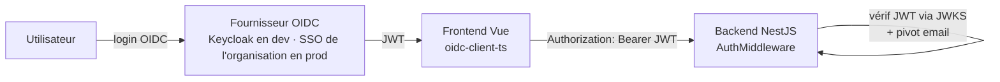
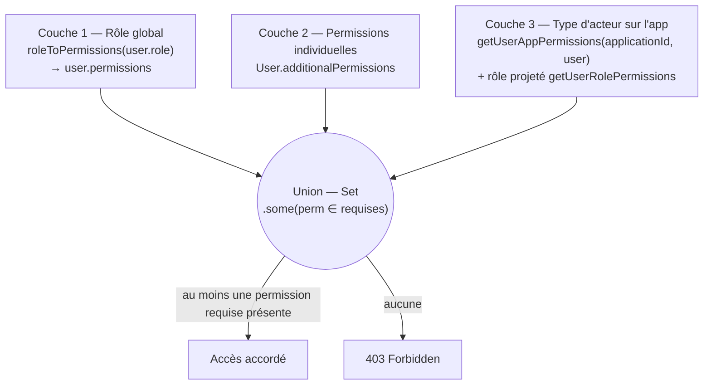

# Permissions et sécurité

Cette page décrit le **modèle d'authentification et d'autorisation** du **Référentiel des Applications (RefApp)**, ainsi que les bonnes pratiques de sécurité associées. Elle a été rédigée en vérifiant chaque mécanisme directement dans le code du backend NestJS et du frontend Vue.

Le principe directeur est un modèle d'autorisation **à trois couches cumulatives** : les droits d'un utilisateur sont l'**union** de ses droits de rôle, de ses permissions individuelles et des permissions héritées de son statut d'acteur sur une application donnée. La décision finale suit une **sémantique OU** : il suffit de posséder _l'une_ des permissions requises pour qu'un accès soit accordé.

> Pour les entités manipulées ici (`Actor`, `ActorType`, `Organization`, `User`), se reporter au [Modèle de données](./04-modele-de-donnees.md). L'architecture générale est décrite dans [Architecture](./02-architecture.md) et [Architecture backend](./08-architecture-backend.md), l'API dans [API](./05-api.md).

## Sommaire

- [1. Authentification](#1-authentification)
- [2. Modèle d'autorisation à trois couches](#2-modèle-dautorisation-à-trois-couches)
- [3. Rôles et mapping des permissions](#3-rôles-et-mapping-des-permissions)
- [4. Catalogue de l'énumération Permission](#4-catalogue-de-lénumération-permission)
- [5. Permissions par type d'acteur](#5-permissions-par-type-dacteur)
- [6. Scope administratif (périmètre organisationnel)](#6-scope-administratif-périmètre-organisationnel)
- [7. Mise en œuvre côté code](#7-mise-en-œuvre-côté-code)
- [8. Bonnes pratiques de sécurité](#8-bonnes-pratiques-de-sécurité)

## 1. Authentification

L'authentification repose sur un **OIDC standard (Authorization Code Flow), agnostique du fournisseur** (configuré par variables d'environnement `OIDC_JWKS_URL` / `OIDC_CONFIG_URL` / `OIDC_CLIENT_ID`), avec une vérification de jeton **JWT côté backend**. **En développement**, le fournisseur OIDC est un **Keycloak local** (realm `referentiel-applications` fourni dans `keycloak/`) ; **en production**, l'application s'interface avec le **fournisseur d'identité (SSO) de l'organisation** via ces mêmes variables. L'**email** est l'identifiant pivot des utilisateurs (`email @unique` dans `backend/prisma/schema/users.prisma`).

### 1.1. Chaîne d'authentification



> La validation des jetons JWT est assurée directement dans le backend (voir §1.3).

### 1.2. Frontend (oidc-client-ts)

Le frontend pilote le flux **Authorization Code** via la librairie `oidc-client-ts`. Le `UserManager` est instancié dans `frontend/src/services/authentication.ts` :

- L'autorité OIDC et le `client_id` ne sont **pas codés en dur** : ils sont récupérés au démarrage auprès du backend (`getConfig()`), puis l'autorité est dérivée en retirant le suffixe `/.well-known/openid-configuration` de `oidcConfigUrl` (`authentication.ts:15`).
- Configuration du `UserManager` (`authentication.ts:17-26`) : `response_type: "code"`, `scope: "openid profile email"`, `redirect_uri` pointant vers `/oidc/callback`.
- Le `userStore` (Pinia) écoute les évènements OIDC (`addUserLoaded` / `addUserUnloaded`) pour maintenir l'état d'authentification et recharger le profil utilisateur (`frontend/src/stores/userStore.ts:13-28`).

> **Piège connu.** `oidc-client-ts` (comme `keycloak-js`) exige un **contexte HTTPS**. En HTTP simple, l'authentification se dégrade : boucles de redirection 302 et 401 intermittents. Toujours servir le frontend derrière TLS hors développement local.

### 1.3. Backend (AuthMiddleware)

Le backend revérifie systématiquement le jeton dans `backend/src/middlewares/auth.middleware.ts` (le middleware est branché dans `backend/src/app.module.ts`) :

- Le JWKS est chargé une fois au constructeur via `createRemoteJWKSet(new URL(this.oidc.jwksUrl))` (`auth.middleware.ts:37`).
- Deux modes d'authentification (`auth.middleware.ts:42-56`) :
  - **Jeton API** (en-tête `API_KEY_HEADER`) → résolution via `TokenService.findUserByToken`.
  - **Bearer JWT** → vérification `jwtVerify(authorization, this.jwks)`, puis `findOrCreateByEmail(payload.email)` (provisionnement à la volée de l'utilisateur sur la base de son email). L'**email est l'identifiant pivot** : le modèle `User` n'a plus de champ `keycloakId` (l'`id` UUID interne reste la clé de liaison).
- Échappatoire de développement : si `DISABLE_JWT_VALIDATION` est défini, le jeton est seulement **décodé** (`decodeJwt`) sans vérification de signature (`auth.middleware.ts:50-52`). À n'utiliser qu'en local.
- En cas d'absence d'utilisateur, réponse **401**. Sur exception, `UnauthorizedException`.
- Une fois l'utilisateur résolu, le middleware calcule ses permissions de rôle et les attache à la requête :
  `req.user = { ...user, permissions: roleToPermissions(user.role) }` (`auth.middleware.ts:63-66`).
- Chaque passage est journalisé via `UserConnexionLogService.log(user.id)` (une entrée par utilisateur par jour, cf. `UserConnexionLog`).

La configuration OIDC backend est centralisée dans `backend/src/config/configs/oidc.config.ts` : `OIDC_JWKS_URL`, `OIDC_CONFIG_URL` et `OIDC_CLIENT_ID` sont **obligatoires** (le service lève une erreur au démarrage s'ils manquent). Cette configuration étant générique, le même code fonctionne avec le **Keycloak local** (dev) comme avec le **fournisseur d'identité (SSO) de l'organisation** (prod) : aucun fournisseur n'est codé en dur.

## 2. Modèle d'autorisation à trois couches

L'autorisation combine **trois sources de permissions cumulatives**. La fusion et la décision sont centralisées dans `backend/src/common/service/check-permissions.service.ts`, méthode `can()`.

> **Permission effective = (permissions de rôle) ∪ (permissions individuelles) ∪ (permissions de type d'acteur sur cette application)**



Extrait du cœur de décision (`check-permissions.service.ts:36-44`) :

```ts
const userPermissions = new Set([
  ...user.permissions,
  ...user.additionalPermissions,
  ...(user.appPerms ?? []),
]);
const hasPermissions = Array.from(userPermissions).some((userPermission) =>
  permissions.includes(userPermission),
);
return hasPermissions;
```

Points clés :

- Si aucune permission n'est requise (`!permissions?.length`), l'accès est **accordé** sans contrôle (`can():24`).
- La **couche 3 n'est calculée que si un `applicationId` est fourni** (`can():25-35`). Elle agrège deux sous-ensembles : les permissions d'acteur (`getUserAppPermissions`) et le rôle projeté sur l'application en tenant compte du scope (`getUserRolePermissions`), affectés à `user.appPerms`.
- La sémantique est un **OU logique** (`.some(...)`) : posséder une seule des permissions requises suffit.

### Couche 1 — Rôle global cumulatif

L'énumération `Roles` (`backend/prisma/schema/users.prisma:46-52`) est **hiérarchique et cumulative** :

`VISITOR < READER < CONTRIBUTOR < ADMIN`

Le mapping rôle → permissions est défini dans `backend/src/permissions/role-to-permissions.ts`, sous forme d'ensembles imbriqués : chaque niveau **étend** le précédent (`READ_PERMISSIONS` inclut `NONE_PERMISSIONS`, etc.). Les permissions de rôle sont calculées par `roleToPermissions(user.role)` et stockées dans `user.permissions` au moment de l'authentification.

### Couche 2 — Permissions individuelles

Le champ `User.additionalPermissions` (`backend/prisma/schema/users.prisma:41`, type `Permission[]`) permet d'accorder des permissions **supplémentaires** à un utilisateur précis, indépendamment de son rôle (anciennement nommé _capabilities_). Toute modification est **auditée** via `UserPermissionLog` (`backend/prisma/schema/user-log.prisma:2-10`), qui conserve `userId`, `changedById`, le `role` et les `additionalPermissions` au moment du changement, ainsi que `createdAt`.

### Couche 3 — Permissions par type d'acteur sur une application

Un utilisateur peut être déclaré **acteur** d'une application via son `ActorType` (MOA, MOE, RSSI, etc.). Il hérite alors de la matrice `AppPermissions` associée à ce type d'acteur, **uniquement pour l'application concernée**. La résolution se fait dans `getUserAppPermissions(applicationId, user)` (`check-permissions.service.ts:47-83`) selon **deux canaux** :

- **Canal email** : un `Actor` de l'application avec `email = user.email` et `isGroup = false` (`check-permissions.service.ts:51-55`).
- **Canal organisation de groupe** : si l'utilisateur a une organisation (`user.organization.path`), une requête SQL (`QueryBuilderGroupActor.buildByApplication`) retrouve les acteurs **de groupe** (`isGroup = true`) dont l'organisation est un **ancêtre** de celle de l'utilisateur, via une comparaison de chemins matérialisés : `lower('<path utilisateur>') LIKE lower(o.path) || '%'` (`backend/src/common/service/prisma-query-builder.service.ts`).

Pour chaque type d'acteur retenu, la matrice `AppPermissions` est convertie en liste de permissions par `transformAppPermissionsObjectToArray` (`backend/src/common/utils/types.ts:38-47`), qui ne conserve que les champs booléens à `true` correspondant à une valeur de l'énumération `Permission`.

S'ajoute à cette couche le **rôle projeté sur l'application** (`getUserRolePermissions`, `check-permissions.service.ts:85-126`) : sans scope, l'utilisateur dispose de toutes les permissions applicatives de son rôle (`roleToAppPermissions(user.role)`) ; avec un scope, ces permissions ne sont accordées que si l'application relève bien de ce périmètre (voir [section 6](#6-scope-administratif-périmètre-organisationnel)).

## 3. Rôles et mapping des permissions

Le tableau ci-dessous restitue les **permissions globales** attribuées à chaque rôle, telles que définies par les ensembles imbriqués de `role-to-permissions.ts` (`roleToPermissions`). L'héritage est **cumulatif** : chaque rôle possède tout ce que possède le rôle inférieur.

| Permission globale   | VISITOR | READER | CONTRIBUTOR | ADMIN |
| :------------------- | :-----: | :----: | :---------: | :---: |
| `AppRead`            |    ✓    |   ✓    |      ✓      |   ✓   |
| `AppList`            |    ✓    |   ✓    |      ✓      |   ✓   |
| `ReportRead`         |    ✓    |   ✓    |      ✓      |   ✓   |
| `ReportPost`         |    ✓    |   ✓    |      ✓      |   ✓   |
| `MDITList`           |         |   ✓    |      ✓      |   ✓   |
| `CreateApplication`  |         |        |      ✓      |   ✓   |
| `CreateGlobalReport` |         |        |      ✓      |   ✓   |
| `ReportManage`       |         |        |      ✓      |   ✓   |
| `OrganizationManage` |         |        |      ✓      |   ✓   |
| `ActorTypeManage`    |         |        |      ✓      |   ✓   |
| `ActorTypeDelete`    |         |        |      ✓      |   ✓   |
| `AdminPanelManage`   |         |        |             |   ✓   |
| `DataExport`         |         |        |             |   ✓   |
| `DeleteApplication`  |         |        |             |   ✓   |
| `ActorTypePost`      |         |        |             |   ✓   |

Symétriquement, `roleToAppPermissions(role)` projette un rôle en **permissions applicatives** (utilisé par la couche 3 lorsqu'aucun scope ne restreint l'utilisateur) :

- **VISITOR** : aucune permission applicative (`[]`).
- **READER** : `ActorRead`, `ComplianceRead`, `HostingRead`, `RelationRead`, `LinkRead`, `MetadataRead`.
- **CONTRIBUTOR** : les lectures READER + `AppWrite`, `ActorWrite`, `ComplianceWrite`, `HostingWrite`, `RelationWrite`, `LinkWrite`, **et** `AppWritePriority`.
- **ADMIN** : identique à CONTRIBUTOR au niveau applicatif (`ADMIN_APP_PERMISSIONS = WRITE_APP_PERMISSIONS`).

> **Trois niveaux d'administration distincts.** Le rôle `ADMIN` ci-dessus est le niveau _global_ (sans
> scope → droits de rôle sur **toutes** les applications) ou _de périmètre_ (avec `scopeOrganization` →
> sur les apps du périmètre, cf. [section 6](#6-scope-administratif-périmètre-organisationnel)). Un
> **troisième** niveau, l'**administrateur d'une application**, est indépendant du rôle : un `ActorType`
> marqué `isAdmin` (backfill `MOA`/`MOE`/`ProductOwner`/`ProductManager`) confère à ses acteurs
> l'**intégralité** des droits applicatifs (`APP_ADMIN_PERMISSIONS`, jeu complet dérivé de
> `AppPermissionsValues`) — mais **uniquement sur leur application** (`getUserAppPermissions`, borné à
> `applicationId`). Ce jeu est **découplé** de `roleToAppPermissions(ADMIN)` : être admin d'une app ne
> confère aucun droit sur les autres, et un admin global ne devient pas « admin complet de chaque
> application » par son seul rôle.

## 4. Catalogue de l'énumération Permission

L'énumération `Permission` (`backend/prisma/schema/permissions.prisma:59-105`) distingue les permissions **globales** (portée transverse) des permissions **applicatives** (portée par application). Les permissions applicatives suivent majoritairement un couple lecture/écriture.

### 4.1. Permissions globales

| Permission           | Rôle                                                 |
| :------------------- | :--------------------------------------------------- |
| `CreateApplication`  | Créer de nouvelles applications                      |
| `DeleteApplication`  | Supprimer une application                            |
| `CreateGlobalReport` | Créer des signalements globaux                       |
| `MDITList`           | Voir la liste des applications sur le TIME / MDIT    |
| `AppList`            | Voir la liste des applications                       |
| `DataExport`         | Exporter les données (export Excel)                  |
| `AdminPanelManage`   | Gérer le panneau d'administration                    |
| `ActorTypePost`      | Créer un type d'acteur                               |
| `ActorTypeManage`    | Éditer un type d'acteur                              |
| `ActorTypeDelete`    | Supprimer un type d'acteur                           |
| `OrganizationManage` | Gérer les organisations (créer, modifier, supprimer) |

### 4.2. Permissions applicatives (par application)

| Permission (lecture) | Permission (écriture) | Domaine                                                             |
| :------------------- | :-------------------- | :------------------------------------------------------------------ |
| `AppRead`            | `AppWrite`            | Informations de base de l'application                               |
| `ActorRead`          | `ActorWrite`          | Acteurs                                                             |
| `ComplianceRead`     | `ComplianceWrite`     | Conformités                                                         |
| `HostingRead`        | `HostingWrite`        | Hébergement                                                         |
| `RelationRead`       | `RelationWrite`       | Relations inter-applications                                        |
| `LinkRead`           | `LinkWrite`           | Liens externes                                                      |
| `MetadataRead`       | _(aucune)_            | Historique des métadonnées (généré automatiquement, pas d'écriture) |

Permissions applicatives **autonomes** (sans couple lecture/écriture) et signalements :

| Permission         | Rôle                                                                         |
| :----------------- | :--------------------------------------------------------------------------- |
| `AppWritePriority` | Modifier la priorité de redémarrage (R0–R3). Lecture couverte par `AppRead`. |
| `ReportRead`       | Voir les signalements                                                        |
| `ReportPost`       | Créer des signalements sur une application                                   |
| `ReportManage`     | Gérer (modifier / supprimer) les signalements                                |

### 4.3. Cas particulier : `AppWritePriority` dissociée de `AppWrite`

La permission `AppWritePriority` gouverne la **priorité de redémarrage** (R0–R3) et est **dissociée** de `AppWrite` : elle peut être accordée séparément. Cette dissociation se lit à deux endroits :

- Dans le schéma, `AppWritePriority` est un booléen propre de `AppPermissions`, avec `@default(false)` (`permissions.prisma:11-12`).
- Au niveau d'un handler, les deux permissions sont acceptées en alternative (sémantique OU). Par exemple la mise à jour d'une application requiert `[Permission.AppWrite, Permission.AppWritePriority]` (`backend/src/applications/application.controller.ts:293`) : posséder l'une _ou_ l'autre suffit pour l'opération concernée.

## 5. Permissions par type d'acteur

La matrice `AppPermissions` (`backend/prisma/schema/permissions.prisma:5-52`) est en relation **1:1** avec `ActorType` (champ `actorTypeId @unique`, `onDelete: Cascade`). Chaque type d'acteur (MOA, MOE, RSSI, Architecte applicatif/technique, TMA, Exploitation, RSIMM, CPD, ProductOwner, ProductManager, Hébergement, Autre…) porte ainsi son propre jeu de booléens : `AppRead`, `AppWrite`, `AppWritePriority`, `ActorRead`/`ActorWrite`, `ComplianceRead`/`ComplianceWrite`, `HostingRead`/`HostingWrite`, `MetadataRead`, `RelationRead`/`RelationWrite`, `LinkRead`/`LinkWrite`, `ReportRead`/`ReportPost`/`ReportManage`.

Ces permissions ne s'appliquent **qu'à l'application** dont l'utilisateur est acteur, via les deux canaux décrits en [couche 3](#couche-3--permissions-par-type-dacteur-sur-une-application) :

- **Canal email** — l'utilisateur est directement nommé acteur de l'application (`Actor.email = user.email`, `isGroup = false`).
- **Canal organisation de groupe** — l'utilisateur appartient (par chemin organisationnel) à une organisation déclarée **acteur de groupe** de l'application (`isGroup = true`).

> Pour la définition des entités `Actor`, `ActorType` et `Organization` (chemins matérialisés, codes d'acteur), se reporter au [Modèle de données](./04-modele-de-donnees.md).

## 6. Scope administratif (périmètre organisationnel)

Le champ `User.scopeOrganizationId` (`backend/prisma/schema/users.prisma:16-18`) restreint l'administration d'un utilisateur à une **branche de l'arbre organisationnel**. Le mécanisme s'appuie sur les **chemins matérialisés** (`Organization.path`).

### 6.1. Effet sur les permissions applicatives

Dans `getUserRolePermissions` (`check-permissions.service.ts:85-126`) :

- **Sans scope** (`scopeOrganization.path` absent) → l'utilisateur est traité comme administrateur global et obtient toutes les permissions applicatives de son rôle.
- **Avec scope** → les permissions de rôle ne sont projetées sur l'application que si celle-ci relève du périmètre, c'est-à-dire :
  - s'il existe un acteur de l'application dont l'organisation contient le chemin de scope (`contains`, insensible à la casse), **ou**
  - si la `businessDivision` de l'application correspond au chemin de scope.
  - Sinon, **aucune** permission de rôle applicative n'est accordée (`return []`).

### 6.2. Effet sur l'administration des utilisateurs

`ScopedPermissionService` (`backend/src/user/scope-permission/scoped-permission.service.ts`) applique le périmètre lors de la modification d'un utilisateur :

- Un requestor **sans scope** est considéré super-administrateur : aucun contrôle (`assertCanUpdate:27-29`).
- Sinon, toute cible et toute organisation manipulée doivent être **dans le périmètre** : `targetPath.startsWith(requestorScopePath)` (`assertWithinScope:125-133`).
- Règle dédiée : **seul un administrateur global peut supprimer le périmètre d'un utilisateur** (`assertScopeOrganizationAction`, action `REMOVE` → exception).

## 7. Mise en œuvre côté code

### 7.1. Backend — garde et décorateur

La protection d'un endpoint repose sur deux éléments, posés **sur le handler** :

```ts
@UseGuards(PermissionGuard)
@RequiredPermissions([Permission.AppWrite, Permission.AppWritePriority])
```

- `@RequiredPermissions([...])` (`backend/src/common/decorators/required-permissions.decorator.ts`) attache les permissions requises en métadonnée.
- `PermissionGuard` (`backend/src/common/guards/permission.guard.ts`) lit cette métadonnée, récupère `request.user` (posé par l'`AuthMiddleware`) et le **paramètre de route `applicationId`**, puis délègue à `CheckPermissions.can(required, user, applicationId)`.

> **Contrainte importante.** Pour que la **couche 3** (permissions par application) soit prise en compte, le paramètre de route contextuel **doit s'appeler `applicationId`** : le guard lit exactement `request.params.applicationId` (`permission.guard.ts:28`). Un paramètre nommé autrement n'activera que les couches 1 et 2.

La sémantique reste **OU** : la liste passée à `@RequiredPermissions` représente des alternatives, l'accès est accordé dès qu'une seule est satisfaite.

### 7.2. Exposition au frontend — `my-perms`

Le frontend connaît les droits de l'utilisateur **sur une application** via `GET /applications/:applicationId/my-perms` (`backend/src/applications/application.controller.ts:149-172`). L'endpoint est lui-même protégé par `@RequiredPermissions([Permission.AppRead])` ; son handler retourne `requestor.appPerms`, c'est-à-dire les permissions applicatives résolues (couche 3) lors du passage dans le guard (`application.service.ts:267-269`).

### 7.3. Frontend — `userStore.hasPermissions`

Le contrôle d'affichage côté Vue est centralisé dans `frontend/src/stores/userStore.ts`. La fonction `hasPermissions(permissions, userApplicationPerms?)` reproduit fidèlement la logique backend (`userStore.ts:79-87`) :

```ts
const userPermissions = new Set([
  ...(user.value?.permissions ?? []),
  ...(user.value?.additionalPermissions ?? []),
  ...Array.from(userApplicationPerms ?? []),
]);
return Array.from(userPermissions).some((p) => permissions.includes(p));
```

Les composants passent en second argument les permissions applicatives obtenues via `my-perms` pour affiner l'affichage par application. Ce contrôle frontend est purement ergonomique : l'autorisation **réelle** est toujours appliquée côté backend par le `PermissionGuard`.

> Pour le détail de l'architecture backend (modules, middleware, services), se reporter à [Architecture backend](./08-architecture-backend.md).

## 8. Bonnes pratiques de sécurité

- **Aucun secret en clair.** Les identifiants OIDC sont injectés par variables d'environnement obligatoires (`OIDC_JWKS_URL`, `OIDC_CONFIG_URL`, `OIDC_CLIENT_ID` — `oidc.config.ts`), et le frontend récupère sa configuration auprès du backend plutôt que de l'embarquer. La gestion des secrets passe par Vault et/ou SOPS, aucun secret en dur dans le dépôt — voir [Exploitation & déploiement](./12-exploitation-deploiement.md).
- **Désactivation de la vérification JWT réservée au local.** `DISABLE_JWT_VALIDATION` court-circuite la vérification de signature (`auth.middleware.ts:50-52`) et ne doit jamais être positionné hors développement.
- **Contexte HTTPS obligatoire.** Le flux OIDC navigateur exige TLS ; en HTTP, attendre des boucles 302 et des 401 intermittents.
- **Validation du jeton dans le backend.** La validation du JWT (signature via JWKS du fournisseur) est faite par l'`AuthMiddleware` du backend, seul garant de la vérification.
- **Validation stricte des entrées.** Les DTO NestJS (class-validator) et le typage Prisma encadrent les données ; conserver une validation stricte sur tout nouvel endpoint.
- **Audit.** Les changements de permissions (`UserPermissionLog`) et les connexions (`UserConnexionLog`) sont journalisés ; préserver ces traces.
- **Respect du périmètre.** Toujours nommer `applicationId` le paramètre de route contextuel pour activer le contrôle par application, et respecter le scope organisationnel pour l'administration des utilisateurs.

---

### Récapitulatif des mécanismes confirmés

| Mécanisme                                                        | Emplacement vérifié                                                                                 |
| :--------------------------------------------------------------- | :-------------------------------------------------------------------------------------------------- |
| Fusion des 3 couches + décision OU (`Set` + `.some()`)           | `backend/src/common/service/check-permissions.service.ts:36-44`                                     |
| Calcul couche 3 conditionné à `applicationId`                    | `check-permissions.service.ts:25-35`                                                                |
| Canaux email / organisation de groupe                            | `check-permissions.service.ts:47-83` + `backend/src/common/service/prisma-query-builder.service.ts` |
| Rôle projeté + effet du scope sur l'app                          | `check-permissions.service.ts:85-126`                                                               |
| Mapping rôle → permissions (cumulatif)                           | `backend/src/permissions/role-to-permissions.ts`                                                    |
| Enum `Roles` (VISITOR<READER<CONTRIBUTOR<ADMIN)                  | `backend/prisma/schema/users.prisma:46-52`                                                          |
| `User.additionalPermissions` + scope                             | `backend/prisma/schema/users.prisma:16-18,41`                                                       |
| Audit permissions / connexions                                   | `backend/prisma/schema/user-log.prisma:2-21`                                                        |
| Enum `Permission` (globales + applicatives)                      | `backend/prisma/schema/permissions.prisma:59-105`                                                   |
| Matrice `AppPermissions` (1:1 ActorType)                         | `backend/prisma/schema/permissions.prisma:5-52`                                                     |
| `AppWritePriority` dissociée (`@default(false)`, OU sur handler) | `permissions.prisma:11-12` + `application.controller.ts:293`                                        |
| Transformation matrice → permissions                             | `backend/src/common/utils/types.ts:38-47`                                                           |
| Garde + décorateur, param `applicationId`                        | `backend/src/common/guards/permission.guard.ts:28-29` + `required-permissions.decorator.ts`         |
| Endpoint `my-perms`                                              | `backend/src/applications/application.controller.ts:149-172` + `application.service.ts:267-269`     |
| Front `userStore.hasPermissions`                                 | `frontend/src/stores/userStore.ts:79-87`                                                            |
| Auth backend (JWKS, modes token/JWT, pivot email)                | `backend/src/middlewares/auth.middleware.ts:37-68`                                                  |
| Config OIDC obligatoire (générique, sans fournisseur en dur)     | `backend/src/config/configs/oidc.config.ts`                                                         |
| Front OIDC (oidc-client-ts, config dynamique)                    | `frontend/src/services/authentication.ts`                                                           |
| Scope administratif utilisateurs                                 | `backend/src/user/scope-permission/scoped-permission.service.ts`                                    |
