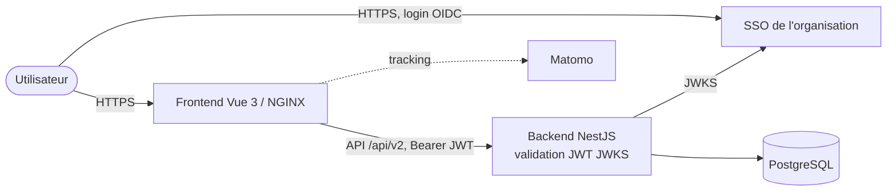

# Exploitation & déploiement

Cette page décrit la mise en production et l'exploitation du Référentiel des Applications (RefApp) : topologie des composants, images et conteneurs, pipelines de construction et de déploiement, variables d'environnement, gestion des secrets, migrations de base de données et observabilité.

Le contenu est établi à partir des fichiers réels du dépôt (`docker-compose*.yml`, `.gitlab-ci-dso.yml`, workflows GitHub Actions, `backend/Dockerfile`, `frontend/Dockerfile`, configuration NestJS). Les éléments non encore en place dans le dépôt sont explicitement marqués « prévu ».

Pour l'architecture applicative détaillée, voir [./02-architecture.md](./02-architecture.md). Pour la sécurité et les permissions, voir [./06-permissions-et-securite.md](./06-permissions-et-securite.md). Pour l'API, voir [./05-api.md](./05-api.md). Pour les zones sensibles des migrations, voir [./11-contribution.md](./11-contribution.md).

## Sommaire

1. [Topologie de déploiement](#1-topologie-de-déploiement)
2. [Images & conteneurs](#2-images--conteneurs)
3. [Pipelines de build & de déploiement](#3-pipelines-de-build--de-déploiement)
4. [Configuration & variables d'environnement](#4-configuration--variables-denvironnement)
5. [Gestion des secrets](#5-gestion-des-secrets)
6. [Base de données en production](#6-base-de-données-en-production)
7. [Observabilité & exploitation](#7-observabilité--exploitation)

## 1. Topologie de déploiement

En production, RefApp s'articule autour des composants suivants :

- **Frontend statique** : application Vue 3 compilée (`pnpm build-only`), servie par un serveur **NGINX non privilégié**. Les variables `VITE_RDA_*` sont injectées au démarrage du conteneur via un script d'entrée, ce qui permet de réutiliser une image unique entre environnements.
- **Backend NestJS** : API REST exposée sous le préfixe `/api/v2`, lancée via `pnpm start:prod` (qui applique d'abord les migrations Prisma, puis démarre `node dist/src/main.js`). C'est lui qui **valide les JWT** (signature via le JWKS du fournisseur OIDC).
- **PostgreSQL** : base de données relationnelle, accédée via Prisma.
- **Fournisseur d'identité OIDC** : en production, le **fournisseur d'identité (SSO) de l'organisation**. (En développement, un **Keycloak local**, realm `referentiel-applications`.) L'authentification est un OIDC générique piloté par variables d'environnement.
- **Matomo** : analytics web, déployé séparément (voir §2).

> Prérequis : les flux OIDC (navigateur) imposent un **contexte sécurisé HTTPS** en production. Le déploiement réel se fait sur la plateforme de déploiement de l'organisation.



Pour le détail des couches applicatives, voir [./02-architecture.md](./02-architecture.md).

## 2. Images & conteneurs

### Dockerfiles

Les deux applications utilisent un **Dockerfile multi-étapes** (`base` → `dev` / `prod`), avec passage d'un argument de build `VERSION`.

**Backend** (`backend/Dockerfile`) — base `node:24-slim`, `pnpm@10.14.0` :

- cible `dev` : `pnpm install` complet, `pnpm db:generate`, démarrage via `pnpm start:dev` ;
- cible `prod` : `pnpm install --frozen-lockfile --ignore-scripts`, génération du client Prisma, `pnpm build`, démarrage via `pnpm start:prod`. Le conteneur tourne sous l'utilisateur `node`.

**Frontend** (`frontend/Dockerfile`) — base `node:24-slim` pour le build, image finale `nginxinc/nginx-unprivileged:1.27-alpine` :

- cible `build` : génération du client d'API (`pnpm api:generate`) puis `pnpm build-only` ;
- cible `prod` : copie du `dist` dans NGINX, conteneur exécuté sous l'utilisateur `1001` (non privilégié). Le script `entrypoint.sh` injecte les variables d'environnement préfixées `VITE_RDA_` au démarrage avant de lancer NGINX.

### Différences dev vs prod (Compose)

| Fichier                   | Rôle                                                                                                                                                                                                                                                                      |
| ------------------------- | ------------------------------------------------------------------------------------------------------------------------------------------------------------------------------------------------------------------------------------------------------------------------- |
| `docker-compose.yml`      | Stack de développement complète : `postgres`, `mailpit` (SMTP de test), `pgadmin`, `backend` (cible `dev`, port `3500`, hot-reload via volume), `prisma-studio`, `keycloak` (port `8082`), `client` (Vite, port `5173`).                                                  |
| `docker-compose.prod.yml` | Surcharge de production : remplace `backend` et `client` par des **images publiées** (`${BACK_IMAGE_TAG}` / `${FRONT_IMAGE_TAG}`, `pull_policy: always`), supprime les volumes de code et les commandes de dev, expose le front sur `8080`, et désactive `prisma-studio`. |
| `docker-compose.ci.yml`   | Surcharge pour l'intégration continue : image `${IMAGE_TAG}`, commande `pnpm start:prod`, montage du dossier `coverage`.                                                                                                                                                  |

En développement, le backend est exposé directement sur le port `3500` et le front (Vite) sur `5173`. En production, le front est servi par NGINX (port `8080`) et appelle le backend NestJS, qui valide lui-même les JWT.

### Composants annexes (compose séparés)

- **Matomo** (`docker-compose.matomo.yml`) : service `matomo` (port `8083`) adossé à une base **MariaDB** dédiée, avec volumes persistants. Déployé indépendamment de la stack applicative.

## 3. Pipelines de build & de déploiement

Le projet combine deux chaînes complémentaires : GitHub Actions (versionnage et construction des images) et une configuration GitLab CI (`.gitlab-ci-dso.yml`, présente dans le dépôt) pour la construction et le déploiement sur la plateforme de déploiement de l'organisation.

### GitHub Actions

- **`release.yml`** : déclenché sur `push` vers `main`, utilise **release-please** pour préparer automatiquement les versions (changelog, tags `vX.Y.Z`) selon les conventional commits.
- **`release-build.yml`** : déclenché sur les tags `v*` (ou manuellement). Il appelle le workflow réutilisable de build pour le backend et le frontend, **cible `prod`**, et publie les images sur **GitHub Container Registry** (`ghcr.io/dnum-mi/referentiel-applications/{backend,frontend}`).
- **`build.yml`** : workflow réutilisable (`workflow_call`). Il se connecte à `ghcr.io`, extrait les métadonnées d'image (`docker/metadata-action`) et exécute `docker/build-push-action` avec l'argument `VERSION` issu de la référence Git.

Ces workflows assurent la **construction et la publication des images** versionnées.

### GitLab CI

`.gitlab-ci-dso.yml` est une configuration GitLab CI présente dans le dépôt. Elle s'appuie sur des templates partagés (catalogue `vault-ci.yml`, `kaniko-ci.yml`) et comporte deux étapes :

1. **`read-secret`** : lecture des secrets depuis **Vault** (`.vault:read_secret`).
2. **`docker-build`** : construction des images backend et frontend avec **Kaniko** (`.kaniko:build-push`), poussées vers un registre (`${REGISTRY_HOST}/${PROJECT_PATH}`), images `ref-app-back` / `ref-app-front` taguées par `CI_COMMIT_SHORT_SHA` et `CI_COMMIT_REF_NAME`.

Le déploiement effectif sur la plateforme de déploiement de l'organisation est piloté côté plateforme à partir des images publiées par cette CI.

## 4. Configuration & variables d'environnement

Les variables ci-dessous sont consommées par le code (`backend/src/config/configs/`, `backend/src/main.ts`, `backend/src/logger/`, frontend `VITE_RDA_*`). **Aucune valeur n'est listée ici** ; se reporter aux gestionnaires de secrets de l'environnement cible. Pour la surface fonctionnelle de l'API, voir [./05-api.md](./05-api.md).

### Backend

| Nom                                            | Rôle                                                                                                                                      |
| ---------------------------------------------- | ----------------------------------------------------------------------------------------------------------------------------------------- |
| `DATABASE_URL`                                 | Chaîne de connexion PostgreSQL (Prisma).                                                                                                  |
| `OIDC_CONFIG_URL`                              | URL `.well-known/openid-configuration` du fournisseur OIDC (Keycloak en dev, SSO de l'organisation en prod).                              |
| `OIDC_JWKS_URL`                                | URL de la JWKS du fournisseur OIDC pour la validation des jetons.                                                                         |
| `OIDC_CLIENT_ID`                               | Identifiant du client OIDC.                                                                                                               |
| `ALLOWED_ORIGINS`                              | Origines CORS autorisées côté backend (liste séparée par des virgules).                                                                   |
| `SMTP_HOST` / `SMTP_PORT` / `SMTP_SECURE`      | Paramètres du serveur d'envoi de courriels.                                                                                               |
| `SMTP_FROM`                                    | Adresse expéditrice des courriels.                                                                                                        |
| `SMTP_ENABLED`                                 | Activation de l'envoi de courriels.                                                                                                       |
| `EMAIL_CRON_ENABLED`                           | Activation des envois automatiques (digest quotidien, relances de validation). Désactivé par défaut.                                      |
| `CORRELATION_CRON_ENABLED`                     | Activation du job planifié de détection des corrélations. Désactivé par défaut.                                                           |
| `TECHNOLOGY_EOL_CRON_ENABLED`                  | Activation du recalcul global des fins de vie (3 h, appels endoflife.date). Désactivé par défaut.                                         |
| `TECHNOLOGY_EOL_BATCH_SIZE`                    | Taille de lot du recalcul, entre 1 et 200 (défaut : 50). Ménage endoflife.date, pas la base.                                              |
| `TECHNOLOGY_EOL_NOTIFY_ENABLED`                | Activation des alertes in-app de fin de vie aux gestionnaires. Désactivée par défaut.                                                     |
| `ENDOFLIFE_ENABLED`                            | `false` coupe tout appel à endoflife.date, fiches et recalcul planifié compris (les fiches affichent « Non vérifiée »). Actif par défaut. |
| `HTTP_PROXY` / `HTTPS_PROXY` / `NO_PROXY`      | Proxy sortant honoré nativement par les appels hors SI : endoflife.date, scan EcoIndex (voir l'encadré).                                  |
| `CORRELATION_SCORE_THRESHOLD`                  | Score minimal (0 à 1) au-delà duquel une paire devient une suggestion. Défaut `0.6`.                                                      |
| `CORRELATION_WEIGHT_NAME`                      | Poids du signal « similarité de nom » dans le score. Défaut `0.6`.                                                                        |
| `CORRELATION_WEIGHT_DATA`                      | Poids du signal « données partagées » dans le score. Défaut `0.25`.                                                                       |
| `CORRELATION_WEIGHT_ACTORS`                    | Poids du signal « acteurs communs » dans le score. Défaut `0.15`.                                                                         |
| `PORT` / `HOST`                                | Port et interface d'écoute du backend (par défaut `3500` / `0.0.0.0`).                                                                    |
| `NODE_ENV`                                     | Environnement d'exécution Node.                                                                                                           |
| `ENV_LABEL`                                    | Libellé d'environnement affiché dans l'interface.                                                                                         |
| `VERSION`                                      | Version applicative (injectée au build / runtime).                                                                                        |
| `MAINTENANCE_MODE`                             | Force le mode maintenance lecture seule (`true`, `1` ou `yes`).                                                                           |
| `MAINTENANCE_CACHE_TTL_MS`                     | Durée de cache de la détection `pg_is_in_recovery()` en millisecondes (défaut : `30000`).                                                 |
| `LOG_LEVEL`                                    | Niveau de journalisation (Pino).                                                                                                          |
| `ONLY_WRITE_SWAGGER`                           | Génère le fichier Swagger puis s'arrête (option d'outillage).                                                                             |
| `WRITE_SWAGGER_YAML`                           | Active/désactive l'écriture du Swagger en YAML.                                                                                           |
| `FOOTER_LINKS`                                 | Liens de pied de page (JSON).                                                                                                             |
| `NON_ACTOR_PERMISSIONS`                        | Permissions accordées aux utilisateurs hors acteur.                                                                                       |
| `DISABLE_JWT_VALIDATION`                       | Désactive la validation JWT côté backend (usage non productif).                                                                           |
| `MAIA_API_URL`                                 | URL du service d'organisation MAIA.                                                                                                       |
| `MOCK_MAIA_SERVICE` / `MOCK_MAIA_ORGANIZATION` | Mode bouchonné du service MAIA (dev/test).                                                                                                |

> **Appels sortants hors SI (fins de vie via endoflife.date, scan EcoIndex)** : ils passent par le `fetch` d'undici avec un `EnvHttpProxyAgent` commun (`backend/src/common/http/outbound-dispatcher.ts`), qui honore `HTTP_PROXY` / `HTTPS_PROXY` / `NO_PROXY` (majuscules ou minuscules) **sans** qu'il soit nécessaire de poser `NODE_USE_ENV_PROXY=1` — le `fetch` global de Node ignore ces variables tant que ce flag n'est pas défini. Le dispatcher n'est pas global : les autres appels sortants du backend (MAIA, JWKS OIDC) sont internes au SI et ne sont pas routés vers le proxy. Pour diagnostiquer, trois contextes de log. **`OutboundHttp`** : au premier appel sortant, quel que soit le flux, une ligne annonce le proxy retenu (hôte:port, identifiants masqués ; cibles HTTPS et HTTP distinguées quand `HTTPS_PROXY` et `HTTP_PROXY` diffèrent — sans `HTTP_PROXY`, une cible HTTP part en direct) ou l'accès direct, et une ligne `error` si l'URL de proxy est inutilisable (schéma `http://` manquant, par exemple) — tout appel sortant échoue alors jusqu'à correction. **`Endoflife`** : chaque échec vers endoflife.date (délai dépassé, erreur réseau avec son code — `ECONNREFUSED`, `ENOTFOUND`… —, statut HTTP) est tracé en `warn` avec l'URL et la durée, au plus une fois par URL et par minute. Un 404 sur l'URL du catalogue est lui aussi tracé (il ne vient jamais d'endoflife.date : proxy ou filtrage d'URL qui répond à sa place), alors qu'un 404 sur une URL produit signifie « produit non suivi » et reste silencieux. **`EcoIndex`** : chaque échec du scan (délai dépassé, erreur réseau, redirection refusée, statut HTTP) est tracé en `warn` avec l'hôte cible (jamais l'URL complète, qui peut porter des paramètres sensibles) et la durée, sans limitation — un scan est déclenché à la main. Aucune ligne `OutboundHttp` du tout : aucun appel sortant n'a été tenté (`ENDOFLIFE_ENABLED=false`, qui coupe aussi le recalcul planifié ; aucune fiche consultée ; aucun scan arrivé jusqu'à l'appel). Une ligne d'annonce sans `warn` et pourtant aucune fin de vie affichée : le produit n'est pas connu du catalogue (état « Produit non suivi » sur la fiche), la version saisie ne correspond à aucun cycle (état « Version non reconnue » sur la fiche, #2449), ou le premier `warn` a été émis plus d'une minute plus tôt ; vérifier aussi que `LOG_LEVEL` laisse passer `warn`. Un scan EcoIndex refusé par la garde anti-SSRF (URL invalide, hôte introuvable, adresse interne) est tracé en `warn` sous `EcoIndex` **sans** ligne `OutboundHttp` : le dispatcher n'est jamais sollicité. Derrière un proxy, un 400 « Hôte de l'URL cible EcoIndex introuvable » signifie que le pod ne résout pas les noms externes : la garde exige le DNS local même si le proxy sait résoudre de son côté. Une fois la garde passée, c'est le proxy qui résout l'hôte cible : la garde rejette toujours les IP et hôtes internes déclarés, mais c'est la politique du proxy qui cloisonne le chemin réel.

### Frontend (`VITE_RDA_*`)

| Nom                       | Rôle                                  |
| ------------------------- | ------------------------------------- |
| `VITE_RDA_MATOMO_URL`     | URL de l'instance Matomo (analytics). |
| `VITE_RDA_MATOMO_SITE_ID` | Identifiant du site Matomo.           |

> Les variables `VITE_RDA_*` sont injectées **au démarrage du conteneur frontend** (script d'entrée NGINX), pas au moment du build, ce qui permet de promouvoir une même image entre environnements.

## 5. Gestion des secrets

**Aucun secret n'est stocké en dur dans le dépôt.** La gestion des secrets se fait via Vault et/ou SOPS.

Bonnes pratiques en vigueur :

- **Vault** pour la diffusion des secrets en CI/CD et au déploiement (la CI lit ses secrets via une étape Vault dédiée).
- **SOPS (age)** comme complément de chiffrement des fichiers de configuration sensibles.
- Variables sensibles fournies par l'environnement d'exécution (jamais commitées), distinction nette entre configuration non sensible et secrets.
- Régénération des secrets en cas de fuite suspectée.

Les valeurs en clair présentes dans `docker-compose.yml` (mots de passe `postgres`, `pgadmin`, Keycloak) concernent **exclusivement le développement local** et ne doivent jamais être réutilisées en production.

## 6. Base de données en production

Les migrations sont appliquées via **Prisma Migrate** :

- script `db:deploy` → `prisma migrate deploy` ;
- au démarrage en production, `start:prod` exécute `prisma migrate deploy` **avant** de lancer l'application, garantissant un schéma à jour.

Zone sensible : certaines migrations dépassent le simple schéma généré par Prisma (contraintes **CHECK**, **migrations de données SQL**, **vues SQL**). Toute évolution doit être revue avec prudence et testée ; les règles et précautions sont décrites dans [./11-contribution.md](./11-contribution.md).

> **Prévu (roadmap)** : évolution vers un **opérateur PostgreSQL Kubernetes (CloudNativePG / CNPG)** pour l'exploitation managée de la base en production (haute disponibilité, sauvegardes, réplication). Cet enabler est suivi dans la feuille de route et n'est pas encore matérialisé dans le dépôt.

## 7. Observabilité & exploitation

- **Health-check** : le backend expose l'endpoint `GET /api/v2/health-check`. Il vérifie PostgreSQL et renvoie `{ maintenance, version, etat: "OK" }` ; en cas d'échec de connexion, il répond `503 Service Unavailable` avec `etat: "KO"`. Le champ `maintenance` combine le forçage manuel et la détection de réplication PostgreSQL.
- **Logs** : journalisation structurée via **Pino** (`nestjs-pino`), niveau configurable par `LOG_LEVEL` (défaut `info`, `debug` en développement). Le format est adapté selon `NODE_ENV`.
- **Analytics** : suivi d'usage via **Matomo** côté frontend (variables `VITE_RDA_MATOMO_*`), déployé en compose séparé.
- **Sécurité HTTP** : le backend active **Helmet** et un **CORS** restreint aux origines autorisées. Les flux OIDC (côté navigateur) requièrent un **contexte sécurisé HTTPS** en production, quel que soit le fournisseur (Keycloak en dev, SSO de l'organisation en prod).

### Calibrer la détection des corrélations

`CORRELATION_SCORE_THRESHOLD` et les trois poids ne se règlent pas à l'aveugle : le nombre de suggestions varie très brutalement autour du seuil, et la bonne valeur dépend des données de l'environnement. La requête ci-dessous, en lecture seule, montre ce que chaque seuil produirait avant d'activer `CORRELATION_CRON_ENABLED`.

```sql
WITH poids AS (
  SELECT 0.6::float8 AS w_nom, 0.25::float8 AS w_donnees, 0.15::float8 AS w_acteurs
),
paires_nom AS (
  SELECT a.id AS id_a, b.id AS id_b
  FROM "Application" a JOIN "Application" b ON a.id < b.id
  WHERE a.label % b.label
  UNION
  SELECT a.id, b.id
  FROM "Application" a JOIN "Application" b ON a.id < b.id
  WHERE a."shortName" IS NOT NULL AND b."shortName" IS NOT NULL
    AND a."shortName" % b."shortName"
),
signaux AS (
  SELECT p.id_a, p.id_b,
         GREATEST(similarity(a.label, b.label),
                  0.8 * COALESCE(similarity(a."shortName", b."shortName"), 0))::float8 AS nom,
         COALESCE((SELECT count(DISTINCT da1."dataDescriptionId")
                   FROM "DataApplication" da1 JOIN "DataApplication" da2
                     ON da1."dataDescriptionId" = da2."dataDescriptionId"
                   WHERE da1."applicationId" = p.id_a AND da2."applicationId" = p.id_b), 0) AS donnees,
         COALESCE((SELECT count(DISTINCT lower(a1.email))
                   FROM "Actor" a1 JOIN "Actor" a2 ON lower(a1.email) = lower(a2.email)
                   WHERE a1."applicationId" = p.id_a AND a2."applicationId" = p.id_b
                     AND a1.email IS NOT NULL AND a1.email <> ''), 0) AS acteurs
  FROM paires_nom p
  JOIN "Application" a ON a.id = p.id_a
  JOIN "Application" b ON b.id = p.id_b
),
scores AS (
  SELECT s.*, (w_nom * nom + w_donnees * LEAST(donnees / 3.0, 1) + w_acteurs * LEAST(acteurs / 2.0, 1))::float8 AS score
  FROM signaux s, poids
)
SELECT seuil, count(*) FILTER (WHERE score >= seuil) AS suggestions
FROM scores, (VALUES (0.40), (0.45), (0.50), (0.55), (0.60), (0.65), (0.70)) AS t(seuil)
GROUP BY seuil ORDER BY seuil;
```

Remplacer le `SELECT` final par celui-ci pour examiner les paires les mieux notées avant de fixer le seuil :

```sql
SELECT round(score::numeric, 3) AS score, round(nom::numeric, 2) AS nom, donnees, acteurs,
       a.label AS application_a, b.label AS application_b
FROM scores s
JOIN "Application" a ON a.id = s.id_a
JOIN "Application" b ON b.id = s.id_b
ORDER BY score DESC LIMIT 20;
```

**Deux points à connaître avant de choisir une valeur.**

Le poids du nom valant 0,5, deux applications au libellé strictement identique atteignent 0,50 : sous un seuil de 0,6, elles ne sont **jamais** proposées. Un second signal (données partagées ou acteurs communs) est toujours nécessaire. C'est un garde-fou contre les faux positifs — deux instances régionales d'un même produit portent souvent le même nom sans être des doublons — mais cela écarte aussi le cas de doublon le plus évident. À trancher au vu des chiffres de l'environnement.

La similarité de nom retient le meilleur du libellé et du nom court. Un nom court qui partage un terme d'organisation avec un autre (« SI Paie DGFiP » et « SI RH DGFiP ») peut donc porter à lui seul le signal, alors que les libellés diffèrent. Vérifier l'échantillon des vingt meilleures paires avant d'activer le cron permet de repérer ce cas.

---

## Récapitulatif

**Fichiers de déploiement réels vérifiés :**

- `docker-compose.yml`, `docker-compose.prod.yml`, `docker-compose.ci.yml`, `docker-compose.matomo.yml`
- `pgadmin.json`
- `backend/Dockerfile`, `frontend/Dockerfile`
- `.github/workflows/build.yml`, `release-build.yml`, `release.yml`
- `.gitlab-ci-dso.yml`
- `backend/src/config/configs/` (app, oidc, database, email), `backend/src/main.ts`, `backend/src/logger/logger.module.ts`, `backend/src/health/health-check.controller.ts`, `backend/package.json`

**Variables d'environnement vérifiées dans le code :** `DATABASE_URL` ; `OIDC_CONFIG_URL`, `OIDC_JWKS_URL`, `OIDC_CLIENT_ID` ; `ALLOWED_ORIGINS` ; `SMTP_HOST/PORT/SECURE/FROM/ENABLED` ; `PORT`, `HOST`, `NODE_ENV`, `ENV_LABEL`, `VERSION` ; `MAINTENANCE_MODE`, `MAINTENANCE_CACHE_TTL_MS` ; `LOG_LEVEL` ; `ONLY_WRITE_SWAGGER`, `WRITE_SWAGGER_YAML` ; `FOOTER_LINKS`, `NON_ACTOR_PERMISSIONS`, `DISABLE_JWT_VALIDATION` ; `MAIA_API_URL`, `MOCK_MAIA_SERVICE`, `MOCK_MAIA_ORGANIZATION` ; `VITE_RDA_MATOMO_URL`, `VITE_RDA_MATOMO_SITE_ID`.

**Éléments marqués « prévu » :** migration vers l'opérateur PostgreSQL Kubernetes **CloudNativePG (CNPG)** (enabler de la feuille de route, non présent dans le dépôt).
