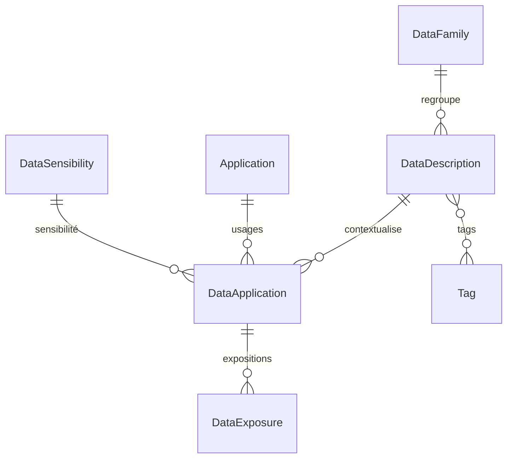

# Catalogue de données

## TL;DR

- Le catalogue distingue une **donnée générique** (`DataDescription` — ex. "Numéro de sécurité
  sociale") de son **usage dans une application** (`DataApplication` — ex. "utilisée en lecture
  seule par l'app Paie, sensibilité RGPD, exposée en API REST"). **Une même donnée générique peut être réutilisée par plusieurs applications.**
- Deux points d'entrée frontend identiques en capacités : l'onglet **Données** d'une application
  (tableau, tri, CRUD) et la **page de détail** d'une donnée rattachée (lecture riche + édition/
  suppression).

---

## 1. Pourquoi cette feature

Le référentiel des applications doit documenter **quelles données personnelles ou sensibles
transitent par quelle application**, dans quel but, avec quel niveau de sensibilité et quel
mode d'exposition — un besoin de conformité (RGPD, sécurité, cartographie SI) récurrent pour un
ministère. Avant cette feature, le catalogue existait côté données (modèle Prisma, quelques
endpoints de lecture) mais n'était :

- ni **éditable depuis le frontend** (rattacher/modifier/détacher une donnée d'une application) ;
- ni doté d'un moyen de **créer de nouvelles données de catalogue** sans passer par un outil
  d'administration de la base ;
- ni **triable** dans le tableau de l'onglet Données.

Le travail livré ferme ces trois manques.

---

## 2. Modèle de données

Fichier source : `backend/prisma/schema/data.prisma`.

| Entité            | Rôle                                                                       | Champs clés                                                                                                                                                             | Suppression en cascade                                            |
| :---------------- | :------------------------------------------------------------------------- | :---------------------------------------------------------------------------------------------------------------------------------------------------------------------- | :---------------------------------------------------------------- |
| `DataFamily`      | Regroupement hiérarchique des descriptions (ex. `"Identité / Etat civil"`) | `path`                                                                                                                                                                  | Détachement `SetNull` sur `DataDescription`                       |
| `DataDescription` | **Donnée générique**, réutilisable entre applications                      | `name`, `description`, `officialUrl`, `familyId?`, `tags[]`                                                                                                             | Interdite tant qu'une `DataApplication` la référence (`Restrict`) |
| `DataApplication` | **Usage** d'une `DataDescription` dans une `Application`                   | `example`, `openDataStatus`, `isReference`, `businessUsage`, `documentationUrl[]`, `conservation`, `volumetry`, `monthlyVolumetry`, `updateFrequency`, `sensibilityId?` | Supprimée si l'`Application` est supprimée (`Cascade`)            |
| `DataExposure`    | Mode d'exposition technique d'un usage (API, fichier, flux)                | `type`, `url`, `endpoint`, `format`, `swaggerUrl`, `authenticationType`                                                                                                 | Supprimée si la `DataApplication` est supprimée (`Cascade`)       |
| `DataSensibility` | Référentiel des niveaux de sensibilité                                     | `label`, `color`                                                                                                                                                        | Détachement `SetNull` sur `DataApplication`                       |

**Point clé** : détacher une donnée d'une application (`DELETE .../applications/:appId/:id`)
supprime uniquement la ligne `DataApplication` — la `DataDescription` sous-jacente reste en base,
disponible pour être rattachée à une autre application. C'est le principe même de réutilisation
du catalogue.
