# Tickets de correction — Audit RGAA 4.1.2 · RefApp v1.75.0

> Backlog opérationnel dérivé de `rapport-audit_v1.75.0.txt`, **au format préconisé par le rapport**
> (section « Format d'un ticket » / « Exploitation des tickets ») : un ticket par élément, sévérité
> globale = la plus élevée des problèmes de l'élément. Chaque ticket contient le **code actuel réel**
> extrait des composants + une **proposition de correction** adaptée au projet (Vue 3 `<script setup>`, DSFR).
> Les captures d'écran ne sont pas reproductibles ici → renvoi `cf. rapport p.XX`.
>
> Chemins relatifs à `frontend/src/` du dépôt applicatif `referentiel-applications`.

> 🎯 Les tickets dont un critère est **conforme sur d'autres pages** portent un pointeur **« Page-référence (grille) »** : s'inspirer de l'implémentation déjà en place plutôt que repartir de zéro. Détail dans [`matrice-criteres-pages_v1.75.0.md`](./matrice-criteres-pages_v1.75.0.md).

## Récapitulatif

| Total problèmes | Bloquants | Majeurs | Mineurs | Critères NC |
| --------------- | --------- | ------- | ------- | ----------- |
| 134             | 16        | 108     | 12      | 28          |

## ⚠️ Corrections de cap : ce que le vrai code a révélé

L'audit datant de v1.75.0, l'extraction du code courant a mis en évidence des **écarts par rapport aux libellés de l'audit** — à connaître avant de corriger :

- **Autocomplete déjà bien avancé** : `AccessibleAutocomplete.vue` implémente déjà `role="combobox"`, `listbox`, `option`, `aria-selected`, `aria-expanded`, `aria-activedescendant` et une région `aria-live`. **Cause racine restante** : un `onMounted` force `role="searchbox"` quand `isSearch` est vrai, ce qui **écrase** le `role="combobox"` (origine du « role searchbox non pertinent » de l'audit, RGAA-010/018/020). Manquent encore `aria-autocomplete="list"` et l'`aria-label` sur le `<ul>`.
- **Pagination v1 = v2** : un seul `PaginationFooter.vue` (via `DsfrPagination`) sert toutes les pages, y compris l'historique P06. Le `<select>` « résultats/page » a déjà un `<label>` FR et le `title="Page N"` existe déjà (corrections partielles — RGAA-029/032).
- **Filtres en HTML brut** : les `*Filter.vue` n'utilisent pas `<DsfrCheckbox>` mais des `<input type="checkbox">` dans des `<label>` englobants, avec des `<legend>` orphelins (hors `<fieldset>`). → migrer vers `<DsfrCheckbox>`/`<DsfrFieldset>` résout nativement 11.1 + 11.5 (RGAA-023/024).
- **Tri tableau** : géré par PrimeVue `DataTable` dans `RefAppTable.vue` (pas `ApplicationTableView.vue`) → correction via slot `#header` + passthrough `:pt` (RGAA-027).
- **Tables profil** : `DsfrTable` génère `<thead>`/`<th scope>` non éditables → remplacer par `<table>` natif pour RGAA-072/081.
- **Localisations réelles** (différentes de l'audit) : icônes `::before` dans `HostingList.vue`/`LabelList.vue` (RGAA-047) ; modale « conformité RGAA » dans `RgaaComplianceSection.vue` (RGAA-054/055) ; onglet Signalement = `ApplicationReportsTab.vue`, `role="status"` parasite dans le slot `#empty` de `RefAppTable.vue` (RGAA-062/063) ; modale « Modifier l'utilisateur » dans `admin/UserActions.vue`, modale tag dans `admin/TagActions.vue`, boutons `-/RO/RW` dans `components/PermissionSelect.vue` (RGAA-085/089/090).
- **Pas de `<main>`** : App.vue utilise un `<div id="main-content">` (RGAA-005). Le footer affiche « Accessibilité : **non conforme** » → à corriger en « **Partiellement conforme** » (RGAA-091).
- **Bugs CSS au passage** : `main.css` contient une déclaration invalide `margin-bottom: 1 0.1rem;` ; contrastes custom hors DSFR insuffisants (tags `.add` ~2.3:1, `.update` ~3.6:1, bordures `#e2e8f0`/`#e5e7eb`), échelle `interpolateYlOrRd` du graphe Time trop claire sur fond clair (RGAA-001/002).

> **Avant de marquer un ticket corrigé** : re-tester sur le code courant (NVDA + Firefox, ou a minima ARC Toolkit). Privilégier `<label>`/`aria-label` réels au `title=` proposé en secours par l'auditeur.

## Format d'un ticket

```
### RGAA-0XX — Nom de l'élément
> Capture : cf. rapport p.XX · Sévérité globale · Pages · Fichier
Problème :
- N° critère – sévérité : détail
  <code actuel réel>
Solution :
- la solution
  <proposition de correction>
```

Sévérité : 🔴 Bloquant · 🟠 Majeur · 🟡 Mineur

## Sommaire (par section)

1. **Gabarit global & transversaux** — RGAA-004, 005, 007, 008, 009, 011, 012, 013, 014, 015, 016, 017, 041, 091
2. **Combobox / Autocomplete & Pagination** — RGAA-006, 010, 018, 019, 020, 021, 028, 029, 030, 031, 032
3. **Composant Filtre** — RGAA-022, 023, 024
4. **Formulaire création/édition d'application** — RGAA-025, 026, 033, 034, 035, 036, 037, 038, 039, 040, 048, 049, 050, 051, 067, 068, 069, 070, 071
5. **Fiche application (P05, 9 onglets)** — RGAA-046, 047, 052, 053, 054, 055, 056, 057, 058, 059, 060, 061, 062, 063
6. **Recherche, tableau & modales associées** — RGAA-027, 042, 043, 044, 045
7. **Profil utilisateur (P09)** — RGAA-072, 073, 074, 075, 076, 077, 078, 079, 080, 081
8. **Admin (P11)** — RGAA-083, 084, 085, 086, 087, 088, 089, 090
9. **Modification (P06/P07), Time (P10) & contraste/reflow** — RGAA-064, 065, 066, 082, 001, 002, 003

---

## Part 1 : Gabarit global & transversaux

### RGAA-004 — Espacement des caractères (CSS global)


> Capture : _cf. rapport p.17_ · **Sévérité globale : 🔴 Bloquant** · Pages : toutes les pages · Fichier : `frontend/src/main.css` (point d'entrée CSS importé par `frontend/src/main.ts` et `frontend/src/App.vue`)

**Problème :**

- `10.12` – bloquant : Du texte est tronqué avec un espacement de caractère plus important que celui par défaut.

Le CSS global du projet impose des tailles de police réduites et des conteneurs serrés qui tronquent le texte lorsque l'utilisateur augmente l'espacement (extension type « Text Spacing »). Plusieurs blocs combinent `font-size` réduit et `gap`/`padding` fixes sans hauteur élastique. À noter aussi une déclaration manifestement invalide ligne 33 (`margin-bottom: 1 0.1rem;`).

```css
/* code actuel réel — frontend/src/main.css */
.fr-input {
  margin-bottom: 1 0.1rem; /* valeur invalide */
}

.filter-block {
  padding: 0.5rem;
  border-radius: 6px;
  border: 1px solid #e2e8f0;
  background-color: #fff;
  font-size: 0.85rem;
  gap: 0.25rem;
}

.selected-tag {
  display: inline-flex;
  align-items: center;
  background: var(--background-raised-grey-hover) !important;
  padding: 0.2rem 0.5rem;
  border-radius: 4px;
  margin-top: 0.3rem;
  font-size: 0.8rem;
}

.checkbox-item {
  display: flex;
  align-items: center;
  gap: 0.5rem;
  font-size: 0.85rem;
}
```

**Solution :**

- Veiller à ce qu'aucune perte d'information ni problème de lisibilité ne se manifeste avec un espacement augmenté : `line-height` jusqu'à 1,5 ; `letter-spacing` jusqu'à 0,12em ; `word-spacing` jusqu'à 0,16em ; `margin-bottom` des `<p>` jusqu'à 2em.
- Concrètement : (1) corriger la valeur CSS invalide ; (2) supprimer les hauteurs fixes et remplacer les `display:flex`/`inline-flex` rigides par des conteneurs élastiques (`min-height` au lieu de `height`, `flex-wrap: wrap`, suppression d'`overflow: hidden` non nécessaire) sur les éléments à texte ; (3) tester avec l'override d'espacement maximal. Le snippet ci-dessous, ajouté dans `main.css`, sert de garde-fou de non-régression (à exécuter dans la recette d'accessibilité, pas forcément à laisser actif en prod).

```css
/* proposition — frontend/src/main.css */

/* Correctif de la valeur invalide */
.fr-input {
  margin-bottom: 0.5rem;
}

/* Rendre les blocs élastiques pour éviter la troncature */
.filter-block,
.selected-tag,
.checkbox-item {
  height: auto;
  min-height: 0;
  overflow: visible;
}

.selected-tag {
  flex-wrap: wrap;
}

/*
 * Garde-fou de non-régression « text spacing » (RGAA 10.12 / WCAG 1.4.12).
 * À activer en recette d'accessibilité pour valider qu'aucun texte n'est tronqué.
 */
.a11y-text-spacing-test * {
  line-height: 1.5 !important;
  letter-spacing: 0.12em !important;
  word-spacing: 0.16em !important;
}
.a11y-text-spacing-test p {
  margin-bottom: 2em !important;
}
```

### RGAA-005 — Zone de contenu principal non définie

> _Pas de capture — non-conformité = absence de balise `<main>` ; rien à montrer (structure invisible). Vérifié : App.vue utilise `<div id="main-content">`._

> Capture : _cf. rapport p.19_ · **Sévérité globale : 🟠 Majeur** · Pages : toutes sauf P04 · Fichier : `frontend/src/App.vue`
>
> 🎯 **Page-référence (grille)** : 9.2 est conforme **uniquement sur P04** → reprendre le gabarit de landmarks de P04 (présence du `<main>`) et le porter au layout global.

**Problème :**

- `9.2` – majeur : La zone de contenu principal n'est pas définie.

Dans `App.vue`, le `RouterView` est enveloppé dans une simple `<div id="main-content">` : il n'existe aucune balise `<main>` / `role="main"`. La cible de lien d'évitement « Aller au contenu principal » (`#main-content`) pointe donc sur un `<div>` neutre.

```vue
<!-- code actuel réel — frontend/src/App.vue -->
<div class="fr-mt-3w fr-mt-md-5w fr-mb-5w" id="main-content">
  <RouterView :key="String(route.params.id ?? '')" />
</div>
```

**Solution :**

- Remplacer la `<div>` par une balise `<main role="main">` (le `role="main"` reste explicite pour les vieux lecteurs d'écran, conformément à l'exemple de structure conforme du rapport).

```vue
<!-- proposition — frontend/src/App.vue -->
<main
  class="fr-mt-3w fr-mt-md-5w fr-mb-5w"
  id="main-content"
  role="main"
  tabindex="-1"
>
  <RouterView :key="String(route.params.id ?? '')" />
</main>
```

_Remarque : le `tabindex="-1"` prépare la cible de focus exploitée par le ticket RGAA-041 (gestion du focus SPA)._

### RGAA-007 — Titre de page peu explicite

> _Pas de capture — concerne l'élément `<title>` (titre de l'onglet du navigateur), non visible dans la page._

> Capture : _cf. rapport p.20_ · **Sévérité globale : 🟠 Majeur** · Pages : P05, P06, P08 · Fichier : `frontend/src/router/index.ts`
>
> 🎯 **Page-référence (grille)** : 8.6 est jugé conforme sur **P01** → s'inspirer de son `<title>` pour rendre P05/P06/P08 aussi explicites.

**Problème :**

- `8.6` – majeur : Présence d'un titre de page (élément `<title>` dans le `<head>`) peu explicite.

Les titres sont aujourd'hui statiques, posés via `meta.title` et appliqués dans le `afterEach`. Ils ne reflètent pas le contexte : P05 affiche « Profil d'application » sans le nom de l'appli, P06 « Historique global » sans dates ni pagination, P08 « Créer une application » sans l'étape courante.

```ts
// code actuel réel — frontend/src/router/index.ts
{
  name: routeNames.PROFILEAPP,
  path: "/applications/:id/:tab?",
  component: () => import("@/views/ApplicationPage.vue"),
  meta: { requiresAuth: true, title: "Profil d'application - Référentiel des applications" },
},
// ...
// Update document title when navigating
router.afterEach((to) => {
  if (to.meta.title) {
    document.title = to.meta.title as string;
  }
});
```

**Solution :**

- Rendre les titres uniques et pertinents (RGAA : « Profil d'application : Alerte SMS - Référentiel des applications »). Comme le nom de l'appli, les dates ou l'étape ne sont connus qu'après chargement des données, prévoir une fonction `setPageTitle()` appelable depuis les vues concernées, tout en gardant le `afterEach` comme valeur par défaut.

```ts
// proposition — frontend/src/router/index.ts
const APP_SUFFIX = "Référentiel des applications";

export function setPageTitle(parts: string | string[]) {
  const segments = Array.isArray(parts) ? parts : [parts];
  document.title = [...segments, APP_SUFFIX].filter(Boolean).join(" - ");
}

// Titre par défaut au changement de route (fallback)
router.afterEach((to) => {
  if (to.meta.title) {
    document.title = to.meta.title as string;
  }
});
```

```vue
<!-- proposition d'appel côté vue — frontend/src/views/ApplicationPage.vue (P05) -->
<script setup lang="ts">
import { watch } from "vue";
import { setPageTitle } from "@/router/index";
// application : ref chargée depuis l'API
watch(
  () => application.value?.label,
  (label) => label && setPageTitle(`Profil d'application : ${label}`),
  { immediate: true },
);
</script>
```

_P06 (`MetadataPage.vue`) : `setPageTitle(\`Modifications du ${dateDebut} au ${dateFin} (page ${page})\`)`. P08 (`CreateApplicationPage.vue`) : `setPageTitle(\`Créer une application - étape ${stepLabel}\`)`._

### RGAA-008 — Header : « Liberté Égalité Fraternité » non restitué


> Capture : _cf. rapport p.20_ · **Sévérité globale : 🟠 Majeur** · Pages : header (toutes) · Fichier : `frontend/src/App.vue`

**Problème :**

- `10.2` – majeur : le texte « Liberté Égalité, Fraternité » n'est pas retransmis par les TA.

La devise est injectée par DSFR via des pseudo-éléments CSS (`::before`/`::after`) sur le bloc-marque du `<DsfrHeader>`, donc non lue par les technologies d'assistance. Le composant est instancié sans slot pour la devise.

```vue
<!-- code actuel réel — frontend/src/App.vue -->
<DsfrHeader
  :service-description="serviceDescription"
  :service-title="serviceTitle"
  :logo-text="logoText"
  :quick-links="quickLinks"
  data-testid="main-header"
></DsfrHeader>
```

**Solution :**

- Ajouter un texte visuellement masqué `<span class="fr-sr-only">Liberté, égalité, fraternité</span>` à l'intérieur du bloc-marque. Avec `@gouvminint/vue-dsfr`, le slot dédié est `#operator` du `DsfrHeader` (ou, à défaut, surcharge via slot du logo) ; on y place la devise masquée.

```vue
<!-- proposition — frontend/src/App.vue -->
<DsfrHeader
  :service-description="serviceDescription"
  :service-title="serviceTitle"
  :logo-text="logoText"
  :quick-links="quickLinks"
  data-testid="main-header"
></DsfrHeader>
```

_Si la version de `@gouvminint/vue-dsfr` n'expose pas ce slot pour le header, ajouter la devise masquée via un petit composant monté à côté du `fr-logo`, ou patcher le rendu en post-mount. Le rendu HTML cible est `<p class="fr-logo">…<span class="fr-sr-only">Liberté, égalité, fraternité</span></p>`._

### RGAA-009 — Header : « Référentiel des Applications » n'est pas un titre

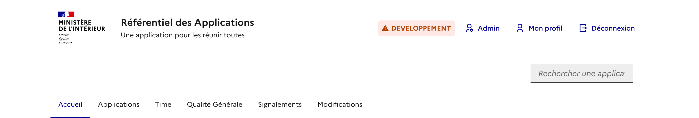

> Capture : _cf. rapport p.21_ · **Sévérité globale : 🟠 Majeur** · Pages : header (toutes) · Fichier : `frontend/src/App.vue`

**Problème :**

- `9.1` – majeur : le texte « Référentiel des Applications » n'est pas un titre.

Le titre de service est passé via la prop `service-title` du `<DsfrHeader>`, que DSFR rend dans un `<p class="fr-header__service-title">` — pas dans un `<h1>`. La page n'a donc pas de titre principal de niveau 1 dans le header.

```vue
<!-- code actuel réel — frontend/src/App.vue -->
const serviceTitle = "Référentiel des Applications"; // ...
<DsfrHeader :service-title="serviceTitle" ... />
<!-- rendu DSFR : <p class="fr-header__service-title">Référentiel des Applications</p> -->
```

**Solution :**

- Faire en sorte que ce texte soit un `<h1>` (ou porte `role="heading" aria-level="1"`). Selon la version de `@gouvminint/vue-dsfr`, `DsfrHeader` accepte une prop `service-title-tag` / `titleTag` permettant de forcer la balise. À défaut, surcharger via le slot du titre de service.

```vue
<!-- proposition — frontend/src/App.vue -->
<DsfrHeader :service-title="serviceTitle" service-title-tag="h1" ... />
<!-- rendu cible : <h1 class="fr-header__service-title">Référentiel des Applications</h1> -->
```

_Si la prop n'existe pas dans la version utilisée, basculer sur le slot `#service-title` (ou équivalent) en y plaçant `<h1 class="fr-header__service-title">{{ serviceTitle }}</h1>`. Vérifier qu'aucune vue ne définit déjà un second `<h1>` afin de ne pas en avoir deux._

### RGAA-011 — Header : page courante indiquée uniquement par la couleur


> Capture : _cf. rapport p.24_ · **Sévérité globale : 🟠 Majeur** · Pages : header (toutes) · Fichier : `frontend/src/App.vue`

**Problème :**

- `3.1` – majeur : la page courante est indiquée que par la couleur.

La navigation principale est gérée par `<DsfrNavigation :nav-items="navItemsComputed">`. Les items sont de simples `{ to, text }` ; l'item actif n'est distingué que par la couleur DSFR, sans forme ni `aria-current` explicitement maîtrisé.

```vue
<!-- code actuel réel — frontend/src/App.vue -->
const baseNavItems = [ { to: { name: routeNames.ACCUEIL }, text: "Accueil" }, {
to: { name: routeNames.SEARCHAPP }, text: "Applications" }, { to: { name:
routeNames.TIMEPAGE }, text: "Time" }, { to: { name: routeNames.QUALITYPAGE },
text: "Qualité Générale" }, { to: { name: routeNames.REPORTS }, text:
"Signalements" }, { to: { name: routeNames.HISTORY }, text: "Modifications" },
]; // ...
<DsfrNavigation
  v-if="userStore.authenticated"
  :nav-items="navItemsComputed"
  id="header-nav"
  data-testid="main-navigation"
/>
```

**Solution :**

- Garantir `aria-current="page"` sur l'item actif (DSFR le pose normalement via `RouterLink`/`exact-active`) **et** ajouter une forme visuelle non basée sur la seule couleur (ex. soulignement renforcé / bordure). Renforcer le style ciblant `aria-current`.

```css
/* proposition — frontend/src/main.css */
.fr-nav__link[aria-current="page"] {
  font-weight: 700;
  text-decoration: underline;
  text-underline-offset: 0.25em;
  text-decoration-thickness: 2px;
}
```

```vue
<!-- proposition — frontend/src/App.vue : s'assurer que l'état courant est exposé.
     Si DsfrNavigation n'ajoute pas aria-current automatiquement, fournir un drapeau. -->
const baseNavItems = computed(() => rawNavItems.map((item) => ({ ...item,
ariaCurrent: route.name === item.to.name ? "page" : undefined, })), );
```

_Vérifier dans le rendu réel que `aria-current="page"` est bien présent sur le lien actif ; la correction principale est l'ajout de la forme visuelle (soulignement) en plus de la couleur._

### RGAA-012 — Footer : paragraphe vide

> _Pas de capture — `<p>` vide, invisible à l'écran (pied de page)._

> Capture : _cf. rapport p.25_ · **Sévérité globale : 🟡 Mineur** · Pages : footer (toutes) · Fichier : `frontend/src/App.vue`

**Problème :**

- `8.9` – mineur : présence d'un `<p>` vide.

Le `<DsfrFooter>` reçoit des liens dont certains ont `to: ""` (liens « version », « Contact Tchap »…), ce qui peut générer un élément vide dans le rendu DSFR du pied de page. Le `<p>` vide constaté provient de ce rendu.

```vue
<!-- code actuel réel — frontend/src/App.vue -->
const mandatoryLinks = computed(() => [ { label: "Accessibilité : non conforme",
title: "Aller à la page d'accessibilité", to: "accessibilite" }, { label: "Plan
du site", title: "Aller au plan du site", to: "plan-du-site" }, { label:
"Contact Tchap", ... to: "", target: "_blank", }, // ... { ...versionLink.value,
to: "" }, ]);
```

**Solution :**

- Supprimer le `<p>` vide. Auditer le rendu DSFR du footer pour identifier d'où vient l'élément vide : si c'est un slot/description non renseigné, ne pas le passer ; si c'est un item à `to`/`href` vide qui produit un `<p>`, fournir un `href` réel (cas version, cf. RGAA-016) plutôt que `to: ""`.

```vue
<!-- proposition — frontend/src/App.vue -->
<!-- 1. Ne plus passer to:"" pour les liens externes : utiliser uniquement href -->
{ label: "Contact Tchap", title: "Contact Tchap - nouvelle fenêtre", href:
"https://www.tchap.gouv.fr/#/room/!ydoKqFOXRAQPQYFvqa:agent.interieur.tchap.gouv.fr?via=agent.interieur.tchap.gouv.fr",
target: "_blank", },
<!-- 2. Si le <p> vide vient d'un slot/description du DsfrFooter, ne pas le rendre :
     ne pas binder de prop description vide. -->
```

_Le `<p>` vide exact n'est pas reproductible depuis le seul template (généré par DSFR) — à localiser dans le DOM rendu, mais la cause probable est un item à `to`/`href` vide. La correction consiste à n'émettre aucun élément vide._

### RGAA-013 — Footer : « Liberté Égalité Fraternité » non restitué

> _Pas de capture — même devise « Liberté Égalité Fraternité » que le bandeau, voir RGAA-008._

> Capture : _cf. rapport p.25_ · **Sévérité globale : 🟠 Majeur** · Pages : footer (toutes) · Fichier : `frontend/src/App.vue`

**Problème :**

- `10.2` – majeur : le texte « Liberté Égalité, Fraternité » n'est pas retransmis par les TA.

Comme dans le header, la devise du bloc-marque du `<DsfrFooter>` provient des pseudo-éléments CSS et n'est pas lue par les TA.

```vue
<!-- code actuel réel — frontend/src/App.vue -->
<DsfrFooter
  :logo-text="logoText"
  :operator-img-src="operatorImgSrc"
  ...
  data-testid="footer"
/>
<!-- rendu DSFR : <p class="fr-logo">Ministère<br>de l'intérieur</p> + devise via ::before/::after -->
```

**Solution :**

- Ajouter `<span class="fr-sr-only">Liberté, égalité, fraternité</span>` dans le bloc-marque du footer, via le slot dédié de `DsfrFooter`.

```vue
<!-- proposition — frontend/src/App.vue -->
<DsfrFooter
  :logo-text="logoText"
  :operator-img-src="operatorImgSrc"
  ...
  data-testid="footer"
>
  <template #brand-content>
    <span class="fr-sr-only">Liberté, égalité, fraternité</span>
  </template>
</DsfrFooter>
```

_Nom de slot à adapter à la version de `@gouvminint/vue-dsfr` (par ex. `#operator`, `#description` ou slot par défaut). Rendu cible : `<p class="fr-logo">…<span class="fr-sr-only">Liberté, égalité, fraternité</span></p>`._

### RGAA-014 — Footer : title du lien logo incohérent avec l'intitulé visible


> Capture : _cf. rapport p.26_ · **Sévérité globale : 🟠 Majeur** · Pages : footer (toutes) · Fichier : `frontend/src/App.vue`

**Problème :**

- `6.1` – majeur : l'attribut `title` du lien du logo ne reprend pas l'intitulé visible.

Le lien du logo opérateur du footer est piloté par `operator-to` / `operator-img-alt`. L'`alt` vaut « Ministère de l'intérieur - Référentiel des Applications » mais le `title` du lien ne reprend pas cet intitulé visible (manque le terme « Accueil »).

```vue
<!-- code actuel réel — frontend/src/App.vue -->
const operatorImgAlt = "Ministère de l'intérieur - Référentiel des
Applications"; const operatorTo = "/applications"; // ...
<DsfrFooter
  :operator-img-src="operatorImgSrc"
  :operator-img-alt="operatorImgAlt"
  :operator-to="operatorTo"
  ...
/>
```

**Solution :**

- Reprendre l'intitulé de l'`alt` de l'image + le terme « Accueil » dans le `title` du lien : `title="Accueil - Ministère de l'intérieur - Référentiel des Applications"`. Si `DsfrFooter` n'expose pas de prop `operator-link-title`, passer un objet `operator-to` enrichi ou surcharger via slot.

```vue
<!-- proposition — frontend/src/App.vue -->
const operatorLinkTitle = "Accueil - Ministère de l'intérieur - Référentiel des
Applications"; // ...
<DsfrFooter
  :operator-img-src="operatorImgSrc"
  :operator-img-alt="operatorImgAlt"
  :operator-to="operatorTo"
  :operator-link-title="operatorLinkTitle"
  ...
/>
<!-- rendu cible : <a href="/applications" title="Accueil - Ministère de l'intérieur - Référentiel des Applications">…</a> -->
```

_Si la prop n'existe pas, utiliser le slot du logo opérateur pour rendre soi-même le `<a :title="operatorLinkTitle">`._

### RGAA-015 — Footer : liens « nouvelle fenêtre » non mentionnés


> Capture : _cf. rapport p.26_ · **Sévérité globale : 🟠 Majeur** · Pages : footer (toutes) · Fichier : `frontend/src/App.vue`

**Problème :**

- `6.1` – majeur : les liens qui ouvrent une nouvelle fenêtre ne le mentionnent pas dans l'intitulé.

Les liens du footer avec `target: "_blank"` (Contact Tchap, Contacter l'équipe, liens écosystème externes) n'indiquent pas « nouvelle fenêtre » dans leur `title`/`aria-label`.

```vue
<!-- code actuel réel — frontend/src/App.vue -->
{ label: "Contact Tchap", title: "Aller au contact Tchap", href:
"https://www.tchap.gouv.fr/#/room/!ydoKqFOXRAQPQYFvqa:agent.interieur.tchap.gouv.fr?via=agent.interieur.tchap.gouv.fr",
to: "", target: "_blank", }, { label: "Contacter l'équipe", title: "Envoyer un
email à l'équipe du Référentiel des Applications", href:
"mailto:support-referentiel-applications@interieur.gouv.fr", to: "", target:
"_blank", icon: "fr-icon-mail-line", },
```

**Solution :**

- Ajouter le terme « nouvelle fenêtre » dans le `title` (et `aria-label` si dispo) de chaque lien ouvrant un nouvel onglet. Pour ceux sans `title`, en ajouter un reprenant l'intitulé visible + « nouvelle fenêtre ». Idem pour les liens écosystème externes (CCT, Code source).

```vue
<!-- proposition — frontend/src/App.vue -->
{ label: "Contact Tchap", title: "Contact Tchap - nouvelle fenêtre", href:
"https://www.tchap.gouv.fr/#/room/!ydoKqFOXRAQPQYFvqa:agent.interieur.tchap.gouv.fr?via=agent.interieur.tchap.gouv.fr",
target: "_blank", }, { label: "Contacter l'équipe", title: "Contacter l'équipe
par email - nouvelle fenêtre", href:
"mailto:support-referentiel-applications@interieur.gouv.fr", target: "_blank",
icon: "fr-icon-mail-line", },
```

_Pour les `ecosystemLinks` externes, suffixer « - nouvelle fenêtre » dès lors qu'ils portent `target: "_blank"`._

### RGAA-016 — Footer : icône « colis » avant le numéro de version

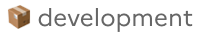

> Capture : _cf. rapport p.27_ · **Sévérité globale : 🟠 Majeur** · Pages : footer (toutes) · Fichier : `frontend/src/App.vue`

**Problème :**

- `6.1` – majeur : l'icône « colis » précédant le numéro de version n'est pas accessible.

Le label du lien version est construit avec un emoji « 📦 » directement dans le texte du lien, lu tel quel par les TA et sans valeur informative.

```vue
<!-- code actuel réel — frontend/src/App.vue -->
const versionLink = computed(() => ({ label: `📦 ${appVersion}`, href:
`https://github.com/dnum-mi/referentiel-applications/releases/tag/${appVersion}`,
})); // ... const mandatoryLinks = computed(() => [ // ... {
...versionLink.value, to: "" }, ]);
```

**Solution :**

- Supprimer l'icône, ou l'isoler dans un `<span aria-hidden="true">`. Comme `label` est rendu comme texte, soit retirer l'emoji du label, soit (si on veut le conserver visuellement) utiliser un slot/`v-html` maîtrisé pour l'envelopper dans `aria-hidden`.

```vue
<!-- proposition — frontend/src/App.vue -->
// Solution simple : retirer l'emoji du libellé restitué const versionLink =
computed(() => ({ label: appVersion, title: `Version ${appVersion} - nouvelle
fenêtre`, href:
`https://github.com/dnum-mi/referentiel-applications/releases/tag/${appVersion}`,
target: "_blank", }));
```

```html
<!-- variante si l'on conserve l'icône visuellement (rendu cible) -->
<a href="..." title="Version 1.75.0 - nouvelle fenêtre">
  <span aria-hidden="true">📦</span> 1.75.0
</a>
```

### RGAA-017 — Footer : bouton « paramètres d'affichage » sans état

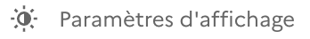

> Capture : _cf. rapport p.27_ · **Sévérité globale : 🟠 Majeur** · Pages : footer (toutes) · Fichier : `frontend/src/App.vue`

**Problème :**

- `7.1` – majeur : le bouton « paramètres d'affichage » devrait afficher son état (mode clair / sombre courant).

Le bouton est défini dans `afterMandatoryLinks` sans `title` dynamique : rien n'informe les TA du mode courant ni de l'action de bascule.

```vue
<!-- code actuel réel — frontend/src/App.vue -->
const afterMandatoryLinks = [ { label: "Paramètres d'affichage", button: true,
class: "fr-icon-theme-fill fr-link--icon-left fr-px-2v", to: "/settings",
onclick: changeTheme, }, ]; const scheme = useScheme(); function changeTheme() {
if (!scheme) return; scheme.setScheme(scheme.theme.value === "light" ? "dark" :
"light"); }
```

**Solution :**

- Mettre le `title` dynamique reprenant l'intitulé « Paramètres d'affichage » + le mode courant + l'action, et le recalculer selon le thème (clair/sombre). Rendre `afterMandatoryLinks` réactif (`computed`).

```vue
<!-- proposition — frontend/src/App.vue -->
const scheme = useScheme(); const themeButtonTitle = computed(() =>
scheme?.theme.value === "dark" ? "Paramètres d'affichage : actuellement en mode
sombre, passer en mode clair" : "Paramètres d'affichage : actuellement en mode
clair, passer en mode sombre", ); const afterMandatoryLinks = computed(() => [ {
label: "Paramètres d'affichage", button: true, title: themeButtonTitle.value,
class: "fr-icon-theme-fill fr-link--icon-left fr-px-2v", to: "/settings",
onclick: changeTheme, }, ]);
```

_Penser à binder `:after-mandatory-links="afterMandatoryLinks"` (déjà le cas) ; le passage en `computed` suffit à mettre à jour le `title` à chaque bascule._

### RGAA-041 — SPA : rôle de navigation, gestion du focus, restitution des titres

> _Pas de capture — non-conformité comportementale (gestion du focus et du titre lors des changements de vue SPA), non capturable en image._

> Capture : _cf. rapport p.49 & p.12-13_ · **Sévérité globale : 🔴 Bloquant** · Pages : application monopage (toutes) · Fichier : `frontend/src/App.vue`, `frontend/src/router/index.ts`

**Problème :**

- `7.1` – bloquant : le rôle transmis par les éléments de navigation (lien) aux TA n'est pas toujours correct.
- `12.8` – bloquant : le fonctionnement de type SPA (contenu modifié sans rechargement complet) impose de gérer le focus clavier à chaque navigation (ordre actuellement illogique) et de restituer le nouveau titre de page aux TA.

Aujourd'hui : la navigation utilise bien `RouterLink` (`<a href>`), mais après navigation le focus reste là où il était (aucun reset), et le nouveau `document.title` (posé dans `afterEach`) n'est pas annoncé par les TA. Il n'existe aucune zone cachée de tête de page servant de cible de focus.

```vue
<!-- code actuel réel — frontend/src/App.vue (extrait) -->
<DsfrSkipLinks
  :links="[
    { id: 'header-search', text: 'Aller à la recherche' },
    { id: 'header-nav', text: 'Aller à la navigation' },
    { id: 'main-content', text: 'Aller au contenu principal' },
    { id: 'footer', text: 'Aller au pied de page' },
  ]"
/>
<DsfrHeader ... />
<div class="fr-mt-3w fr-mt-md-5w fr-mb-5w" id="main-content">
  <RouterView :key="String(route.params.id ?? '')" />
</div>
```

```ts
// code actuel réel — frontend/src/router/index.ts
router.afterEach((to) => {
  if (to.meta.title) {
    document.title = to.meta.title as string;
  }
});
```

**Solution :**

- Appliquer la **solution #2** du rapport (« simuler des changements de pages ») : déclencheurs `<a href>` / `role="link"` (déjà respecté via `RouterLink`), mise à jour du `<title>`, et restitution du titre via un texte caché placé **tout au début de la page (avant les liens d'évitement)**, en classe `fr-sr-only`, qui sert aussi de **cible de focus**. Le focus est géré comme si un rechargement avait eu lieu.

1. Ajouter en tête de `App.vue` un élément focusable masqué portant le titre de la page courante :

```vue
<!-- proposition — frontend/src/App.vue (tout début du template, AVANT DsfrSkipLinks) -->
<template>
  <h1
    ref="pageTitleAnnouncer"
    class="fr-sr-only"
    tabindex="-1"
    data-testid="page-title-announcer"
  >
    {{ currentPageTitle }}
  </h1>

  <DsfrSkipLinks ... />
  <DsfrHeader ... />
  <main class="fr-mt-3w fr-mt-md-5w fr-mb-5w" id="main-content" role="main">
    <RouterView :key="String(route.params.id ?? '')" />
  </main>
  <!-- ... -->
</template>
```

```vue
<!-- proposition — frontend/src/App.vue (script setup) -->
<script setup lang="ts">
import { ref, nextTick } from "vue";
import { useRouter } from "vue-router";

const pageTitleAnnouncer = ref<HTMLElement | null>(null);
const currentPageTitle = ref("");
const router = useRouter();

// Focus géré comme un rechargement : après chaque navigation,
// on met à jour le titre caché et on lui donne le focus.
router.afterEach(async (to) => {
  currentPageTitle.value = (to.meta.title as string) ?? document.title;
  await nextTick();
  pageTitleAnnouncer.value?.focus();
});
</script>
```

2. Conserver dans `router/index.ts` la mise à jour de `document.title` (`afterEach` existant), qui reste la source du libellé annoncé. Le hook de focus est posé côté `App.vue` car il a besoin de la `ref` du DOM.

_Note de cohérence avec RGAA-009 : pour éviter deux `<h1>`, soit cet annonceur sert de seul `<h1>` de page (et le titre de service du header passe alors en `role="heading"`/`<p>`), soit l'annonceur devient un `<div role="status">`/élément non titré. Choisir une stratégie unique de hiérarchie de titres lors de l'implémentation._

### RGAA-091 — Mention d'accessibilité obligatoire et déclaration de conformité

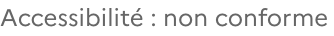

> Capture : _cf. rapport (synthèse de conformité)_ · **Sévérité globale : 🟠 Organisationnel** · Pages : footer + page accessibilité (toutes) · Fichier : `frontend/src/App.vue`, `frontend/src/views/AccessibilityPage.vue`

**Problème :**

- Organisationnel : la mention de conformité affichée en pied de page est erronée. Le résultat de l'audit (28 critères non conformes mais site partiellement utilisable) impose la mention exacte « Accessibilité : Partiellement conforme ». Le footer affiche actuellement « Accessibilité : non conforme ». De plus, la déclaration d'accessibilité publiée sur `/accessibilite` (`AccessibilityPage.vue`) est incomplète : état de conformité « en cours d'audit », aucun coordonnées de contact, aucune voie de recours.

```vue
<!-- code actuel réel — frontend/src/App.vue -->
const mandatoryLinks = computed(() => [ { label: "Accessibilité : non conforme",
title: "Aller à la page d'accessibilité", to: "accessibilite" }, { label: "Plan
du site", title: "Aller au plan du site", to: "plan-du-site" }, // ... ]);
```

```vue
<!-- code actuel réel — frontend/src/views/AccessibilityPage.vue -->
<h2 class="fr-h2">État de conformité</h2>
<p>
  Le référentiel des applications est en cours d'audit d'accessibilité pour évaluer sa conformité
  aux RGAA (Référentiel Général d'Amélioration de l'Accessibilité).
</p>
```

**Solution :**

- Corriger la mention obligatoire du footer en « Accessibilité : Partiellement conforme » (valeur exacte requise par l'arrêté).
- Compléter la déclaration sur `/accessibilite` : état de conformité (RGAA 4.1.2 — partiellement conforme), date d'audit, taux de conformité, liste des non-conformités, coordonnées de contact réelles (remplacer les placeholders) et voie de recours (Défenseur des droits).

```vue
<!-- proposition — frontend/src/App.vue -->
const mandatoryLinks = computed(() => [ { label: "Accessibilité : Partiellement
conforme", title: "Aller à la page d'accessibilité", to: "accessibilite" }, {
label: "Plan du site", title: "Aller au plan du site", to: "plan-du-site" }, //
... ]);
```

```vue
<!-- proposition — frontend/src/views/AccessibilityPage.vue -->
<h2 class="fr-h2">État de conformité</h2>
<p>
  Le référentiel des applications est <strong>partiellement conforme</strong> au RGAA 4.1.2
  (Référentiel Général d'Amélioration de l'Accessibilité) en raison des non-conformités listées
  ci-dessous.
</p>

<h2 class="fr-h2">Résultats des tests</h2>
<p>
  L'audit réalisé en 2026 révèle 28 critères non conformes. Le taux de conformité global est de
  <strong>XX&nbsp;%</strong>. <!-- à compléter avec le taux exact de l'audit -->
</p>

<h2 class="fr-h2">Établissement de cette déclaration</h2>
<p>Cette déclaration a été établie le JJ/MM/AAAA. <!-- à compléter --></p>

<h2 class="fr-h2">Retour d'information et contact</h2>
<p>
  Pour signaler un défaut d'accessibilité, contactez l'équipe à l'adresse
  <a href="mailto:support-referentiel-applications@interieur.gouv.fr">support-referentiel-applications@interieur.gouv.fr</a>.
</p>

<h2 class="fr-h2">Voies de recours</h2>
<p>
  Si vous n'obtenez pas de réponse, vous pouvez saisir le Défenseur des droits :
  <a href="https://www.defenseurdesdroits.fr/" target="_blank" rel="noopener">
    defenseurdesdroits.fr - nouvelle fenêtre
  </a>.
</p>
```

_Les valeurs « XX % », la date et certaines coordonnées sont des placeholders à renseigner avec les données réelles de l'audit avant publication._

---

## Part 2 : Combobox / Autocomplete & Pagination

### RGAA-006 — Pagination (landmark de navigation)


> Capture : _cf. rapport p.19_ · **Sévérité globale : 🟡 Mineur** · Pages : P04/P05/P11 · Fichier : `frontend/src/components/PaginationFooter.vue`
>
> 🎯 **Page-référence (grille)** : 12.6 est conforme sur **P01** → s'aligner sur ses landmarks de navigation (`role="navigation"` + `aria-label`).

**Problème :**

- `12.6` – Mineur : la zone de navigation `<nav>` (pagination) ne possède pas le landmark ARIA associé. Le composant `<DsfrPagination>` génère bien une balise `<nav>`, mais sans `role="navigation"` ni `aria-label` permettant de la distinguer des autres zones de navigation de la page.

```vue
<div class="footer-item pagination-centered">
  <DsfrPagination
    :current-page="page"
    :pages="pages"
    data-testid="pagination-component"
    @update:current-page="emit('update:page', $event)"
  />
</div>
```

**Solution :**

- Encapsuler la pagination dans un `<nav role="navigation" aria-label="Pagination">` (le `role` redondant avec `<nav>` est explicitement demandé par l'audit et reste sans effet négatif). Si `<DsfrPagination>` n'expose pas l'attribut, envelopper le composant.

```vue
<nav
  class="footer-item pagination-centered"
  role="navigation"
  aria-label="Pagination"
>
  <DsfrPagination
    :current-page="page"
    :pages="pages"
    data-testid="pagination-component"
    @update:current-page="emit('update:page', $event)"
  />
</nav>
```

### RGAA-010 — Header · Barre de recherche – Combobox


> Capture : _cf. rapport p.22-23_ · **Sévérité globale : 🟠 Majeur** · Pages : Header (toutes pages) · Fichier : `frontend/src/components/search/SearchHeader.vue` + `frontend/src/components/AccessibleAutocomplete.vue`

**Problème :**

- `11.1` – Majeur : le champ de recherche n'a pas d'étiquette visible. Un `<label class="fr-sr-only" for="app-search">` existe déjà dans `SearchHeader.vue`, mais comme il est masqué visuellement il ne remplit pas l'exigence d'étiquette **visible** : il faut en plus un `title` sur le champ.
- `7.1` – Majeur : il n'y a pas de nom (`aria-label`) sur le conteneur `<ul>` de la liste de suggestions.
- `7.1` – Majeur : présence d'un `role="searchbox"` non pertinent. Le template d'`AccessibleAutocomplete.vue` pose pourtant `role="combobox"`, mais le hook `onMounted` **écrase** ce rôle par `searchbox` quand `isSearch` est vrai (cas du header).
- `7.1` – Majeur : absence d'attribut `aria-autocomplete="list"` sur le champ.

```vue
<!-- SearchHeader.vue : étiquette masquée, pas de title sur le champ -->
<label class="fr-sr-only" for="app-search">Recherche d’une application</label>
<AccessibleAutocomplete
  v-if="!isMobile"
  id="app-search"
  :isSearch="true"
  placeholder="Rechercher une application…"
  ...
/>
```

```ts
// AccessibleAutocomplete.vue : le rôle combobox du template est écrasé par searchbox
onMounted(() => {
  if (props.isSearch) inputEl.value?.setAttribute("role", "searchbox");
});
```

```vue
<!-- AccessibleAutocomplete.vue : <ul> sans aria-label, <input> sans aria-autocomplete -->
<input
  :id="id"
  type="text"
  role="combobox"
  :aria-controls="id ? id + '-list' : 'autocomplete-list'"
  :aria-expanded="showList.toString()"
/>
<ul class="autocomplete-list" role="listbox"></ul>
```

**Solution :**

- Supprimer le `onMounted` qui force `role="searchbox"` : laisser le `role="combobox"` du template (qui est le rôle pertinent pour un champ de recherche à suggestions).
- Ajouter `aria-autocomplete="list"` sur le champ `<input>`.
- Ajouter un `aria-label` pertinent sur le `<ul>` (ex. via une prop `listLabel` ou un `aria-label` statique).
- Côté `SearchHeader.vue`, exposer un `title` sur le champ (faisant office d'étiquette visible) — passer une prop `title` répercutée sur l'`<input>`.

```ts
// AccessibleAutocomplete.vue : retirer la surcharge searchbox
// (supprimer entièrement le onMounted qui posait role="searchbox")
```

```vue
<!-- AccessibleAutocomplete.vue -->
<input
  :id="id"
  type="text"
  role="combobox"
  aria-autocomplete="list"
  :title="title"
  :aria-controls="id ? id + '-list' : 'autocomplete-list'"
  :aria-expanded="showList.toString()"
/>
<ul
  class="autocomplete-list"
  role="listbox"
  :aria-label="listLabel ?? 'Suggestions'"
></ul>
```

```vue
<!-- SearchHeader.vue -->
<AccessibleAutocomplete
  id="app-search"
  title="Rechercher une application"
  list-label="Applications proposées"
  placeholder="Rechercher une application…"
  ...
/>
```

### RGAA-018 — Combobox v1 (datalist)


> Capture : _cf. rapport p.27-28_ · **Sévérité globale : 🟠 Majeur** · Pages : P04/P05/P10 · Fichier : `frontend/src/components/AccessibleAutocomplete.vue`

**État réel du code :** la version actuelle d'`AccessibleAutocomplete.vue` a **déjà** largement traité le pattern ARIA décrit pour la « v1 » : la liste est un `<ul role="listbox">` (et non un `<datalist>`), les items portent `role="option"` + `aria-selected`, le champ porte `role="combobox"`, `aria-expanded`, `aria-controls`, `aria-activedescendant`, et une région `aria-live="polite" aria-atomic="true"` annonce le nombre de résultats. **Ce qui manque encore** : le nom (`aria-label`) sur le `<ul>` conteneur et l'attribut `aria-autocomplete="list"` sur le champ.

**Problème :**

- `7.1` – Majeur : pas de nom (`aria-label`) sur le conteneur `<ul>` de la liste.
- `7.1` – Majeur : `role="combobox"` sur le champ → **déjà présent** (template), mais neutralisé par la surcharge `searchbox` du `onMounted` lorsque `isSearch` (cf. RGAA-010).
- `7.1` – Majeur : `role="listbox"` sur le conteneur de la liste → **déjà présent** (`<ul role="listbox">`).
- `7.1` – Majeur : `aria-selected="[true/false]"` sur les items → **déjà présent**.
- `7.1` – Majeur : `aria-autocomplete="list"` sur le champ → **absent**.
- `7.1` – Majeur : `aria-expanded="[true/false]"` sur le champ → **déjà présent**.
- `7.5` – Majeur : message de statut sur le nombre de suggestions → **déjà présent** (région `aria-live`), à conserver et fiabiliser.

```vue
<!-- code actuel réel : conteneur sans aria-label, input sans aria-autocomplete -->
<input
  :id="id"
  type="text"
  role="combobox"
  :aria-controls="id ? id + '-list' : 'autocomplete-list'"
  :aria-activedescendant="ariaActiveDescendant"
  :aria-expanded="showList.toString()"
/>
<ul
  v-if="showList && (hasResults || displayNoResult)"
  :id="id ? id + '-list' : 'autocomplete-list'"
  class="autocomplete-list"
  role="listbox"
></ul>
```

```vue
<!-- région de statut déjà en place -->
<div
  class="visually-hidden"
  aria-live="polite"
  aria-atomic="true"
>{{ liveRegionText }}</div>
```

**Solution :**

- Ajouter `aria-autocomplete="list"` sur le `<input>` et `aria-label` (ou `:aria-label`) sur le `<ul role="listbox">` (cf. RGAA-010).
- Conserver la région `aria-live` et enrichir le message annoncé pour guider la navigation clavier/tactile.

```vue
<input
  :id="id"
  type="text"
  role="combobox"
  aria-autocomplete="list"
  :aria-controls="id ? id + '-list' : 'autocomplete-list'"
  :aria-activedescendant="ariaActiveDescendant"
  :aria-expanded="showList.toString()"
/>
<ul role="listbox" :aria-label="listLabel ?? 'Suggestions'"></ul>
```

### RGAA-019 — Combobox v2 « Tapez au moins 3 caractères »

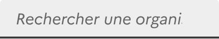

> Capture : _cf. rapport p.29-30_ · **Sévérité globale : 🔴 Bloquant** · Pages : P04/P05/P10/P11 · Fichier : `frontend/src/components/AccessibleAutocomplete.vue`
>
> 🎯 **Page-référence (grille)** : la grille classe 7.3 conforme sur **P11** mais NC sur P04/P05/P08/P10 → vérifier l'écart d'usage du composant sur P11 avant de généraliser le correctif clavier.

**État réel du code :** le composant **partage le même code** que la v1 (un seul `AccessibleAutocomplete.vue`). Le point **bloquant 7.3** de l'audit (« items sans `role="option"`, ne fonctionne pas au clavier ») est partiellement adressé : les items sont des `<li role="option">` et la navigation flèches HAUT/BAS + Entrée est gérée par `onKeydown`. **Mais** la sélection à la souris se fait via `@mousedown.prevent` sur des `<li>` non focusables (pas de `<button>`, pas de `tabindex`) : un utilisateur ne disposant que d'un pointeur logiciel ou d'une navigation séquentielle Tab ne peut pas atteindre/activer les items directement. L'audit préconise explicitement un `<button role="option">` par item.

**Problème :**

- `7.3` – **Bloquant** : items de liste non réellement actionnables au clavier en dehors des flèches (pas d'élément interactif `<button>` dans chaque item). À fiabiliser pour garantir l'activation au clavier.
- `7.1` – Majeur : idem v1 (nom du conteneur `aria-label` absent, `aria-autocomplete="list"` absent, surcharge `searchbox`).
- `7.5` – Majeur : message de statut sur le nombre de suggestions → **déjà présent** (région `aria-live`).

```vue
<!-- code actuel réel : items = <li role="option"> sans élément interactif, activés via mousedown -->
<li
  v-for="(item, index) in results"
  :key="index"
  class="autocomplete-item"
  :id="`autocomplete-item-${index}`"
  :class="{ highlighted: index === highlightedIndex }"
  @mousedown.prevent="select(item)"
  role="option"
  :aria-selected="index === highlightedIndex ? 'true' : 'false'"
>
  <slot name="suggestion" :item="item">{{ props.displayLabel(item) }}</slot>
</li>
```

**Solution :**

- Placer un `<button type="button" role="option">` à l'intérieur de chaque item, navigable et activable au clavier (Entrée/Espace), tout en conservant la navigation flèches via `aria-activedescendant`.
- Appliquer les correctifs `7.1` communs (cf. RGAA-018) : `aria-autocomplete="list"`, `aria-label` du `<ul>`, suppression de la surcharge `searchbox`.
- Conserver et enrichir la région `aria-live`.

```vue
<ul role="listbox" :aria-label="listLabel ?? 'Suggestions'">
  <li v-for="(item, index) in results" :key="index" class="autocomplete-item">
    <button
      type="button"
      role="option"
      :id="`autocomplete-item-${index}`"
      :class="{ highlighted: index === highlightedIndex }"
      :aria-selected="index === highlightedIndex ? 'true' : 'false'"
      @click="select(item)"
    >
      <slot name="suggestion" :item="item">{{ props.displayLabel(item) }}</slot>
    </button>
  </li>
</ul>
```

### RGAA-020 — Combobox v3 « tags »

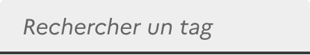

> Capture : _cf. rapport p.31_ · **Sévérité globale : 🔴 Bloquant** · Pages : P04/P05/P08/P10 · Fichier : `frontend/src/components/common/TagSearchSelect.vue`

**État réel du code :** `TagSearchSelect.vue` réutilise `AccessibleAutocomplete` avec `id="tag-search"` et `:isSearch="true"`. **Aucun `<label for="tag-search">` n'est présent** dans le composant : le seul intitulé « Tags » provient du parent (un `<legend>` du `fieldset` filtre, non associé au champ). Les correctifs `7.1` communs (nom du `<ul>`, `aria-autocomplete`, surcharge `searchbox`) sont hérités d'`AccessibleAutocomplete` et donc identiques à RGAA-010/018.

**Problème :**

- `11.1` – **Bloquant** : étiquette « Tags » non associée au champ (`<legend>` parent, pas de `<label for>` sur `tag-search`).
- `7.1` – Majeur : pas de nom (`aria-label`) sur le conteneur `<ul>` de la liste.
- `7.1` – Majeur : `role="searchbox"` non pertinent (`:isSearch="true"` → surcharge `onMounted`, cf. RGAA-010).
- `7.1` – Majeur : absence d'`aria-autocomplete="list"` sur le champ.

```vue
<!-- code actuel réel : aucun <label for>, autocomplete en isSearch (role searchbox) -->
<ul class="fr-tags-group" data-testid="info-tags">
  <li v-for="(tag, index) in props.tags" :key="index" class="tag-item">
    <DsfrTag :label="tag" selectable @click.stop.prevent="removeTag(index)" class="fr-tag--dismiss" />
  </li>
</ul>
<AccessibleAutocomplete
  id="tag-search"
  data-testid="search-tags"
  :search="getTagsOptions"
  placeholder="Rechercher un tag"
  :onChange="addTag"
  :displayNoResult="true"
  :isSearch="true"
  :displayLabel="(item) => item.name"
/>
```

**Solution :**

- Ajouter un `<label for="tag-search" class="fr-label">Tags</label>` (ou, à défaut, un `title="Tags"` répercuté sur le champ) explicitement lié à l'`id` du champ.
- Les `7.1` (nom du `<ul>`, `aria-autocomplete="list"`, suppression de la surcharge `searchbox`) sont résolus dans `AccessibleAutocomplete.vue` (cf. RGAA-010/018) — ici, fournir le `list-label` et retirer `:isSearch` ou conserver le rôle `combobox` corrigé.

```vue
<label for="tag-search" class="fr-label">Tags</label>
<AccessibleAutocomplete
  id="tag-search"
  data-testid="search-tags"
  title="Tags"
  list-label="Tags proposés"
  :search="getTagsOptions"
  placeholder="Rechercher un tag"
  :onChange="addTag"
  :displayNoResult="true"
  :displayLabel="(item) => item.name"
/>
```

### RGAA-021 — Boutons Tags

> _Pas de capture — nécessite des tags déjà sélectionnés (chips avec bouton « supprimer ») ; aucun tag actif dans le filtre au moment de la capture. Cf. rapport p.32-33._

> Capture : _cf. rapport p.32-33_ · **Sévérité globale : 🟠 Majeur** · Pages : P04/P05/P08/P10 · Fichier : `frontend/src/components/common/TagSearchSelect.vue`

**Problème :**

- `7.1` – Majeur : présence d'attributs `aria-pressed` inappropriés sur les boutons de tags. Les tags sélectionnés sont rendus via `<DsfrTag selectable>`, qui produit un `<button aria-pressed>` ; or ces boutons servent à **supprimer** le tag (action ponctuelle), pas à basculer un état → `aria-pressed` est sémantiquement faux.
- `7.1` – Majeur : intitulés des boutons peu explicites (le bouton n'annonce que le libellé du tag, sans indiquer l'action « Supprimer »).

```vue
<!-- code actuel réel : DsfrTag selectable → <button aria-pressed>, intitulé = libellé seul -->
<li v-for="(tag, index) in props.tags" :key="index" class="tag-item">
  <DsfrTag :label="tag" selectable @click.stop.prevent="removeTag(index)" class="fr-tag--dismiss" />
</li>
```

**Solution :**

- Ne pas utiliser le rendu `selectable` (qui pose `aria-pressed`) : utiliser un tag « dismiss » sans état pressé, ou poser explicitement un `<button>` sans `aria-pressed`.
- Ajouter un `title` explicite reprenant le libellé visible + le terme « Supprimer » : `title="Supprimer le tag : <valeur>"`.

```vue
<li v-for="(tag, index) in props.tags" :key="index" class="tag-item">
  <DsfrTag
    :label="tag"
    tag-name="button"
    class="fr-tag--dismiss"
    :title="`Supprimer le tag : ${tag}`"
    @click.stop.prevent="removeTag(index)"
  />
</li>
```

### RGAA-028 — Pagination v1 · Sémantique

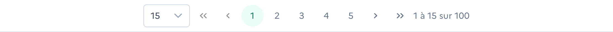

> Capture : _cf. rapport p.41_ · **Sévérité globale : 🟡 Mineur** · Pages : P04/P05/P11 · Fichier : `frontend/src/components/PaginationFooter.vue`

**Problème :**

- `8.9` – Mineur : présence d'un élément sans valeur sémantique. Le compteur de résultats est rendu dans un `<div>` (et le total dans une `footer-item`), alors qu'un texte porteur d'information doit utiliser un `<p>`.

```vue
<!-- code actuel réel -->
<div
  class="footer-item total-count"
  data-testid="pagination-total-count"
>{{ totalFiltered }} résultat(s)</div>
```

**Solution :**

- Remplacer le `<div>` du compteur par un `<p>` (élément à valeur sémantique).

```vue
<p
  class="footer-item total-count"
  data-testid="pagination-total-count"
>{{ totalFiltered }} résultat(s)</p>
```

### RGAA-029 — Pagination v1 · select « lignes par page »

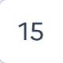

> Capture : _cf. rapport p.42_ · **Sévérité globale : 🔴 Bloquant** · Pages : P04/P05/P11 · Fichier : `frontend/src/components/PaginationFooter.vue`
>
> 🎯 **Page-référence (grille)** : 11.2 (étiquette pertinente) est conforme sur **8 pages** → reprendre un libellé d'étiquette explicite déjà en place ailleurs dans l'app.

**État réel du code :** le `<select>` « Résultats par page » possède **déjà** un `<label for="rows-per-page">Résultats par page</label>` associé — le point bloquant `11.1` audité (champ sans étiquette) et le `11.2` (étiquette vocalisée en anglais) **semblent déjà corrigés** sur ce `<select>` natif. Reste à vérifier qu'aucun `aria-label` anglais résiduel n'est posé, et le point `7.1` sur le **conteneur de liste** (`<ul>`) concerne la liste de pagination générée par `<DsfrPagination>`, qui n'a pas de nom accessible.

**Problème :**

- `11.1` – **Bloquant** : étiquette du champ « lignes par page » → **déjà traité** (`<label for="rows-per-page">` présent). À conserver.
- `11.2` – Majeur : étiquette vocalisée en anglais → **non reproduit** dans le code actuel (label FR « Résultats par page », pas d'`aria-label` EN). Vérifier l'absence de tout `aria-label` anglais (ex. hérité d'un composant DSFR/PrimeVue) et, le cas échéant, le supprimer au profit d'un `title` FR.
- `7.1` – Majeur : pas de nom (`aria-label`) sur le conteneur `<ul>` de la liste de pagination (généré par `<DsfrPagination>`).

```vue
<!-- code actuel réel : select déjà étiqueté en français -->
<div class="footer-item">
  <label for="rows-per-page" class="fr-label">Résultats par page</label>
  <select
    id="rows-per-page"
    class="fr-select"
    :value="limit"
    data-testid="pagination-rows-select"
    @change="emit('update:limit', +$event.target.value)"
  >
    <option v-for="opt in [5, 15, 30, 50, 100]" :key="opt" :value="opt">{{ opt }}</option>
  </select>
</div>

<DsfrPagination
  :current-page="page"
  :pages="pages"
  @update:current-page="emit('update:page', $event)"
/>
```

**Solution :**

- Conserver le `<label for>` (ou, à défaut d'étiquette visible souhaitée, ajouter `title="Choisir le nombre de lignes par page"` sur le `<select>` en lieu et place de tout `aria-label` anglais).
- S'assurer qu'aucun `aria-label` anglais n'est présent ; si DSFR en injecte un, le neutraliser.
- Nommer le `<ul>` de pagination via `aria-label="Pagination"` (à porter sur le wrapper `<nav>` de RGAA-006 ou directement sur le `<ul>` si exposé).

```vue
<select
  id="rows-per-page"
  class="fr-select"
  :value="limit"
  title="Choisir le nombre de lignes par page"
  data-testid="pagination-rows-select"
  @change="emit('update:limit', +$event.target.value)"
></select>
```

### RGAA-030 — Pagination v1 · boutons précédent/suivant


> Capture : _cf. rapport p.42_ · **Sévérité globale : 🟠 Majeur** · Pages : P04/P05/P11 · Fichier : `frontend/src/components/PaginationFooter.vue`

**Problème :**

- `8.7` – Majeur : absence de signalement de changement de langue. Les boutons « premier / précédent / suivant / dernier » générés par `<DsfrPagination>` exposent des `aria-label` en anglais (ex. `First page`, `Previous page`, `Next page`, `Last page`) au sein d'une page en français.

```vue
<!-- code actuel réel : les aria-label EN proviennent de DsfrPagination, non surchargés ici -->
<DsfrPagination
  :current-page="page"
  :pages="pages"
  data-testid="pagination-component"
  @update:current-page="emit('update:page', $event)"
/>
```

**Solution :**

- Fournir des libellés français à `<DsfrPagination>` via ses props de traduction si disponibles (ex. `first-page-title` / `last-page-title` / `previous-page-title` / `next-page-title`), sinon réécrire les `aria-label` en français après rendu.
- Cibler : `aria-label="Aller à la première page"`, `aria-label="Page précédente"`, `aria-label="Page suivante"`, `aria-label="Aller à la dernière page"`.

```vue
<DsfrPagination
  :current-page="page"
  :pages="pages"
  first-page-title="Aller à la première page"
  previous-page-title="Page précédente"
  next-page-title="Page suivante"
  last-page-title="Aller à la dernière page"
  data-testid="pagination-component"
  @update:current-page="emit('update:page', $event)"
/>
```

### RGAA-031 — Pagination v2 · Sémantique


> Capture : _cf. rapport p.43_ · **Sévérité globale : 🟡 Mineur** · Pages : P06 · Fichier : `frontend/src/components/PaginationFooter.vue`

**État réel du code :** la « pagination v2 » de la page historique (`views/MetadataPage.vue`) utilise le **même** composant `PaginationFooter.vue` (aucun composant de pagination dédié n'existe pour P06). Le `<div>` audité sans valeur sémantique correspond donc au même compteur de résultats que RGAA-028 (`<div class="footer-item total-count">`).

**Problème :**

- `8.9` – Mineur : présence d'un élément sans valeur sémantique (`<div>` au lieu d'un `<p>`) pour le texte du compteur de résultats affiché sous le tableau d'historique.

```vue
<!-- code actuel réel (partagé avec P06 via MetadataPage.vue) -->
<div
  class="footer-item total-count"
  data-testid="pagination-total-count"
>{{ totalFiltered }} résultat(s)</div>
```

**Solution :**

- Remplacer le `<div>` par un `<p>` (correction commune avec RGAA-028, puisque le composant est partagé).

```vue
<p
  class="footer-item total-count"
  data-testid="pagination-total-count"
>{{ totalFiltered }} résultat(s)</p>
```

### RGAA-032 — Pagination v2 · liens non explicites

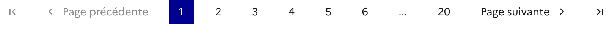

> Capture : _cf. rapport p.43_ · **Sévérité globale : 🟠 Majeur** · Pages : P06 · Fichier : `frontend/src/components/PaginationFooter.vue`

**État réel du code :** les pages passées à `<DsfrPagination>` portent **déjà** un `title: \`Page ${index + 1}\``dans le tableau`pages`calculé. Si les liens audités restent « peu explicites », c'est que ce`title`n'est pas répercuté par le composant DSFR sur les`<a>` (qui n'affichent que le numéro comme intitulé). À vérifier au rendu.

**Problème :**

- `6.1` – Majeur : présence d'intitulés de liens de pagination peu explicites (intitulé visible = numéro seul, ex. « 2 »).

```ts
// code actuel réel : title déjà fourni dans le modèle de pages
const pages = computed(() => {
  const totalPages = Math.max(1, Math.ceil(props.totalFiltered / props.limit));
  return Array.from({ length: totalPages }).map((_, index) => ({
    label: String(index + 1),
    title: `Page ${index + 1}`,
    href: `#page-${index + 1}`,
  }));
});
```

**Solution :**

- S'assurer que le `title` (`"Page 2"`, etc.) est bien rendu sur chaque `<a>` de pagination. Si `<DsfrPagination>` n'exploite pas la propriété `title` des `pages`, fournir l'intitulé explicite via la prop adéquate du composant (ou un `aria-label` par page), afin que chaque lien annonce « Page N ».

```ts
const pages = computed(() => {
  const totalPages = Math.max(1, Math.ceil(props.totalFiltered / props.limit));
  return Array.from({ length: totalPages }).map((_, index) => ({
    label: String(index + 1),
    title: `Page ${index + 1}`,
    ariaLabel: `Page ${index + 1}`, // si DsfrPagination expose aria-label par page
    href: `#page-${index + 1}`,
  }));
});
```

---

## Part 3 : Composant Filtre

### RGAA-022 — Filtre | Titre

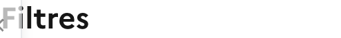

> Capture : _cf. rapport p.34_ · **Sévérité globale : 🟠 Majeur** · Pages : P04/P10 · Fichier : `frontend/src/components/search/SidebarFilter.vue`

**Problème :**

- `9.1` – majeur : Présence d'un titre de hiérarchie simulé. Le titre du panneau de filtres « Filtres » est rendu avec un `<h5>`, alors qu'aucun `<h2>`/`<h3>`/`<h4>` ne le précède dans la hiérarchie de la page de recherche. Le niveau de titre ne reflète donc pas la structure réelle du document (saut de niveau, hiérarchie « simulée » uniquement pour l'apparence).

```vue
<!-- frontend/src/components/search/SidebarFilter.vue (lignes 47-50) -->
<h5>Filtres</h5>
<p class="total-count" data-testid="sidebar-total-count">
  {{ total }} application(s) trouvée(s) sur {{ statsStore.totalApplications }}
</p>
```

**Solution :**

- Remplacer l'élément de titre `<h5>` par un titre `<h2>`, cohérent avec la hiérarchie de la page de recherche (le `<h1>` étant porté par la vue principale). On garde la même classe visuelle si nécessaire pour ne pas changer le rendu DSFR.
- Note (rapport) : pour des considérations de référencement, il est possible d'utiliser à la place un `role="heading"` + `aria-level="2"` sur un élément neutre.

```vue
<!-- Correction : vrai titre de niveau 2 -->
<h2 class="fr-h6">Filtres</h2>
<p class="total-count" data-testid="sidebar-total-count">
  {{ total }} application(s) trouvée(s) sur {{ statsStore.totalApplications }}
</p>

<!-- Variante role/aria-level si le niveau visuel h5 doit être conservé tel quel -->
<!-- <p role="heading" aria-level="2" class="filters-title">Filtres</p> -->
```

---

### RGAA-023 — Filtre | Regroupement de champ (sections Général, Qualité, Statut, Conformité)

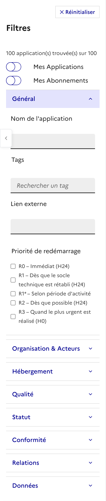

> Capture : _cf. rapport p.35_ · **Sévérité globale : 🟠 Majeur** · Pages : P04/P10 · Fichier : `frontend/src/components/search/PriorityRestartFilter.vue`, `frontend/src/components/search/StatusFilter.vue`, `frontend/src/components/search/ComplianceFilter.vue`, `frontend/src/components/search/QualityFilter.vue`, `frontend/src/components/search/ApplicationFilter.vue`

**Problème :**

- `11.5` – majeur : Absence de regroupement de champs de même nature. Plusieurs sections de filtres utilisent un `<legend>` orphelin (sans `<fieldset>` parent) ou aucun regroupement du tout autour de groupes de cases à cocher / champs de même nature. Un `<legend>` hors `<fieldset>` n'a aucune valeur sémantique. Fichiers concernés :
  - `PriorityRestartFilter.vue` (l.17) : `<legend>` « Priorité de redémarrage » sans `<fieldset>` autour du groupe de cases à cocher.
  - `StatusFilter.vue` (l.29) : `<legend>` « Statut de l'application » sans `<fieldset>` autour des cases à cocher.
  - `QualityFilter.vue` (l.30) : `<legend>` « Indice de qualité » sans `<fieldset>` autour des deux champs IQ min/max.
  - `ApplicationFilter.vue` (l.16) : `<legend>` « Tags » sans `<fieldset>`.
  - `ComplianceFilter.vue` : groupe de cases à cocher (« Conformité ») sans aucun `<legend>` ni `<fieldset>`.

```vue
<!-- frontend/src/components/search/PriorityRestartFilter.vue (lignes 15-31) — état réel -->
<template>
  <div>
    <legend class="fr-label fr-mb-2w">Priorité de redémarrage</legend>
    <div data-testid="priority-restart-filter">
      <label
        v-for="option in priorityRestartLabelsOptions"
        :key="option.value"
        class="checkbox-item"
      >
        <input
          type="checkbox"
          :value="option.value"
          :checked="filters.priorityRestart?.includes(option.value)"
          :data-testid="`priority-restart-option-${option.value}`"
          @change="(e) => togglePriority(option.value, (e.target as HTMLInputElement).checked)"
        />
        {{ option.text }}
      </label>
    </div>
  </div>
</template>
```

**Solution :**

- Entourer chaque groupe de champs de même nature d'un `<fieldset>`, et transformer le `<legend>` orphelin en `<legend>` réellement contenu dans ce `<fieldset>` (intitulé du regroupement). Le même correctif s'applique aux 5 composants listés : remplacer le `<div>` racine par un `<fieldset>` et placer le `<legend>` en premier enfant. La correction de RGAA-024 (séparation `label`/`input` + `for`/`id`) est intégrée ci-dessous sur l'exemple « Priorité de redémarrage ».

```vue
<!-- Correction : frontend/src/components/search/PriorityRestartFilter.vue -->
<template>
  <fieldset class="fr-fieldset" data-testid="priority-restart-filter">
    <legend class="fr-label fr-mb-2w">Priorité de redémarrage</legend>
    <div
      v-for="option in priorityRestartLabelsOptions"
      :key="option.value"
      class="checkbox-item"
    >
      <input
        :id="`priority-restart-option-${option.value}`"
        type="checkbox"
        :value="option.value"
        :checked="filters.priorityRestart?.includes(option.value)"
        :data-testid="`priority-restart-option-${option.value}`"
        @change="(e) => togglePriority(option.value, (e.target as HTMLInputElement).checked)"
      />
      <label :for="`priority-restart-option-${option.value}`">{{
        option.text
      }}</label>
    </div>
  </fieldset>
</template>
```

---

### RGAA-024 — Filtre | Cases à cocher


> Capture : _cf. rapport p.37_ · **Sévérité globale : 🟠 Majeur** · Pages : P04/P10 · Fichier : `frontend/src/components/search/ComplianceFilter.vue`, `frontend/src/components/search/StatusFilter.vue`, `frontend/src/components/search/PriorityRestartFilter.vue`, `frontend/src/components/search/HostingFilter.vue`

**Problème :**

- `11.1` – majeur : Présence d'étiquettes `<label>` englobant les champs `<input>` de type case à cocher sans attribut `for` ni identifiant `id` associé. Les cases à cocher des filtres sont écrites en HTML brut (pas via `<DsfrCheckbox>`) avec un `<label class="checkbox-item">` qui enveloppe l'`<input>`. Si l'association implicite par imbrication fonctionne parfois, l'absence de couple `id`/`for` explicite n'est pas fiable (et plusieurs technologies d'assistance ne restituent pas correctement l'étiquette). Le même pattern fautif se répète dans :
  - `ComplianceFilter.vue` (l.18-27)
  - `StatusFilter.vue` (l.31-52, deux groupes : « Sans statut » et la liste des statuts)
  - `PriorityRestartFilter.vue` (l.19-28)
  - `HostingFilter.vue` (l.80-88, case « Sans hébergement »)

```vue
<!-- frontend/src/components/search/ComplianceFilter.vue (lignes 15-30) — état réel -->
<template>
  <div>
    <div data-testid="compliance-filter">
      <label
        v-for="option in complianceOptions"
        :key="option"
        class="checkbox-item"
      >
        <input
          type="checkbox"
          :value="option"
          :checked="filters.compliance__in?.includes(option)"
          :data-testid="`compliance-option-${option}`"
          @change="(e) => toggleCompliance(option, (e.target as HTMLInputElement).checked)"
        />
        {{ option.toUpperCase() }}
      </label>
    </div>
  </div>
</template>
```

**Solution :**

- Sortir le champ `<input>` de l'élément `<label>` et lier les deux par un `id` unique sur l'`<input>` et un `for` identique sur le `<label>`. La valeur du `data-testid` (déjà unique par option) sert d'identifiant. Appliquer le même correctif aux 4 fichiers listés. Profiter de l'occasion pour entourer le groupe d'un `<fieldset>`/`<legend>` (cf. RGAA-023).

```vue
<!-- Correction : frontend/src/components/search/ComplianceFilter.vue -->
<template>
  <fieldset class="fr-fieldset" data-testid="compliance-filter">
    <legend class="fr-label fr-mb-2w">Conformité</legend>
    <div
      v-for="option in complianceOptions"
      :key="option"
      class="checkbox-item"
    >
      <input
        :id="`compliance-option-${option}`"
        type="checkbox"
        :value="option"
        :checked="filters.compliance__in?.includes(option)"
        :data-testid="`compliance-option-${option}`"
        @change="(e) => toggleCompliance(option, (e.target as HTMLInputElement).checked)"
      />
      <label :for="`compliance-option-${option}`">{{
        option.toUpperCase()
      }}</label>
    </div>
  </fieldset>
</template>
```

```vue
<!-- Correction : frontend/src/components/search/HostingFilter.vue (case « Sans hébergement ») -->
<div class="checkbox-item">
  <input
    id="hosting-missing-checkbox"
    type="checkbox"
    :checked="Boolean(filters.missingHosting)"
    data-testid="hosting-missing-checkbox"
    @change="(e) => toggleMissingHosting((e.target as HTMLInputElement).checked)"
  />
  <label for="hosting-missing-checkbox">Sans hébergement</label>
</div>
```

> Alternative recommandée à terme : remplacer ces cases à cocher HTML brutes par le composant DSFR `<DsfrCheckbox>` (qui gère nativement le couple `id`/`for` et le balisage `fr-fieldset`/`fr-checkbox-group`), pour homogénéiser avec le reste du design system.

---

## Part 4 : Formulaire création/édition d'application

### RGAA-025 — WYSIWYG · Information communiquée par la couleur et par la forme


> Capture : _cf. rapport p.38_ · **Sévérité globale : 🟠 Majeur** · Pages : P05/P08 · Fichier : `frontend/src/components/MarkdownEditor.vue`

**Problème :**

- `7.1` – majeur : l'état actif du bouton « éditer » / « aperçu » est uniquement porté par une classe CSS visuelle (`.active`, ombre, transform) et n'est pas restitué dans le code aux technologies d'assistance.
- `10.2` – majeur : avec les CSS désactivées, aucun contenu visible ne porte l'information de l'onglet actif (seule l'icône `fr-icon-*` reste, et elle est `aria-hidden="true"`).

```vue
<button
  v-for="tab in tabs"
  :key="tab.value"
  :data-testid="`markdown-tab-${tab.value}`"
  :title="tab.title"
  type="button"
  class="icon-button"
  :class="{ active: currentTab === tab.value }"
  @click="currentTab = tab.value"
>
  <i :class="`fr-icon-${tab.icon}`" aria-hidden="true" />
</button>
```

**Solution :**

- Exposer l'état actif avec `aria-current="true"` sur le bouton sélectionné (rendu dans le code).
- Ajouter un intitulé textuel masqué visuellement mais restitué par les TA et présent CSS désactivées via un `<span class="fr-sr-only">` (DSFR). Pour le bouton « éditer », préciser le format markdown (recommandation).

```vue
<button
  v-for="tab in tabs"
  :key="tab.value"
  :data-testid="`markdown-tab-${tab.value}`"
  :title="tab.title"
  type="button"
  class="icon-button"
  :class="{ active: currentTab === tab.value }"
  :aria-current="currentTab === tab.value ? 'true' : undefined"
  @click="currentTab = tab.value"
>
  <i :class="`fr-icon-${tab.icon}`" aria-hidden="true" />
  <span class="fr-sr-only">{{ tab.value === "edit" ? "Éditer le texte en format markdown" : "Visualiser l'aperçu" }}</span>
</button>
```

### RGAA-026 — WYSIWYG · Champ `<textarea>`


> Capture : _cf. rapport p.39_ · **Sévérité globale : 🔴 Bloquant** · Pages : P05/P08 · Fichier : `frontend/src/components/MarkdownEditor.vue`
>
> 🎯 **Page-référence (grille)** : le piège clavier (12.9) est circonscrit à **P05/P08** (ce composant) ; les 9 autres pages sont conformes → **un seul correctif sur `MarkdownEditor.vue` suffit** à couvrir 12.9.

**Problème :**

- `11.1` – bloquant : la zone de saisie n'a pas d'étiquette visible. Elle ne reçoit qu'un `:aria-label="ariaLabel"` (optionnel, et invisible — l'attribut `title` faisant office d'étiquette visible est absent).
- `12.9` – bloquant : piège au clavier. La touche `Tab` est interceptée par `handleKeydown` (`event.preventDefault()` systématique pour indenter), ce qui empêche de sortir de la zone de texte vers l'élément interactif suivant.

```vue
<textarea
  v-if="currentTab === 'edit'"
  ref="textareaRef"
  v-model="localValue"
  class="editor fr-input"
  :disabled
  :aria-label="ariaLabel"
  rows="10"
  data-testid="markdown-textarea"
  @input="emitChange"
  @keydown="handleKeydown"
/>
```

```ts
function handleKeydown(event: KeyboardEvent) {
  const textarea = textareaRef.value;
  if (!textarea) return;
  const start = textarea.selectionStart;
  const end = textarea.selectionEnd;

  if (event.key === "Tab") {
    event.preventDefault();
    // ... indentation, le focus reste piégé dans la zone de texte
    return;
  }
  // ...
}
```

**Solution :**

- Ajouter un `title` pertinent (« Description ») qui fait office d'étiquette visible, en plus de l'`aria-label`.
- Lever le piège clavier : ne pas capturer `Tab` par défaut. Proposition : laisser `Tab` naviguer normalement et ne déclencher l'indentation qu'avec un raccourci documenté (ou désactiver la capture). Ici on rend `Tab` naturel ; on conserve l'indentation sur `Tab` uniquement quand du texte est sélectionné (multi-lignes), et on permet la sortie sinon.

```vue
<textarea
  v-if="currentTab === 'edit'"
  ref="textareaRef"
  v-model="localValue"
  class="editor fr-input"
  :disabled
  :aria-label="ariaLabel"
  title="Description"
  rows="10"
  data-testid="markdown-textarea"
  @input="emitChange"
  @keydown="handleKeydown"
/>
```

```ts
function handleKeydown(event: KeyboardEvent) {
  const textarea = textareaRef.value;
  if (!textarea) return;
  const start = textarea.selectionStart;
  const end = textarea.selectionEnd;

  // 12.9 : ne pas piéger le focus. Tab n'indente que si une portion est sélectionnée,
  // sinon on laisse la tabulation atteindre l'élément suivant/précédent.
  if (event.key === "Tab" && start !== end) {
    event.preventDefault();
    // ... indentation des lignes sélectionnées
    return;
  }
  // Tab sans sélection : comportement natif (sortie du champ) -> pas de preventDefault
  // ... gestion Enter inchangée
}
```

### RGAA-033 — Champs « Populations » et « Objectifs » · Regroupement de champs


> Capture : _cf. rapport p.44_ · **Sévérité globale : 🟠 Majeur** · Pages : P05/P08 · Fichier : `frontend/src/components/form/ApplicationForm.vue`

**Problème :**

- `11.5` – majeur : les champs de même nature (chaque ligne « Population », chaque ligne « Objectif ») ne sont pas regroupés. Le code utilise un `<div class="fr-form-group">` avec une `<legend>` orpheline (une `<legend>` hors `<fieldset>` n'a pas de valeur de regroupement).

```vue
<div class="fr-form-group fr-mt-3w">
  <legend class="fr-label">Populations</legend>
  <p class="fr-hint-text">Indiquez ici le public cible concerné (ex. : RH, agents publics, entreprises...)</p>
  <div class="fr-mt-2w">
    <div v-for="(_targetPopulation, index) in form.targetPopulations" :key="index" class="fr-grid-row fr-grid-row--gutters fr-mb-2w">
      <div class="fr-col">
        <DsfrInput v-model.trim="form.targetPopulations[index]" :disabled="!canEditBase" :data-testid="`application-population-${index}`" />
      </div>
      <!-- ... bouton supprimer ... -->
    </div>
    <!-- ... bouton ajouter ... -->
  </div>
</div>
```

**Solution :**

- Remplacer le `<div class="fr-form-group">` par un `<fieldset>` et la `<legend>` orpheline par une vraie `<legend>` enfant du `<fieldset>`. Idem pour « Objectifs ».

```vue
<fieldset class="fr-fieldset fr-mt-3w">
  <legend class="fr-fieldset__legend fr-label">Populations</legend>
  <p class="fr-hint-text">Indiquez ici le public cible concerné (ex. : RH, agents publics, entreprises...)</p>
  <div class="fr-mt-2w">
    <div v-for="(_targetPopulation, index) in form.targetPopulations" :key="index" class="fr-grid-row fr-grid-row--gutters fr-mb-2w">
      <div class="fr-col">
        <DsfrInput
          v-model.trim="form.targetPopulations[index]"
          :disabled="!canEditBase"
          :title="`Population champ numéro ${index + 1}`"
          :data-testid="`application-population-${index}`"
        />
      </div>
      <!-- ... -->
    </div>
  </div>
</fieldset>
```

### RGAA-034 — Champs « Populations » et « Objectifs » · Sémantique (`<label>` vides)


> Capture : _cf. rapport p.45_ · **Sévérité globale : 🟡 Mineur** · Pages : P05/P08 · Fichier : `frontend/src/components/form/ApplicationForm.vue`

**Problème :**

- `8.9` – mineur : les `DsfrInput` des lignes « Population » / « Objectif » sont rendus par le composant DSFR avec un élément `<label>` vide (aucune prop `label` fournie), élément sans valeur sémantique.

```vue
<DsfrInput
  v-model.trim="form.targetPopulations[index]"
  :disabled="!canEditBase"
  :data-testid="`application-population-${index}`"
/>
<!-- DsfrInput génère un <label> vide car aucune prop `label` n'est passée -->
```

**Solution :**

- Ne pas laisser le composant produire de `<label>` vide. Soit fournir une étiquette réelle (voir RGAA-035 : `title`), soit, si l'on garde une mise en forme spécifique, utiliser exclusivement du CSS et supprimer le `<label>` vide. Avec DSFR, fournir un `title` (étiquette visible) sur l'input plutôt qu'un `label` vide résout 8.9 et 11.1 simultanément.

```vue
<DsfrInput
  v-model.trim="form.targetPopulations[index]"
  :disabled="!canEditBase"
  :title="`Population champ numéro ${index + 1}`"
  :data-testid="`application-population-${index}`"
/>
```

### RGAA-035 — Champs « Populations » et « Objectifs » · Champs sans étiquette


> Capture : _cf. rapport p.45_ · **Sévérité globale : 🔴 Bloquant** · Pages : P05/P08 · Fichier : `frontend/src/components/form/ApplicationForm.vue`

**Problème :**

- `11.1` – bloquant : aucun des champs « Population » / « Objectif » n'a d'étiquette visible. Pour « Objectif » un `:placeholder="\`Objectif ${index + 1}\`"` existe mais un placeholder ne tient pas lieu d'étiquette ; pour « Population » il n'y a rien.

```vue
<DsfrInput
  v-model.trim="form.purposes[index]"
  :disabled="!canEditBase"
  :placeholder="`Objectif ${index + 1}`"
  :data-testid="`application-purpose-${index}`"
/>
```

**Solution :**

- Ajouter un `title` numéroté et cohérent sur chaque champ (l'attribut `title` faisant office d'étiquette visible). Faire de même pour « Populations ».

```vue
<DsfrInput
  v-model.trim="form.purposes[index]"
  :disabled="!canEditBase"
  :title="`Objectif champ numéro ${index + 1}`"
  :data-testid="`application-purpose-${index}`"
/>
```

### RGAA-036 — Champs « Populations » et « Objectifs » · Boutons « Supprimer »

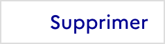

> Capture : _cf. rapport p.46_ · **Sévérité globale : 🟠 Majeur** · Pages : P05/P08 · Fichier : `frontend/src/components/form/ApplicationForm.vue`

**Problème :**

- `7.1` – majeur : l'intitulé du bouton de suppression ne reprend ni le contexte ni la numérotation (`title="Supprimer cet objectif"` est identique pour toutes les lignes, donc non distinctif).
- `12.8` – majeur : après suppression, l'ordre de tabulation est incohérent car aucun focus n'est repositionné (`removePurpose` / `removePopulation` se contentent d'un `splice`).

```vue
<DsfrButton
  type="button"
  tertiary
  size="sm"
  icon="delete-line"
  label="Supprimer"
  title="Supprimer cet objectif"
  aria-label="Supprimer cet objectif"
  :disabled="!canEditBase"
  :data-testid="`application-purpose-remove-${index}`"
  @click="removePurpose(index)"
/>
```

```ts
function removePurpose(index: number) {
  form.value.purposes.splice(index, 1);
}
function removePopulation(index: number) {
  form.value.targetPopulations.splice(index, 1);
}
```

**Solution :**

- Contextualiser et numéroter l'intitulé : `title`/`aria-label` = « Supprimer le champ de l'objectif numéro N ».
- Après suppression, déplacer le focus sur le 1er champ restant ; s'il n'en reste aucun, sur le bouton « Ajouter ». Idem « Population ».

```vue
<DsfrButton
  type="button"
  tertiary
  size="sm"
  icon="delete-line"
  label="Supprimer"
  :title="`Supprimer le champ de l'objectif numéro ${index + 1}`"
  :aria-label="`Supprimer le champ de l'objectif numéro ${index + 1}`"
  :disabled="!canEditBase"
  :data-testid="`application-purpose-remove-${index}`"
  @click="removePurpose(index)"
/>
```

```ts
const purposeAddBtn = ref<HTMLElement | null>(null); // ref sur le DsfrButton "Ajouter un objectif"

async function removePurpose(index: number) {
  form.value.purposes.splice(index, 1);
  await nextTick();
  if (form.value.purposes.length > 0) {
    document
      .querySelector<HTMLInputElement>('[data-testid="application-purpose-0"]')
      ?.focus();
  } else {
    document
      .querySelector<HTMLButtonElement>(
        '[data-testid="application-purpose-add"]',
      )
      ?.focus();
  }
}
// removePopulation : même logique avec les data-testid "application-population-0" / "application-population-add"
```

### RGAA-037 — Champs « Populations » et « Objectifs » · Boutons « Ajouter »


> Capture : _cf. rapport p.47_ · **Sévérité globale : 🟠 Majeur** · Pages : P05/P08 · Fichier : `frontend/src/components/form/ApplicationForm.vue`

**Problème :**

- `12.8` – majeur : après activation de « Ajouter un objectif » / « Ajouter une population », le focus reste sur le bouton « Ajouter ». L'ordre de tabulation devient incohérent : l'utilisateur clavier ne sait pas qu'un nouveau champ vide est apparu au-dessus.

```ts
function addPurpose() {
  form.value.purposes.push("");
}
function addPopulation() {
  form.value.targetPopulations.push("");
}
```

**Solution :**

- Après l'ajout, déplacer le focus sur le nouveau champ affiché. Idem « population ».

```ts
async function addPurpose() {
  form.value.purposes.push("");
  await nextTick();
  const last = form.value.purposes.length - 1;
  document
    .querySelector<HTMLInputElement>(
      `[data-testid="application-purpose-${last}"]`,
    )
    ?.focus();
}

async function addPopulation() {
  form.value.targetPopulations.push("");
  await nextTick();
  const last = form.value.targetPopulations.length - 1;
  document
    .querySelector<HTMLInputElement>(
      `[data-testid="application-population-${last}"]`,
    )
    ?.focus();
}
// Penser à importer nextTick depuis "vue".
```

### RGAA-038 — Champ « Organisation » · Champ sans étiquette


> Capture : _cf. rapport p.48_ · **Sévérité globale : 🔴 Bloquant** · Pages : P05/P08 · Fichier : `frontend/src/components/common/OrganizationSearchSelect.vue`

**Problème :**

- `11.1` – bloquant : le `<select>` de suggestions (`DsfrSelect`) est rendu avec `:label-visible="false"` et sans `label`, donc sans étiquette visible.
- `8.9` – mineur : ce `DsfrSelect` produit en conséquence un `<label>` vide.

```vue
<div v-if="selectOptions.length > 0" class="fr-mt-1w">
  <DsfrSelect v-model="selectedOrganizationId" :options="selectOptions" :disabled="isLoading" :label-visible="false" />
</div>
```

**Solution :**

- Renseigner l'étiquette du `DsfrSelect` (visible) avec un intitulé explicite, par exemple « Choisir une organisation de votre choix ». Cela corrige 11.1 et 8.9 en même temps.

```vue
<div v-if="selectOptions.length > 0" class="fr-mt-1w">
  <DsfrSelect
    v-model="selectedOrganizationId"
    :options="selectOptions"
    :disabled="isLoading"
    label="Choisir une organisation de votre choix"
    label-visible
  />
</div>
```

### RGAA-039 — Champ « Organisation » · Regroupement de champ


> Capture : _cf. rapport p.48_ · **Sévérité globale : 🟠 Majeur** · Pages : P05/P08 · Fichier : `frontend/src/components/common/OrganizationSearchSelect.vue`

**Problème :**

- `11.5` – majeur : le champ de recherche (`DsfrInputGroup`) et le `<select>` de résultats sont deux champs de même nature non regroupés. Le conteneur est un simple `<div>` sans rôle de regroupement.

```vue
<template>
  <div>
    <div class="fr-form-group">
      <DsfrInputGroup v-model.trim="searchQuery" :label="searchLabel" ... />
    </div>
    <div v-if="selectOptions.length > 0" class="fr-mt-1w">
      <DsfrSelect
        v-model="selectedOrganizationId"
        :options="selectOptions"
        ...
      />
    </div>
    <!-- messages de statut -->
  </div>
</template>
```

**Solution :**

- Soit un `<fieldset>`/`<legend>`, soit `role="group"` + `aria-labelledby` pointant vers l'intitulé de la légende. Variante `role="group"` (plus souple avec DSFR) :

```vue
<template>
  <div role="group" :aria-labelledby="groupLabelId">
    <p :id="groupLabelId" class="fr-label">{{ searchLabel }}</p>
    <div class="fr-form-group">
      <DsfrInputGroup v-model.trim="searchQuery" :label="searchLabel" ... />
    </div>
    <div v-if="selectOptions.length > 0" class="fr-mt-1w">
      <DsfrSelect
        v-model="selectedOrganizationId"
        :options="selectOptions"
        ...
      />
    </div>
    <!-- messages de statut -->
  </div>
</template>
```

```ts
import { useId } from "vue";
const groupLabelId = `org-search-group-${useId()}`;
```

### RGAA-040 — Champ « Organisation » · Message de statut

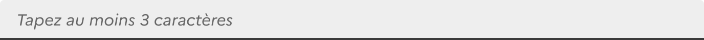

> Capture : _cf. rapport p.49_ · **Sévérité globale : 🟠 Majeur** · Pages : P05/P08 · Fichier : `frontend/src/components/common/OrganizationSearchSelect.vue`

**Problème :**

- `7.5` – majeur : les paragraphes annonçant le nombre de suggestions (« N résultats trouvés ») ou « Aucune organisation trouvée » ne sont pas des messages de statut : ils n'ont ni `aria-live` ni `aria-atomic`, donc leur mise à jour n'est pas annoncée aux technologies d'assistance.

```vue
<div
  v-if="searchQuery && !isLoading && organizations.length > 0"
  class="fr-mt-1w"
>
  <p class="fr-text--xs fr-text--mention-grey">
    {{ organizations.length }} résultat{{ organizations.length > 1 ? "s" : "" }} trouvé{{ organizations.length > 1 ? "s" : "" }}
  </p>
</div>

<div v-else-if="searchQuery && organizations.length === 0" class="fr-mt-1w">
  <p class="fr-text--xs fr-text--mention-grey">Aucune organisation trouvée</p>
</div>
```

**Solution :**

- Regrouper le statut dans un unique conteneur live `aria-live="polite"` `aria-atomic="true"` (présent dans le DOM en permanence pour que les changements soient bien notifiés).

```vue
<div
  class="fr-mt-1w"
  aria-live="polite"
  aria-atomic="true"
  data-testid="org-search-status"
>
  <p v-if="searchQuery && !isLoading && organizations.length > 0" class="fr-text--xs fr-text--mention-grey">
    {{ organizations.length }} résultat{{ organizations.length > 1 ? "s" : "" }} trouvé{{ organizations.length > 1 ? "s" : "" }}
  </p>
  <p v-else-if="searchQuery && !isLoading && organizations.length === 0" class="fr-text--xs fr-text--mention-grey">
    Aucune organisation trouvée
  </p>
</div>
```

### RGAA-048 — Modales · Indication du caractère obligatoire

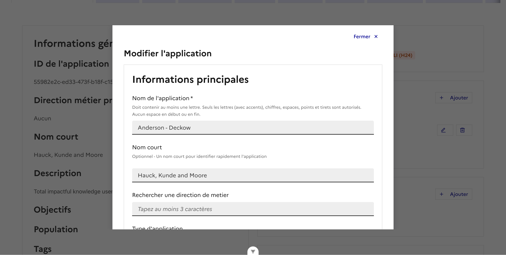

> Capture : _cf. rapport p.57-58_ · **Sévérité globale : 🟠 Majeur** · Pages : P05 · Fichiers : `frontend/src/components/form/ApplicationForm.vue`, `frontend/src/components/hosting/HostingModal.vue`, `frontend/src/components/form/LinkForm.vue`, `frontend/src/components/label/LabelModal.vue`

**Problème :**

- `11.10` – majeur : aucune indication en amont du formulaire ne signale que les champs marqués `*` (rendus par la prop `required` de DSFR) sont obligatoires. Exemple dans `LabelModal.vue` : le formulaire commence directement par les champs, sans mention.

```vue
<!-- LabelModal.vue : aucun texte d'amont indiquant le rôle de l'astérisque -->
<form data-testid="label-form" @submit.prevent="handleSubmit">
  <div v-else class="fr-form-group">
    <DsfrInput v-model="labelForm.value" required label-visible label="Valeur" ... />
    <DsfrInput v-model="labelSourceSearch" label-visible label="Source de noms" ... />
  </div>
  ...
</form>
```

**Solution :**

- Ajouter en début de chaque formulaire un `<p>Tous les champs avec un * sont obligatoires</p>`. À répéter dans `HostingModal.vue`, `LinkForm.vue`, `LabelModal.vue` et au début de `ApplicationForm.vue`.

```vue
<form data-testid="label-form" @submit.prevent="handleSubmit">
  <p class="fr-text--sm fr-mb-2w" data-testid="required-fields-hint">Tous les champs avec un * sont obligatoires</p>
  <div v-else class="fr-form-group">
    <DsfrInput v-model="labelForm.value" required label-visible label="Valeur" ... />
    ...
  </div>
  ...
</form>
```

### RGAA-049 — Modales · Champ en erreur, nommer le champ

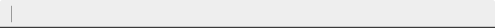

> Capture : _cf. rapport p.59_ · **Sévérité globale : 🟠 Majeur** · Pages : P05 · Fichiers : `frontend/src/components/form/LinkForm.vue`, `frontend/src/components/hosting/HostingModal.vue`, `frontend/src/components/label/LabelModal.vue`, `frontend/src/components/form/ApplicationForm.vue`

**Problème :**

- `11.10` – majeur : les messages d'erreur ne citent pas nommément le champ concerné. Dans `LinkForm.vue` la validation repose entièrement sur l'attribut natif `required` (message navigateur générique « Veuillez renseigner ce champ »), sans message applicatif nommant « Type de lien », « URL », « Description ». Dans `HostingModal.vue`, le bouton est seulement désactivé (`!isFormValid`) sans message indiquant quel champ manque.

```vue
<!-- LinkForm.vue : pas de message d'erreur applicatif nommant le champ -->
<DsfrSelect
  v-model="form.type"
  :options="linkTypes"
  label="Type de lien"
  label-visible
  required
  ...
/>
<DsfrInput
  v-model="form.link"
  label="URL"
  type="url"
  label-visible
  required
  ...
/>
<DsfrInput
  v-model="form.description"
  label="Description"
  label-visible
  required
  is-textarea
  ...
/>
```

**Solution :**

- Ajouter une validation applicative qui produit un `error-message` nommant le champ, ex. « Veuillez compléter le champ : Type de lien ». À appliquer aussi au champ « Valeur » (LabelModal) et « Durée d'interruption maximale » (DIMA).

```vue
<DsfrSelect
  v-model="form.type"
  :options="linkTypes"
  label="Type de lien"
  label-visible
  required
  :error-message="typeError"
  data-testid="link-type-select"
/>
```

```ts
const typeError = ref<string | undefined>();
const linkError = ref<string | undefined>();
const descriptionError = ref<string | undefined>();

function handleSubmit() {
  typeError.value = form.value.type
    ? undefined
    : "Veuillez compléter le champ : Type de lien";
  linkError.value = form.value.link
    ? undefined
    : "Veuillez compléter le champ : URL";
  descriptionError.value = form.value.description
    ? undefined
    : "Veuillez compléter le champ : Description";
  if (typeError.value || linkError.value || descriptionError.value) return;
  emit("submit", form.value);
}
```

### RGAA-050 — Modale « Modifier l'application » · Erreur « Description »

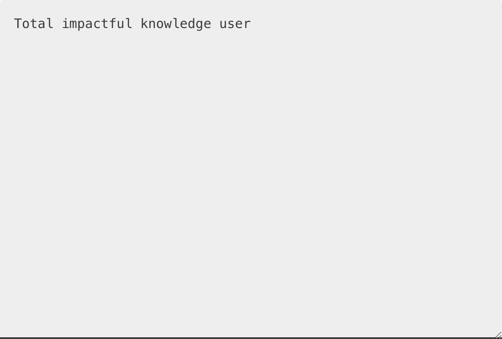

> Capture : _cf. rapport p.60_ · **Sévérité globale : 🟠 Majeur** · Pages : P05 · Fichier : `frontend/src/components/form/ApplicationForm.vue`

**Problème :**

- `11.10` – majeur : le message d'erreur de la description (`descriptionError`) est affiché par le `DsfrInputGroup` parent, mais le champ réellement éditable est le `<textarea>` interne au `MarkdownEditor`. Aucun `aria-describedby` ne relie ce `<textarea>` au message d'erreur : le message ne pointe pas vers le champ.

```vue
<DsfrInputGroup
  class="fr-mt-3w"
  label="Description"
  label-visible
  required
  :error-message="descriptionError"
>
  <MarkdownEditor
    v-model.trim="form.description"
    :disabled="!canEditBase"
    aria-label="Description"
    data-testid="application-description"
  />
</DsfrInputGroup>
```

**Solution :**

- Donner un `id` unique au message d'erreur et le passer au `<textarea>` du `MarkdownEditor` via `aria-describedby`. On étend `MarkdownEditor` d'une prop `describedby` répercutée sur le `<textarea>`.

```vue
<!-- ApplicationForm.vue -->
<DsfrInputGroup
  class="fr-mt-3w"
  label="Description"
  label-visible
  required
  :error-message="descriptionError"
>
  <MarkdownEditor
    v-model.trim="form.description"
    :disabled="!canEditBase"
    aria-label="Description"
    :describedby="descriptionError ? 'application-description-error' : undefined"
    data-testid="application-description"
  />
</DsfrInputGroup>
<!-- DsfrInputGroup doit rendre l'error-message avec id="application-description-error"
     (sinon ajouter un <p :id="..."> manuel relié au textarea) -->
```

```vue
<!-- MarkdownEditor.vue -->
const props = defineProps<{ modelValue: string; disabled: boolean; ariaLabel?:
string; describedby?: string }>();

<textarea
  ...
  :aria-label="ariaLabel"
  :aria-describedby="describedby"
  title="Description"
/>
```

### RGAA-051 — Boutons « Modifier » et « Ajouter »

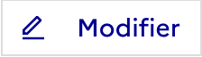

> Capture : _cf. rapport p.61_ · **Sévérité globale : 🟠 Majeur** · Pages : P05 · Fichier : `frontend/src/components/InformationsGenerales.vue`

**Problème :**

- `7.1` – majeur : les intitulés « Modifier » et « Ajouter » des cartes ne sont pas suffisamment explicites (plusieurs boutons « Ajouter » identiques pour « Hébergement » et « Noms alternatifs »).

```vue
<DsfrButton
  tertiary
  size="sm"
  class="fr-btn--icon-left fr-icon-edit-line"
  label="Modifier"
  data-testid="info-edit-btn"
  :disabled="!canEditBase"
  @click="applicationModal.openModal"
/>
...
<DsfrButton
  tertiary
  size="sm"
  class="fr-btn--icon-left fr-icon-add-line"
  label="Ajouter"
  data-testid="info-add-hosting-btn"
  :disabled="!canEditHostings"
  @click="isHostingModalOpen = true"
/>
...
<DsfrButton
  tertiary
  size="sm"
  class="fr-btn--icon-left fr-icon-add-line"
  label="Ajouter"
  data-testid="info-add-label-btn"
  :disabled="!canEditBase"
  @click="openCreateLabelModal"
/>
```

**Solution :**

- Ajouter un `title` contextualisé reprenant le titre de la section (le `label` visible reste court).

```vue
<DsfrButton
  ...
  label="Modifier"
  title="Modifier – Informations générales"
  data-testid="info-edit-btn"
  ...
/>
...
<DsfrButton
  ...
  label="Ajouter"
  title="Ajouter un hébergement"
  data-testid="info-add-hosting-btn"
  ...
/>
...
<DsfrButton
  ...
  label="Ajouter"
  title="Ajouter des noms alternatifs"
  data-testid="info-add-label-btn"
  ...
/>
```

### RGAA-067 — P08 étapes 1 & 3 · Indication du caractère obligatoire

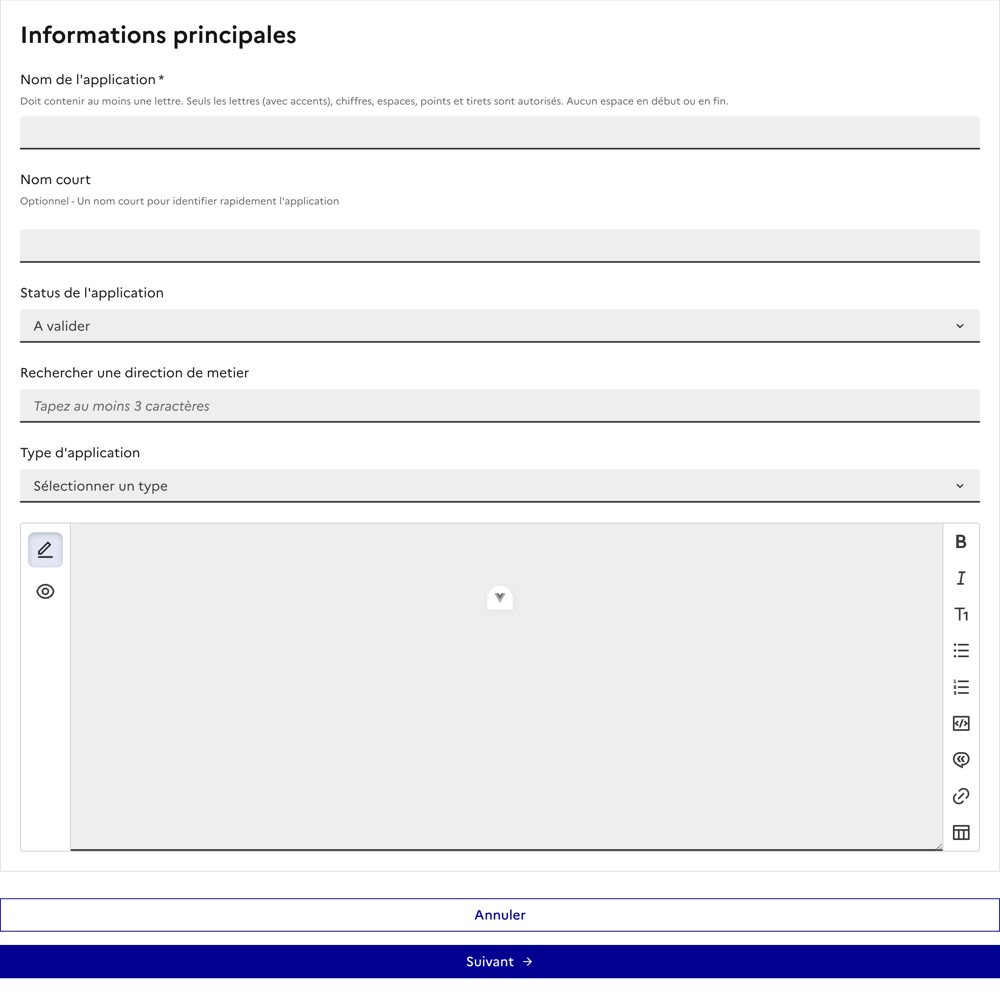

> Capture : _cf. rapport p.72_ · **Sévérité globale : 🟠 Majeur** · Pages : P08 · Fichiers : `frontend/src/components/form/ApplicationForm.vue`, `frontend/src/views/CreateApplicationPage.vue`

**Problème :**

- `11.10` – majeur : en mode création (stepper), les étapes 1 et 3 ne signalent pas en amont que les champs `*` sont obligatoires. L'étape 1 commence directement par le `<h3>` puis les champs ; l'étape 3 (MOA) n'indique que « Toutes les informations du contact MOA sont obligatoires » mais pas la convention de l'astérisque pour l'ensemble du formulaire.

```vue
<!-- Étape 1 : aucun rappel de la convention * -->
<div v-if="!isCreateMode || currentStep === 1" class="fr-card fr-p-3w">
  <h3 class="fr-mb-3w">Informations principales</h3>
  <DsfrInputGroup v-model.trim="form.label" label="Nom de l'application" label-visible required ... />
  ...
</div>
```

**Solution :**

- Ajouter, en tête de formulaire (juste après le `<DsfrStepper>` / l'ouverture du `<form>`), un `<p>Tous les champs avec un * sont obligatoires</p>` visible à chaque étape.

```vue
<form data-testid="application-form" @submit.prevent="handleSubmit">
  <p class="fr-text--sm fr-mb-3w" data-testid="required-fields-hint">Tous les champs avec un * sont obligatoires</p>
  <DsfrStepper v-if="isCreateMode" :steps="steps" :current-step="currentStep" class="fr-mb-4w" />
  <div v-if="!isCreateMode || currentStep === 1" class="fr-card fr-p-3w">
    ...
  </div>
</form>
```

### RGAA-068 — P08 étape 1 · `<textarea>` obligatoire (erreur non reliée)

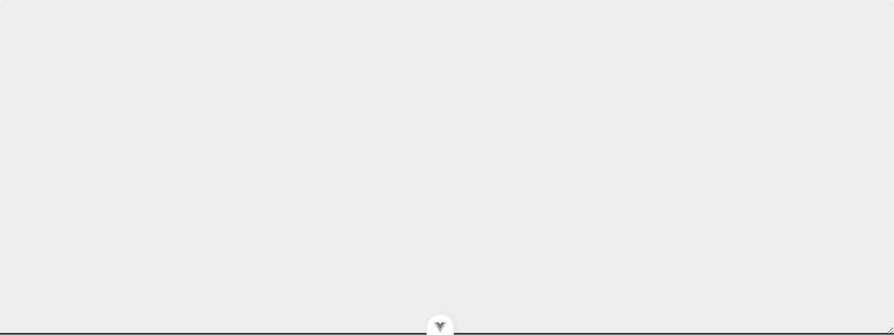

> Capture : _cf. rapport p.73_ · **Sévérité globale : 🟠 Majeur** · Pages : P08 · Fichier : `frontend/src/components/form/ApplicationForm.vue`

**Problème :**

- `11.10` – majeur : à l'étape 1, le message d'erreur « La description est obligatoire. » (`descriptionError`) ne pointe pas vers le champ : le `<textarea>` du `MarkdownEditor` n'a pas d'`aria-describedby` reliant le message. Le champ « Nom de l'application » (`DsfrInputGroup` natif) gère bien cette liaison, mais pas la description.

```ts
function validateStep1(): boolean {
  labelError.value = undefined;
  descriptionError.value = undefined;
  if (form.value.label === "") {
    labelError.value = "Le nom de l'application est obligatoire.";
    return false;
  }
  if (form.value.description === "") {
    descriptionError.value = "La description est obligatoire.";
    return false;
  }
  return true;
}
```

```vue
<DsfrInputGroup
  class="fr-mt-3w"
  label="Description"
  label-visible
  required
  :error-message="descriptionError"
>
  <MarkdownEditor v-model.trim="form.description" :disabled="!canEditBase" aria-label="Description" data-testid="application-description" />
</DsfrInputGroup>
```

**Solution :**

- Identique à RGAA-050 : relier le `<textarea>` du `MarkdownEditor` au message d'erreur via `aria-describedby` (prop `describedby`), comme c'est déjà le cas pour « Nom de l'application ».

```vue
<MarkdownEditor
  v-model.trim="form.description"
  :disabled="!canEditBase"
  aria-label="Description"
  :describedby="descriptionError ? 'application-description-error' : undefined"
  data-testid="application-description"
/>
```

### RGAA-069 — P08 · Boutons « Précédent » / « Suivant »


> Capture : _cf. rapport p.74_ · **Sévérité globale : 🟠 Majeur** · Pages : P08 · Fichier : `frontend/src/components/form/ApplicationForm.vue`

**Problème :**

- `12.8` – majeur : après « Précédent » / « Suivant », le focus reste sur le bouton, alors que le contenu de l'étape a entièrement changé (SPA, pas de rechargement). L'ordre de tabulation devient incohérent et le changement d'étape n'est pas annoncé.

```ts
function nextStep() {
  if (validateCurrentStep() && currentStep.value < steps.length) {
    currentStep.value++;
  }
}
function previousStep() {
  if (currentStep.value > 1) {
    currentStep.value--;
  }
}
```

**Solution :**

- Après changement d'étape, déplacer le focus sur le titre de l'étape en cours (nom + numéro). Rendre ce titre focalisable (`tabindex="-1"`) et lui donner un libellé reprenant la numérotation.

```vue
<!-- titre de chaque étape, ex. étape 1 -->
<h3
  ref="stepTitleRef"
  tabindex="-1"
  class="fr-mb-3w"
>Étape {{ currentStep }} sur {{ steps.length }} — {{ steps[currentStep - 1] }}</h3>
```

```ts
import { ref, nextTick } from "vue";
const stepTitleRef = ref<HTMLElement | null>(null);

async function focusStepTitle() {
  await nextTick();
  stepTitleRef.value?.focus();
}

async function nextStep() {
  if (validateCurrentStep() && currentStep.value < steps.length) {
    currentStep.value++;
    await focusStepTitle();
  }
}
async function previousStep() {
  if (currentStep.value > 1) {
    currentStep.value--;
    await focusStepTitle();
  }
}
```

### RGAA-070 — P08 étape 3 · Champ « Email du contact MOA » · Format de donnée


> Capture : _cf. rapport p.74_ · **Sévérité globale : 🟠 Majeur** · Pages : P08 · Fichier : `frontend/src/components/form/ApplicationForm.vue`

**Problème :**

- `11.10` – majeur : aucune indication en amont du format attendu pour « Email du contact MOA ». L'étiquette est juste « Email du contact MOA » sans exemple.

```vue
<DsfrInputGroup
  v-model.trim="moaActor.email"
  label="Email du contact MOA"
  label-visible
  required
  type="email"
  :error-message="moaEmailError"
  data-testid="application-moa-email"
/>
```

**Solution :**

- Intégrer un exemple de format dans l'étiquette (et idéalement aussi pour le contact MOE).

```vue
<DsfrInputGroup
  v-model.trim="moaActor.email"
  label="Email du contact MOA – ex : exemple@mail.fr"
  label-visible
  required
  type="email"
  :error-message="moaEmailError"
  data-testid="application-moa-email"
/>
```

### RGAA-071 — P08 étape 3 · Champ « Email du contact MOA » · Suggestion d'erreur

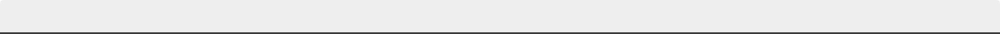

> Capture : _cf. rapport p.74_ · **Sévérité globale : 🟠 Majeur** · Pages : P08 · Fichier : `frontend/src/components/form/ApplicationForm.vue`
>
> 🎯 **Page-référence (grille)** : 11.11 est conforme sur **P05 et P11** → reprendre leur formulation de suggestion d'erreur (champ nommé + exemple).

**Problème :**

- `11.11` – majeur : la suggestion d'erreur en cas d'email invalide est peu explicite : `moaEmailError` vaut « L'email du contact MOA est invalide. », sans rappeler le format attendu.

```ts
} else if (!isEmailValid(moaActor.value.email)) {
  moaErrors.push("L'email du contact MOA est invalide.");
  moaEmailError.value = "L'email du contact MOA est invalide.";
}
```

**Solution :**

- Donner un exemple de format dans le message d'erreur (et dans l'étiquette, cf. RGAA-070), pour aider à corriger la saisie.

```ts
} else if (!isEmailValid(moaActor.value.email)) {
  const msg = "L'email du contact MOA est invalide. Format attendu – ex : exemple@mail.fr";
  moaErrors.push(msg);
  moaEmailError.value = msg;
}
```

---

## Part 5 : Fiche application (P05, 9 onglets)

### RGAA-046 — Bouton « S'abonner / Abonné(e) »

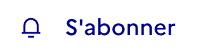

> Capture : _cf. rapport p.55_ · **Sévérité globale : 🟠 Majeur** · Pages : P05 · Fichier : `frontend/src/views/ApplicationPage.vue`

**Problème :**

- `7.1` – majeur : intitulé peu explicite — l'attribut `title` ne reprend ni en début ni en fin l'intitulé visible (« S'abonner » / « Abonné(e) »).
- `12.8` – majeur : ordre de tabulation incohérent après activation du bouton (le focus est perdu après le re-render `isSubscribed`).

```vue
<DsfrButton
  class="fr-btn--tertiary-no-outline fr-btn--icon-left"
  :class="
    isSubscribed ? 'fr-icon-notification-3-fill' : 'fr-icon-notification-3-line'
  "
  :disabled="isSubscriptionLoading"
  @click="toggleSubscription"
  :title="
    isSubscribed
      ? 'Ne plus recevoir de notifications pour cette application'
      : 'Recevoir des notifications lors des modifications'
  "
>
  {{ isSubscribed ? "Abonné(e)" : "S'abonner" }}
</DsfrButton>
```

**Solution :**

- Reprendre l'intitulé visible en tête du `title`.
- Conserver le focus sur le bouton après bascule : poser une `ref` sur le bouton et lui rendre le focus dans `toggleSubscription` (le bouton reste monté, seul le label change, donc `nextTick` + `focus()` suffit).

```vue
<script setup lang="ts">
import { nextTick, ref } from "vue";

const subscribeBtn = ref<InstanceType<
  typeof import("@gouvminint/vue-dsfr").DsfrButton
> | null>(null);

async function toggleSubscription() {
  try {
    isSubscriptionLoading.value = true;
    if (isSubscribed.value) await userStore.unsubscribeFromApp(id);
    else await userStore.subscribeToApp(id);
  } catch (err) {
    console.error("Erreur lors de la modification de l'abonnement", err);
  } finally {
    isSubscriptionLoading.value = false;
    await nextTick();
    // garde le focus clavier sur le bouton après activation
    (subscribeBtn.value?.$el as HTMLElement | undefined)
      ?.querySelector("button")
      ?.focus();
  }
}
</script>

<DsfrButton
  ref="subscribeBtn"
  class="fr-btn--tertiary-no-outline fr-btn--icon-left"
  :class="
    isSubscribed ? 'fr-icon-notification-3-fill' : 'fr-icon-notification-3-line'
  "
  :disabled="isSubscriptionLoading"
  @click="toggleSubscription"
  :title="
    isSubscribed
      ? 'Abonné(e) - Ne plus recevoir de notifications pour cette application'
      : 'S\'abonner - Recevoir des notifications lors des modifications'
  "
>
  {{ isSubscribed ? "Abonné(e)" : "S'abonner" }}
</DsfrButton>
```

---

### RGAA-047 — Onglet « Informations générales » | images informatives en `::before`


> Capture : _cf. rapport p.55-56_ · **Sévérité globale : 🟠 Majeur** · Pages : P05 · Fichier : `frontend/src/components/InformationsGenerales.vue`

**Problème :**

- `10.2` – majeur : les icônes DSFR (`fr-icon-*`) porteuses d'information sont générées en pseudo-élément `::before` ; avec les CSS désactivées, aucune information textuelle visible/exposée ne subsiste.

> Note : dans `InformationsGenerales.vue` actuel, les blocs « Hébergement » et « Noms alternatifs » délèguent l'affichage des icônes à `HostingList.vue` / `LabelList.vue`. Les icônes informatives ciblées par l'audit (pictogramme de géolocalisation/serveur précédant la valeur) sont rendues dans `HostingList.vue`. Le patch ci-dessous montre le motif à appliquer ; il doit être répliqué partout où une `fr-icon-*` précède une valeur porteuse de sens (hébergement : site/techno).

```vue
<!-- frontend/src/components/hosting/HostingList.vue (extrait représentatif du motif fautif) -->
<p class="fr-mb-0">
  <span class="fr-icon-map-pin-2-line fr-mr-1w"></span>
  {{ hosting.site }}
</p>
```

**Solution :**

- Marquer l'icône `aria-hidden="true"` et ajouter un intitulé visuellement masqué (`fr-sr-only`) qui nomme l'information portée par le pictogramme.

```vue
<p class="fr-mb-0">
  <span class="fr-icon-map-pin-2-line fr-mr-1w" aria-hidden="true"></span>
  <span class="fr-sr-only">Géolocalisation : </span>
  {{ hosting.site }}
</p>
<p class="fr-mb-0">
  <span class="fr-icon-server-line fr-mr-1w" aria-hidden="true"></span>
  <span class="fr-sr-only">Technologie : </span>
  {{ hosting.platform }}
</p>
```

---

### RGAA-052 — Modales Hébergement / Noms alternatifs / Dette / Confirmation | focus à l'ouverture

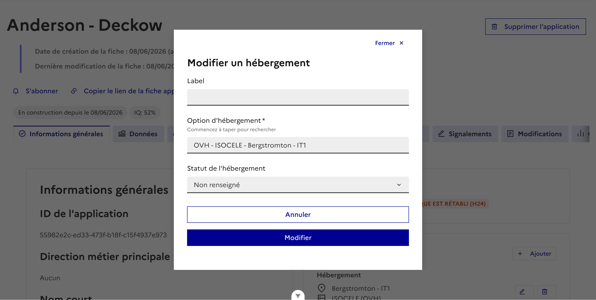

> Capture : _cf. rapport p.62_ · **Sévérité globale : 🟠 Majeur** · Pages : P05 · Fichier : `frontend/src/components/hosting/HostingModal.vue`, `frontend/src/components/label/LabelModal.vue`, `frontend/src/components/technical-debt/TechnicalDebtModal.vue`, `frontend/src/components/modal/DeleteConfirmationModal.vue`

**Problème :**

- `12.8` – majeur : après activation du bouton qui ouvre la modale, l'ordre de tabulation est incohérent — le focus n'est pas déplacé sur le premier élément interactif de la modale (bouton « Fermer »).

```vue
<!-- frontend/src/components/modal/DeleteConfirmationModal.vue -->
<DsfrModal
  :opened="opened"
  title="Confirmation de suppression"
  size="sm"
  data-testid="delete-confirmation-modal"
  @close="cancel"
>
  <p>Êtes-vous sûr de vouloir supprimer {{ itemName }} ? Cette action est irréversible.</p>
  ...
</DsfrModal>
```

```vue
<!-- frontend/src/components/hosting/HostingModal.vue -->
<DsfrModal
  :opened="true"
  :title="
    props.initialHosting ? 'Modifier un hébergement' : 'Créer un hébergement'
  "
  data-testid="hosting-modal"
  @close="$emit('close')"
></DsfrModal>
```

**Solution :**

- À l'ouverture, déplacer le focus sur le premier élément interactif (le bouton « Fermer » du `DsfrModal`). Pour les modales montées via `v-if` (Hosting/Label/Technical/Delete), faire le focus dans `onMounted` ; pour celles pilotées par `opened`, le faire dans un `watch(() => opened)`.

```vue
<script setup lang="ts">
import { nextTick, onMounted } from "vue";

function focusModalCloseButton() {
  // le bouton de fermeture rendu par DsfrModal
  const closeBtn = document.querySelector<HTMLButtonElement>(
    '[data-testid="hosting-modal"] .fr-btn--close',
  );
  closeBtn?.focus();
}

onMounted(async () => {
  await nextTick();
  focusModalCloseButton();
});
</script>
```

> Pour `DeleteConfirmationModal.vue` (piloté par la prop `opened`) :

```vue
<script setup lang="ts">
import { nextTick, watch } from "vue";

const props = defineProps({ opened: Boolean, itemName: String });

watch(
  () => props.opened,
  async (isOpen) => {
    if (!isOpen) return;
    await nextTick();
    document
      .querySelector<HTMLButtonElement>(
        '[data-testid="delete-confirmation-modal"] .fr-btn--close',
      )
      ?.focus();
  },
);
</script>
```

---

### RGAA-053 — Onglet « Liens » | liens avec icônes

> _Pas de capture — l'application de test n'a aucun lien enregistré (données absentes). Cf. rapport p.63._

> Capture : _cf. rapport p.63_ · **Sévérité globale : 🟠 Majeur** · Pages : P05 · Fichier : `frontend/src/components/LinksTab.vue`

**Problème :**

- `6.1` – majeur : les liens ouvrant une nouvelle fenêtre (`target="_blank"`) ne le signalent pas dans l'intitulé.

```vue
<template #body-lien="{ data }">
  <a
    :href="data.lien.to"
    target="_blank"
    rel="noopener noreferrer"
    data-testid="link-item"
    >{{ data.lien.label }}</a
  >
</template>
```

**Solution :**

- Ajouter un `title` reprenant l'intitulé visible + « nouvelle fenêtre ». Le faire aussi pour la `DsfrCard` mobile (`:link` ouvrant un nouvel onglet).

```vue
<template #body-lien="{ data }">
  <a
    :href="data.lien.to"
    target="_blank"
    rel="noopener noreferrer"
    :title="`${data.lien.label} - nouvelle fenêtre`"
    data-testid="link-item"
  >
    {{ data.lien.label }}
  </a>
</template>
```

---

### RGAA-054 — Modale « Ajouter une conformité RGAA » | cohérence de tabulation

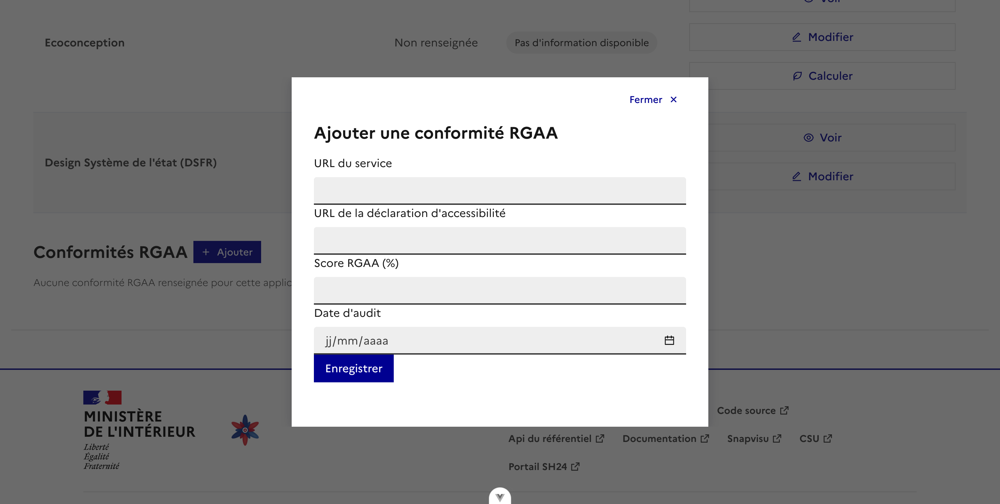

> Capture : _cf. rapport p.63_ · **Sévérité globale : 🟠 Majeur** · Pages : P05 · Fichier : `frontend/src/components/compliances/RgaaComplianceSection.vue`

**Problème :**

- `12.8` – majeur : après activation du bouton « Ajouter » qui ouvre la modale, l'ordre de tabulation est incohérent — le focus n'est pas placé sur le premier élément interactif (bouton « Fermer »).

```vue
<DsfrButton
  v-if="canWrite"
  icon="fr-icon-add-line"
  size="sm"
  label="Ajouter"
  data-testid="rgaa-add-btn"
  :disabled="isLoading"
  @click="openCreate"
  class="fr-ml-1w"
/>
...
<DsfrModal
  v-if="showModal"
  :title="modalTitle"
  :opened="showModal"
  @close="closeModal"
></DsfrModal>
```

**Solution :**

- Au passage de `showModal` à `true`, déplacer le focus sur le bouton « Fermer » de la modale.

```vue
<script setup lang="ts">
import { nextTick, watch } from "vue";

watch(showModal, async (isOpen) => {
  if (!isOpen) return;
  await nextTick();
  document
    .querySelector<HTMLButtonElement>(
      '[data-testid="rgaa-section"] .fr-modal .fr-btn--close',
    )
    ?.focus();
});
</script>
```

---

### RGAA-055 — Modale « Conformité RGAA » | message de statut + tabulation


> Capture : _cf. rapport p.64_ · **Sévérité globale : 🟠 Majeur** · Pages : P05 · Fichier : `frontend/src/components/compliances/RgaaComplianceSection.vue`

**Problème :**

- `12.8` – majeur : après suppression d'une conformité RGAA, l'ordre de tabulation est incohérent (le focus disparaît avec la ligne supprimée).
- `7.5` – majeur : le message de confirmation (création/suppression) n'est pas correctement restitué aux TA.

```vue
<script setup lang="ts">
async function remove(item: RgaaComplianceDto) {
  if (
    !confirm(
      `Supprimer la conformité RGAA pour « ${item.service_url ?? "ce site"} » ?`,
    )
  )
    return;
  try {
    await rgaaControllerDelete({
      path: { applicationId: props.applicationId, id: item.id },
    });
    items.value = items.value.filter((i) => i.id !== item.id);
    toaster.addSuccessMessage("Conformité RGAA supprimée.");
  } catch {
    toaster.addErrorMessage(
      "Erreur lors de la suppression de la conformité RGAA.",
    );
  }
}
</script>

<DsfrButton
  v-if="canWrite"
  ...
  label="Ajouter"
  data-testid="rgaa-add-btn"
  @click="openCreate"
/>
```

**Solution :**

- Après création/suppression, replacer le focus sur le bouton « Ajouter ».
- Ajouter un `<p aria-live="polite" aria-atomic="true">` dédié, alimenté par un message texte (« Conformité RGAA créée » / « Conformité RGAA supprimée »).

```vue
<script setup lang="ts">
import { nextTick, ref } from "vue";

const statusMessage = ref("");
const addBtn = ref<HTMLElement | null>(null);

async function focusAddButton() {
  await nextTick();
  (addBtn.value as unknown as { $el?: HTMLElement })?.$el
    ?.querySelector("button")
    ?.focus();
}

async function remove(item: RgaaComplianceDto) {
  if (
    !confirm(
      `Supprimer la conformité RGAA pour « ${item.service_url ?? "ce site"} » ?`,
    )
  )
    return;
  try {
    await rgaaControllerDelete({
      path: { applicationId: props.applicationId, id: item.id },
    });
    items.value = items.value.filter((i) => i.id !== item.id);
    statusMessage.value = "Conformité RGAA supprimée.";
    await focusAddButton();
  } catch {
    toaster.addErrorMessage(
      "Erreur lors de la suppression de la conformité RGAA.",
    );
  }
}
</script>

<template>
  <p
    class="fr-sr-only"
    aria-live="polite"
    aria-atomic="true"
    data-testid="rgaa-status"
  >
    {{ statusMessage }}
  </p>
  <DsfrButton
    ref="addBtn"
    v-if="canWrite"
    label="Ajouter"
    data-testid="rgaa-add-btn"
    @click="openCreate"
  />
</template>
```

> Renseigner aussi `statusMessage.value = "Conformité RGAA créée."` dans `save()` après un `rgaaControllerCreate` réussi.

---

### RGAA-056 — Onglet « Acteurs » | Modale « Modifier l'acteur » | champ sans étiquette


> Capture : _cf. rapport p.64_ · **Sévérité globale : 🔴 Bloquant** · Pages : P05 · Fichier : `frontend/src/components/actor/ActorForm.vue`, `frontend/src/components/common/OrganizationSearchSelect.vue`

**Problème :**

- `11.1` – **bloquant** : le `<select>` de filtrage des organisations n'a pas d'étiquette visible.
- `8.9` – mineur : `<label>` vide associé à ce champ.

> Le `DsfrSelect` listant les organisations dans `OrganizationSearchSelect.vue` est rendu avec `:label-visible="false"` et sans `label`, ce qui produit un `<label>` vide.

```vue
<!-- frontend/src/components/common/OrganizationSearchSelect.vue -->
<div v-if="selectOptions.length > 0" class="fr-mt-1w">
  <DsfrSelect v-model="selectedOrganizationId" :options="selectOptions" :disabled="isLoading" :label-visible="false" />
</div>
```

**Solution :**

- Donner un `label` explicite au `DsfrSelect` et le rendre visible.

```vue
<div v-if="selectOptions.length > 0" class="fr-mt-1w">
  <DsfrSelect
    v-model="selectedOrganizationId"
    :options="selectOptions"
    :disabled="isLoading"
    label="Choisir une organisation"
    label-visible
  />
</div>
```

---

### RGAA-057 — Modale « Modifier l'acteur » | regroupement de champs


> Capture : _cf. rapport p.65_ · **Sévérité globale : 🟠 Majeur** · Pages : P05 · Fichier : `frontend/src/components/actor/ActorForm.vue`

**Problème :**

- `11.5` – majeur : absence de regroupement pour les champs de même nature (identité de la personne : « Prénom » / « Nom »).

```vue
<template v-if="!isGroup">
  <DsfrInput
    v-model="form.firstname"
    label="Prénom"
    label-visible
    placeholder="Prénom"
    data-testid="actor-firstname-input"
    class="fr-mb-3w"
  />
  <DsfrInput
    v-model="form.lastname"
    label="Nom"
    label-visible
    placeholder="Nom de famille"
    data-testid="actor-lastname-input"
    class="fr-mb-3w"
  />
</template>
```

**Solution :**

- Encapsuler les champs dans un `<fieldset>`/`<legend>` (ou `role="group"` + `aria-labelledby`).

```vue
<template v-if="!isGroup">
  <fieldset
    class="fr-fieldset fr-mb-3w"
    aria-labelledby="actor-identity-legend"
  >
    <legend id="actor-identity-legend" class="fr-fieldset__legend">
      Identité de l'acteur
    </legend>
    <div class="fr-fieldset__element">
      <DsfrInput
        v-model="form.firstname"
        label="Prénom"
        label-visible
        placeholder="Prénom"
        data-testid="actor-firstname-input"
      />
    </div>
    <div class="fr-fieldset__element">
      <DsfrInput
        v-model="form.lastname"
        label="Nom"
        label-visible
        placeholder="Nom de famille"
        data-testid="actor-lastname-input"
      />
    </div>
  </fieldset>
</template>
```

---

### RGAA-058 — Modale « Modifier l'acteur » | message de statut (suggestions)


> Capture : _cf. rapport p.66_ · **Sévérité globale : 🟠 Majeur** · Pages : P05 · Fichier : `frontend/src/components/common/OrganizationSearchSelect.vue`

**Problème :**

- `7.5` – majeur : absence de message de statut informant les TA du nombre de suggestions d'organisations selon la saisie (« X résultat(s) trouvé(s) » / « Aucune organisation trouvée »).

```vue
<div
  v-if="searchQuery && !isLoading && organizations.length > 0"
  class="fr-mt-1w"
>
  <p class="fr-text--xs fr-text--mention-grey">
    {{ organizations.length }} résultat{{ organizations.length > 1 ? "s" : "" }} trouvé{{ organizations.length > 1 ? "s" : "" }}
  </p>
</div>
...
<div v-else-if="searchQuery && organizations.length === 0" class="fr-mt-1w">
  <p class="fr-text--xs fr-text--mention-grey">Aucune organisation trouvée</p>
</div>
```

**Solution :**

- Exposer ces messages dans une région live : `<p aria-live="polite" aria-atomic="true">`. Les paragraphes étant déjà visibles, ajouter les attributs ARIA sur eux suffit (et idéalement une région unique pour éviter la double annonce).

```vue
<div
  v-if="searchQuery && !isLoading && organizations.length > 0"
  class="fr-mt-1w"
>
  <p class="fr-text--xs fr-text--mention-grey" aria-live="polite" aria-atomic="true">
    {{ organizations.length }} résultat{{ organizations.length > 1 ? "s" : "" }} trouvé{{ organizations.length > 1 ? "s" : "" }}
  </p>
</div>
...
<div v-else-if="searchQuery && organizations.length === 0" class="fr-mt-1w">
  <p class="fr-text--xs fr-text--mention-grey" aria-live="polite" aria-atomic="true">Aucune organisation trouvée</p>
</div>
```

---

### RGAA-059 — Modale « Modifier l'acteur » | message de statut + tabulation

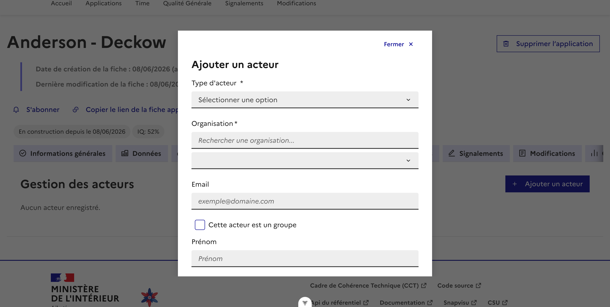

> Capture : _cf. rapport p.67_ · **Sévérité globale : 🟠 Majeur** · Pages : P05 · Fichier : `frontend/src/components/actor/ActorTab.vue`

**Problème :**

- `12.8` – majeur : après enregistrement d'un acteur, l'ordre de tabulation est incohérent — le focus n'est pas renvoyé vers le bouton qui a ouvert la modale.
- `7.5` – majeur : le message « Acteur sauvegardé avec succès ! » (toaster) n'est pas correctement restitué aux TA.

```vue
<script setup lang="ts">
async function handleSaveActors(actor: CreateActorDto & { id?: string }) {
  loading.value = true;
  actorModal.closeModal();
  try {
    if (!actor.id) {
      await api.applicationActorsControllerCreate({
        path: { applicationId: props.application.id },
        body: actor,
      });
    } else {
      await updateActor(actor, props.application.id, actor.id);
    }
    await fetchActorsByApplication(props.application.id);
    toaster.addSuccessMessage("Acteur sauvegardé avec succès !");
  } catch {
    toaster.addErrorMessage("Erreur lors de la sauvegarde de l’acteur.");
  } finally {
    loading.value = false;
  }
}
</script>
```

**Solution :**

- Mémoriser le bouton ayant ouvert la modale (« Ajouter un acteur » ou « Modifier » de la ligne) et lui rendre le focus après enregistrement.
- Doubler le toaster d'une région live dédiée pour fiabiliser la restitution.

```vue
<script setup lang="ts">
import { nextTick, ref } from "vue";

const statusMessage = ref("");
const lastTrigger = ref<HTMLElement | null>(null);

function rememberTrigger(event: Event) {
  lastTrigger.value = event.currentTarget as HTMLElement;
}

async function handleSaveActors(actor: CreateActorDto & { id?: string }) {
  loading.value = true;
  actorModal.closeModal();
  try {
    if (!actor.id) {
      await api.applicationActorsControllerCreate({
        path: { applicationId: props.application.id },
        body: actor,
      });
    } else {
      await updateActor(actor, props.application.id, actor.id);
    }
    await fetchActorsByApplication(props.application.id);
    statusMessage.value = "Acteur sauvegardé avec succès !";
    toaster.addSuccessMessage("Acteur sauvegardé avec succès !");
    await nextTick();
    lastTrigger.value?.focus();
  } catch {
    toaster.addErrorMessage("Erreur lors de la sauvegarde de l’acteur.");
  } finally {
    loading.value = false;
  }
}
</script>

<template>
  <p
    class="fr-sr-only"
    aria-live="polite"
    aria-atomic="true"
    data-testid="actor-status"
  >
    {{ statusMessage }}
  </p>
  <!-- mémoriser le déclencheur sur les boutons d'ouverture -->
  <DsfrButton
    ...
    data-testid="actor-add-btn"
    @click="
      (e) => {
        rememberTrigger(e);
        actorModal.openCreateModal();
      }
    "
  >
    Ajouter un acteur
  </DsfrButton>
  <!-- idem dans la cellule Actions : @click="(e) => { rememberTrigger(e); data.Actions.edit(); }" -->
</template>
```

---

### RGAA-060 — Onglet « Relations » | tableau | cases à cocher

> _Pas de capture — l'application de test n'a aucune relation, donc aucune case à cocher à montrer. Cf. rapport p.68._

> Capture : _cf. rapport p.68_ · **Sévérité globale : 🔴 Bloquant** · Pages : P05 · Fichier : `frontend/src/components/RelationshipsTab.vue`

**Problème :**

- `11.1` – **bloquant** : les cases à cocher de sélection des relations n'ont aucune étiquette (ni `<label>`, ni `title`, ni `aria-label`).

```vue
<template #body-selection="{ data }">
  <input
    v-model="selectedRelationIds"
    type="checkbox"
    :value="data.selection"
  />
</template>
```

**Solution :**

- Ajouter un `title` (ou `aria-label`) pertinent sur chaque case, construit à partir des données de la ligne. À faire sur toutes les cases.

```vue
<template #body-selection="{ data }">
  <input
    v-model="selectedRelationIds"
    type="checkbox"
    :value="data.selection"
    :title="`${data.applicationSource} en relation avec ${data.applicationCible.label} (${data.relation})`"
    :aria-label="`Sélectionner la relation ${data.applicationSource} - ${data.applicationCible.label} (${data.relation})`"
    :data-testid="`relation-row-select-${data.selection}`"
  />
</template>
```

---

### RGAA-061 — Onglet « Relations » | information par la couleur et la forme

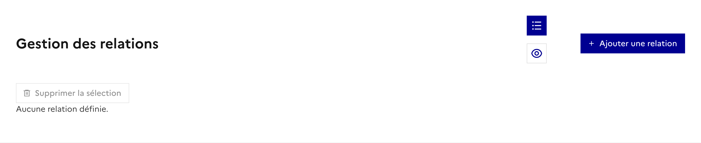

> Capture : _cf. rapport p.68_ · **Sévérité globale : 🟠 Majeur** · Pages : P05 · Fichier : `frontend/src/components/RelationshipsTab.vue`

**Problème :**

- `7.1` – majeur : l'état actif de la bascule « Liste » / « Graphe » n'est communiqué que par la couleur et la forme (`tertiary: viewMode.value !== 'list'`), sans information exposée au code.

```vue
<script setup lang="ts">
const mainButtons = computed(() =>
  props.isMobile
    ? []
    : [
        {
          label: "Liste",
          title: "Vue liste des relations",
          icon: "fr-icon-list-unordered",
          onClick: () => setViewMode("list"),
          tertiary: viewMode.value !== "list",
        },
        {
          label: "Graphe",
          title: "Vue graphe des relations",
          icon: "fr-icon-eye-line",
          onClick: () => setViewMode("graph"),
          tertiary: viewMode.value !== "graph",
        },
      ],
);
</script>

<DsfrButtonGroup :buttons="mainButtons" />
```

**Solution :**

- Ajouter `aria-current="true"` sur le bouton actif (et l'enlever sur l'autre). `DsfrButtonGroup` transmet les attributs au `<button>` via la définition du bouton.

```vue
<script setup lang="ts">
const mainButtons = computed(() =>
  props.isMobile
    ? []
    : [
        {
          label: "Liste",
          title: "Vue liste des relations",
          icon: "fr-icon-list-unordered",
          onClick: () => setViewMode("list"),
          tertiary: viewMode.value !== "list",
          "aria-current": viewMode.value === "list" ? "true" : undefined,
        },
        {
          label: "Graphe",
          title: "Vue graphe des relations",
          icon: "fr-icon-eye-line",
          onClick: () => setViewMode("graph"),
          tertiary: viewMode.value !== "graph",
          "aria-current": viewMode.value === "graph" ? "true" : undefined,
        },
      ],
);
</script>
```

---

### RGAA-062 — Onglet « Signalement » | rôle et attribut non pertinents

> _Pas de capture — non-conformité portée par des attributs (`role="status"` / `aria-live`) non visibles à l'écran. Cf. rapport p.69._

> Capture : _cf. rapport p.69_ · **Sévérité globale : 🟠 Majeur** · Pages : P05 · Fichier : `frontend/src/components/RefAppTable.vue` (slot `#empty`, utilisé par l'onglet Signalement `frontend/src/components/ApplicationReportsTab.vue` via `empty-message`)

**Problème :**

- `7.1` – majeur : présence d'un attribut `aria-live` inapproprié sur le message d'état vide du tableau.
- `7.1` – majeur : présence d'un `role="status"` inapproprié sur ce même message.

> Le message « Aucun signalement proposé. » est rendu par le slot `#empty` de `RefAppTable.vue`. Ce contenu statique (table vide au chargement) n'a pas vocation à être annoncé comme un statut dynamique.

```vue
<!-- frontend/src/components/RefAppTable.vue -->
<template #empty>
  <div class="fr-py-2w fr-text--center" role="status" aria-live="polite">
    {{ emptyMessage }}
  </div>
</template>
```

**Solution :**

- Retirer `role="status"` et `aria-live` : le message d'absence de données n'a pas besoin d'être restitué comme un message de statut dans ce contexte.

```vue
<template #empty>
  <div class="fr-py-2w fr-text--center">{{ emptyMessage }}</div>
</template>
```

---

### RGAA-063 — Onglet « Signalement » | champ sans étiquette

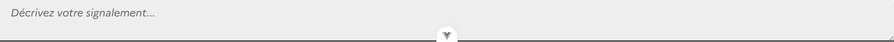

> Capture : _cf. rapport p.69_ · **Sévérité globale : 🔴 Bloquant** · Pages : P05 · Fichier : `frontend/src/components/ApplicationReportsTab.vue`

**Problème :**

- `11.1` – **bloquant** : le `textarea` « Proposer un signalement » n'a pas d'étiquette visible (seulement un `placeholder`).
- `8.9` – mineur : `<label>` vide généré pour ce champ.

```vue
<h4>Proposer un signalement</h4>
<DsfrInput
  v-model="reportText"
  is-textarea
  placeholder="Décrivez votre signalement..."
  required
  class="fr-mb-1w"
  rows="2"
  data-testid="report-issue-textarea"
/>
```

**Solution :**

- Renseigner un `label` explicite et le rendre visible (« Décrivez votre signalement »).

```vue
<h4>Proposer un signalement</h4>
<DsfrInput
  v-model="reportText"
  is-textarea
  label="Décrivez votre signalement"
  label-visible
  placeholder="Décrivez votre signalement..."
  required
  class="fr-mb-1w"
  rows="2"
  data-testid="report-issue-textarea"
/>
```

---

## Part 6 : Recherche, tableau de données & modales associées

### RGAA-027 — Tableaux de données | éléments de tri/filtrage

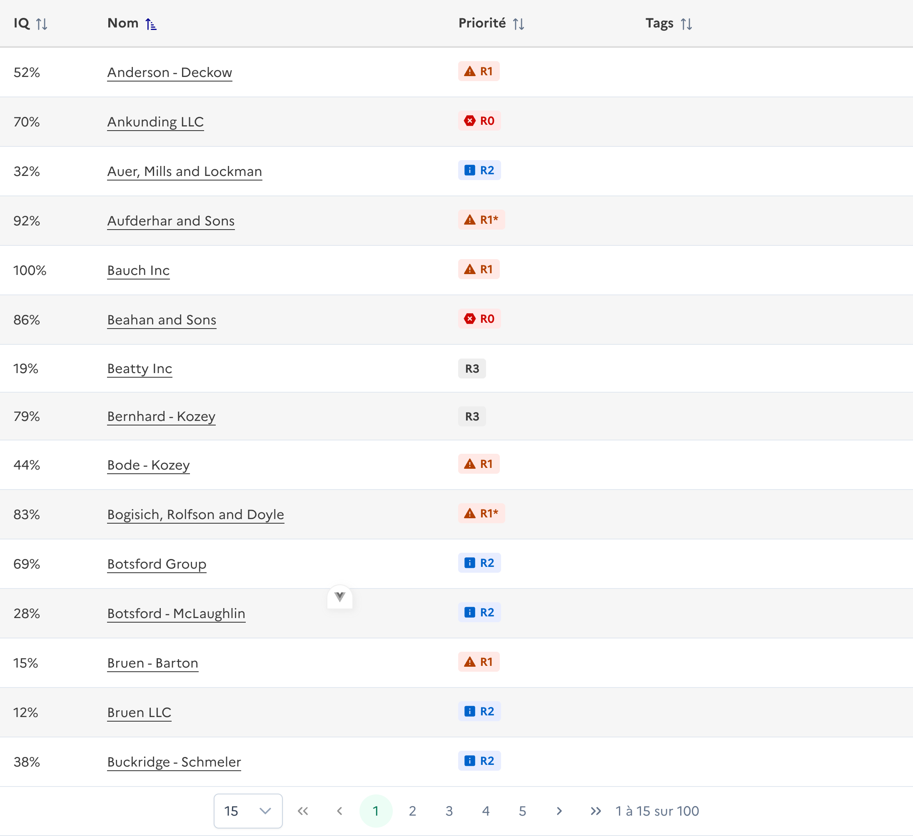

> Capture : _cf. rapport p.40_ · **Sévérité globale : 🟠 Majeur** · Pages : P04/P06/P11 · Fichier : `frontend/src/components/RefAppTable.vue`

**Problème :**

- `7.1` – majeur : présence d'un attribut `tabindex="0"` inapproprié sur les éléments `<th>` (en-têtes triables rendus par PrimeVue `DataTable`).
- `7.1` – majeur : absence de rôles sur les éléments de tri — le `<th>` triable est focusable et activable directement, sans `<button>` interne dédié au tri ni `title` décrivant l'état/action.

Le tri est délégué à PrimeVue (`<Column :sortable="column.sortable" …>`), qui génère pour chaque en-tête triable un `<th tabindex="0">` cliquable, sans bouton interne. Le composant n'override pas ce rendu :

```vue
<DataTable
  :value="items"
  :lazy="lazy"
  :sort-field="internalSortField"
  :sort-order="internalSortOrder"
  …
  @sort="onSort"
>
  <Column
    v-for="column in columns"
    :key="column.field"
    :field="column.field"
    :header="column.header"
    :sortable="column.sortable"
    :style="column.width ? { width: column.width } : undefined"
    :aria-label="column.header"
  >
    <template #body="slotProps">
      <Skeleton v-if="isSorting" width="80%" height="1rem" aria-label="Chargement en cours" />
      <slot v-else :name="`body-${column.field}`" v-bind="slotProps">
        {{ slotProps.data[column.field] }}
      </slot>
    </template>
  </Column>
</DataTable>
```

**Solution :**

- Surcharger le rendu de l'en-tête de colonne via le slot `#header` de `<Column>` (PrimeVue) pour produire le markup attendu : retirer le `tabindex="0"` du `<th>`, et placer **à l'intérieur du `<th>` un `<button type="button">`** qui encapsule le texte (ex. « IQ ») et l'icône de tri (`<svg aria-hidden="true">`). Le bouton porte un `title="<libellé> - <action/état>"` (ex. « IQ - Tri descendant »).
- Désactiver le tri natif au clic sur le `<th>` (laisser PrimeVue gérer l'`aria-sort` du `<th>`) et déclencher le tri depuis le `<button>` interne. La cible du `:pt` (passthrough PrimeVue) ou un `#header` custom permet de neutraliser `tabindex` sur le `headercell`.

```vue
<DataTable
  :value="items"
  :lazy="lazy"
  :sort-field="internalSortField"
  :sort-order="internalSortOrder"
  …
  :pt="{ headerCell: { tabindex: null } }"
  @sort="onSort"
>
  <Column
    v-for="column in columns"
    :key="column.field"
    :field="column.field"
    :header="column.header"
    :sortable="column.sortable"
    :style="column.width ? { width: column.width } : undefined"
    :aria-label="column.header"
  >
    <!-- En-tête de tri accessible : bouton interne + icône décorative -->
    <template v-if="column.sortable" #header>
      <button
        type="button"
        class="p-datatable-column-header-content sort-button"
        :title="sortTitle(column)"
        @click="requestSort(column.field)"
      >
        <span class="p-datatable-column-title">{{ column.header }}</span>
        <span data-pc-section="sort" aria-hidden="true">
          <svg
            width="14"
            height="14"
            viewBox="0 0 14 14"
            fill="none"
            xmlns="http://www.w3.org/2000/svg"
            class="p-icon p-datatable-sort-icon"
            aria-hidden="true"
          >
            <path d="…" fill="currentColor" />
          </svg>
        </span>
      </button>
    </template>

    <template #body="slotProps">
      <Skeleton v-if="isSorting" width="80%" height="1rem" aria-label="Chargement en cours" />
      <slot v-else :name="`body-${column.field}`" v-bind="slotProps">
        {{ slotProps.data[column.field] }}
      </slot>
    </template>
  </Column>
</DataTable>
```

```ts
// Helper côté <script setup> : title décrivant le libellé + l'état/action de tri
function sortTitle(column: TableColumn): string {
  if (internalSortField.value !== column.field) {
    return `${column.header} - Trier par ordre croissant`;
  }
  return internalSortOrder.value === -1
    ? `${column.header} - Tri descendant`
    : `${column.header} - Tri ascendant`;
}

function requestSort(field: string): void {
  const nextOrder =
    internalSortField.value === field && internalSortOrder.value === 1 ? -1 : 1;
  emit("sort", { sortField: field, sortOrder: nextOrder });
}
```

> Note : la définition des colonnes (`columns` / `column.sortable`) est passée par `ApplicationTableView.vue` (`:columns="tableColumns"`) — aucun markup `<th>` n'y est écrit en dur, tout passe par `RefAppTable.vue`. C'est donc bien ce dernier qu'il faut corriger.

---

### RGAA-042 — P01 Lien « Nous contacter sur Tchap »


> Capture : _cf. rapport p.50_ · **Sévérité globale : 🟠 Majeur** · Pages : P01 · Fichier : `frontend/src/views/HomePage.vue`

**Problème :**

- `6.1` – majeur : l'intitulé du lien n'est pas suffisamment explicite. Le lien s'ouvre dans une nouvelle fenêtre (`target="_blank"`) mais ni le `title` ni l'`aria-label` ne mentionnent « nouvelle fenêtre ».

```vue
<a
  class="fr-col fr-btn fr-btn--secondary fr-btn--md"
  data-testid="home-contact-link"
  title="Contacter l’équipe sur Tchap"
  aria-label="Contacter l’équipe sur Tchap"
  href="https://www.tchap.gouv.fr/#/room/!ydoKqFOXRAQPQYFvqa:agent.interieur.tchap.gouv.fr?via=agent.interieur.tchap.gouv.fr"
  target="_blank"
><span class="fr-icon-mail-open-line fr-icon--sm fr-mr-1w"></span>
  Nous Contacter sur Tchap
</a>
```

**Solution :**

- Ajouter le terme « nouvelle fenêtre » sur les attributs `title` ET `aria-label` du lien.

```vue
<a
  class="fr-col fr-btn fr-btn--secondary fr-btn--md"
  data-testid="home-contact-link"
  title="Contacter l’équipe sur Tchap – nouvelle fenêtre"
  aria-label="Contacter l’équipe sur Tchap – nouvelle fenêtre"
  href="https://www.tchap.gouv.fr/#/room/!ydoKqFOXRAQPQYFvqa:agent.interieur.tchap.gouv.fr?via=agent.interieur.tchap.gouv.fr"
  target="_blank"
  rel="noopener"
><span class="fr-icon-mail-open-line fr-icon--sm fr-mr-1w"></span>
  Nous Contacter sur Tchap
</a>
```

---

### RGAA-043 — P04 Sémantique

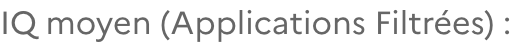

> Capture : _cf. rapport p.52_ · **Sévérité globale : 🟡 Mineur** · Pages : P04 · Fichier : `frontend/src/views/ApplicationSearchPage.vue`

**Problème :**

- `8.9` – mineur : présence d'un élément `<div>` sans valeur sémantique utilisé pour véhiculer du texte (le bloc « IQ moyen (Applications Filtrées) »).

```vue
<div class="average-iq" data-testid="application-average-iq">
  <span class="average-iq__label">IQ moyen (Applications Filtrées) : </span>
  <span class="average-iq__value">{{ averageIqDisplay }}</span>
</div>
```

**Solution :**

- Remplacer le `<div>` par un élément `<p>` à valeur sémantique (le style scoped `.average-iq` reste applicable, `<p>` est conservé en `display: flex`).

```vue
<p class="average-iq" data-testid="application-average-iq">
  <span class="average-iq__label">IQ moyen (Applications Filtrées) : </span>
  <span class="average-iq__value">{{ averageIqDisplay }}</span>
</p>
```

---

### RGAA-044 — P04 Modale « Personnaliser les colonnes » | regroupement

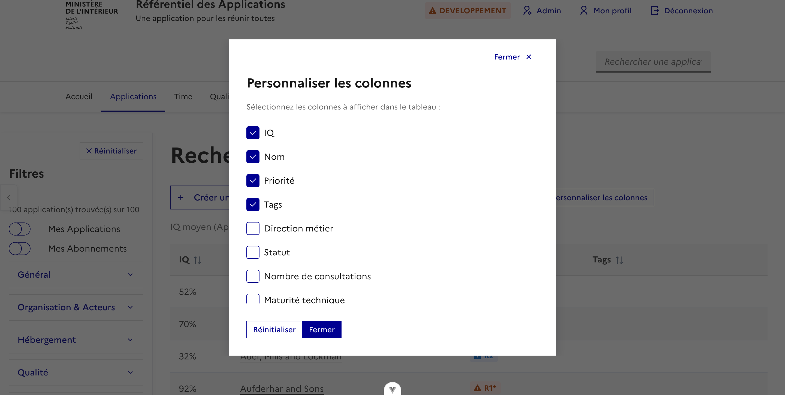

> Capture : _cf. rapport p.53_ · **Sévérité globale : 🟠 Majeur** · Pages : P04 · Fichier : `frontend/src/components/ColumnCustomization.vue`
>
> 🎯 **Page-référence (grille)** : 11.6 est NC sur **P04** mais **conforme sur P11 (Admin)** → copier le markup `<fieldset>`/`<legend>` de la modale conforme de P11.

**Problème :**

- `11.6` – majeur : absence de légende pour le regroupement de champs. Le `<fieldset>` est bien généré par `DsfrCheckboxSet`, mais le texte d'introduction « Sélectionnez les colonnes à afficher dans le tableau : » est dans un `<p>` **hors** du `fieldset`, et la `legend` du set est vide (`legend=""`).

```vue
<DsfrModal
  :opened="visible"
  title="Personnaliser les colonnes"
  data-testid="customize-columns-dialog"
  @close="hideDialog"
>
  <p class="fr-text--sm description">Sélectionnez les colonnes à afficher dans le tableau :</p>

  <DsfrCheckboxSet
    v-model="selectedColumns"
    legend=""
    :options="columnOptions"
    name="column-selection"
    data-testid="column-selection-checkboxes"
    @update:model-value="handleColumnChange"
  />
</DsfrModal>
```

**Solution :**

- Supprimer le `<p>` externe et porter son texte dans la `legend` du `DsfrCheckboxSet` : DSFR rend alors un véritable `<legend>` à l'intérieur du `<fieldset>`, ce qui fournit le nom du regroupement. (Si la classe `description` est nécessaire visuellement, l'appliquer via `legend-class` selon la version DSFR-Vue, sinon styler le `<legend>` généré.)

```vue
<DsfrModal
  :opened="visible"
  title="Personnaliser les colonnes"
  data-testid="customize-columns-dialog"
  @close="hideDialog"
>
  <DsfrCheckboxSet
    v-model="selectedColumns"
    legend="Sélectionnez les colonnes à afficher dans le tableau :"
    :options="columnOptions"
    name="column-selection"
    data-testid="column-selection-checkboxes"
    @update:model-value="handleColumnChange"
  />
</DsfrModal>
```

> Markup HTML cible (rendu DSFR) :
>
> ```html
> <fieldset class="fr-fieldset" aria-labelledby="…-set">
>   <legend class="fr-fieldset__legend fr-text--sm description">
>     Sélectionnez les colonnes à afficher dans le tableau :
>   </legend>
>   <div class="fr-fieldset__element">
>     <div class="fr-checkbox-group">
>       <input
>         id="basic-…-checkbox"
>         name="column-quality"
>         type="checkbox"
>         value="quality"
>         checked
>       />
>       <label for="basic-…-checkbox" class="fr-label">IQ</label>
>     </div>
>   </div>
>   …
> </fieldset>
> ```

---

### RGAA-045 — P04 Modale « Signaler une application manquante » | champ sans étiquette

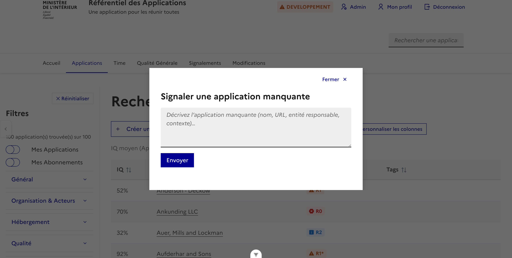

> Capture : _cf. rapport p.54_ · **Sévérité globale : 🔴 Bloquant** · Pages : P04 · Fichier : `frontend/src/components/modal/ReportModal.vue`
>
> 🎯 **Page-référence (grille)** : 11.2 (étiquette pertinente) est conforme sur **8 pages** → s'inspirer d'un champ déjà bien étiqueté ailleurs (étiquette explicite plutôt que placeholder).

**Problème :**

- `11.1` – bloquant : absence d'étiquette visible sur le champ de description. Le `DsfrInput` (textarea) ne reçoit que `placeholder` et `required`, sans `label`.
- `11.2` – majeur : étiquette non pertinente — la seule information de saisie est dans le `placeholder` (« Décrivez l'application manquante (nom, URL, entité responsable, contexte)… »), qui n'est ni une étiquette persistante ni fiablement restitué.

```vue
<DsfrInput
  v-model.trim="description"
  is-textarea
  :placeholder="placeholder"
  required
  rows="4"
  data-testid="report-description"
/>
```

```ts
const placeholderMapper = {
  application:
    "Décrivez le signalement (champ à corriger, erreur constatée, etc.)…",
  global:
    "Décrivez l’application manquante (nom, URL, entité responsable, contexte)…",
};
const placeholder = computed(() => placeholderMapper[props.context]);
```

**Solution :**

- Fournir une étiquette visible et explicite via le `label` du `DsfrInput` (DSFR génère alors un `<label for>` correctement associé). Conserver le `placeholder` comme aide secondaire. Adapter le libellé au contexte comme pour le placeholder.

```vue
<DsfrInput
  v-model.trim="description"
  is-textarea
  :label="fieldLabel"
  :placeholder="placeholder"
  required
  rows="4"
  data-testid="report-description"
/>
```

```ts
const labelMapper = {
  application:
    "Décrivez le signalement : champ à corriger, erreur constatée, contexte",
  global:
    "Décrivez l’application manquante : nom, url, entité responsable, contexte",
};
const fieldLabel = computed(() => labelMapper[props.context]);
```

---

## Part 7 : Profil utilisateur (P09, 3 onglets)

### RGAA-072 — Mes informations | `<thead>` vide

> _Pas de capture — `<thead>` vide, invisible à l'écran (table DSFR des permissions)._

> Capture : _cf. rapport p.75_ · **Sévérité globale : 🟡 Mineur** · Pages : P09 · Fichier : `frontend/src/components/users/UserInfoTab.vue`

**Problème :**

- `8.9` – mineur : présence d'une balise `<thead>` vide générée par `DsfrTable` (aucun en-tête n'est passé pour le tableau « Informations personnelles »).

```vue
<DsfrTable title="Informations personnelles" data-testid="user-profile-table">
  <tr>
    <th scope="row">Organisation</th>
    <td data-testid="user-profile-organization">
      {{ userStore.user.organization?.path || "Non renseignée" }}
    </td>
  </tr>
  <tr>
    <th scope="row">Email</th>
    <td data-testid="user-profile-email">
      {{ userStore.user.email }}
    </td>
  </tr>
</DsfrTable>
```

**Solution :**

- Supprimer le `<thead>` inutile. `DsfrTable` ajoute un `<thead>` (même vide) dès lors qu'aucun `:headers` n'est fourni ; ici le tableau est en réalité un tableau clé/valeur à en-têtes de ligne. On remplace `DsfrTable` par un `<table>` natif sans `<thead>` (encapsulé dans le conteneur DSFR `fr-table`).

```vue
<div class="fr-table" data-testid="user-profile-table">
  <table>
    <caption class="fr-sr-only">Informations personnelles</caption>
    <tbody>
      <tr>
        <th scope="row">Organisation</th>
        <td data-testid="user-profile-organization">
          {{ userStore.user.organization?.path || "Non renseignée" }}
        </td>
      </tr>
      <tr>
        <th scope="row">Email</th>
        <td data-testid="user-profile-email">
          {{ userStore.user.email }}
        </td>
      </tr>
    </tbody>
  </table>
</div>
```

---

### RGAA-073 — Mes informations | rôle et permissions | sémantique

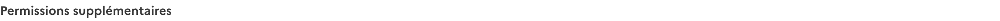

> Capture : _cf. rapport p.75_ · **Sévérité globale : 🟡 Mineur** · Pages : P09 · Fichier : `frontend/src/components/users/UserPermissionList.vue` · `frontend/src/components/users/UserPermissions.vue`

**Problème :**

- `8.9` – mineur : absence de balise sémantique. Les libellés (« Rôle », libellés des listes de permissions) et le marqueur d'absence de permission sont rendus dans des `<span>` non sémantiques, et le tiret `—` n'est pas évocateur.

```vue
<!-- UserPermissionList.vue -->
<div class="fr-mb-3w">
  <p class="fr-text--sm fr-text--bold fr-mb-1w">{{ props.label }}</p>
  <div v-if="props.permissions.length" class="fr-tags-group">
    <div v-for="perm in props.permissions" :key="perm" class="fr-flex fr-align-items-center" style="gap: 0.25rem">
      <DsfrTag small class="fr-tag--dismiss" :label="PERMISSIONS_LABELS[perm]" />
    </div>
  </div>
  <span v-else class="fr-text--disabled">—</span>
</div>
```

```vue
<!-- UserPermissions.vue (extrait : le rôle) -->
<div class="fr-mb-3w">
  <p class="fr-text--sm fr-text--bold fr-mb-1w">Rôle</p>
  <span class="fr-badge fr-mr-1w" :class="RolesWordingBadgeClass[user.role]">
    {{ RolesWording[user.role] }}
  </span>
</div>
```

**Solution :**

- Remplacer le `<span>` d'absence de permission par un `<p>` et remplacer le tiret par une phrase explicite « Le profil n'a aucune permission supplémentaire. ». Le `<span class="fr-badge">` du rôle reste un `<span>` (le badge DSFR est correctement véhiculé par son texte) ; seul le marqueur d'absence pose problème vis-à-vis du 8.9.

```vue
<!-- UserPermissionList.vue -->
<div class="fr-mb-3w">
  <p class="fr-text--sm fr-text--bold fr-mb-1w">{{ props.label }}</p>
  <div v-if="props.permissions.length" class="fr-tags-group">
    <div v-for="perm in props.permissions" :key="perm" class="fr-flex fr-align-items-center" style="gap: 0.25rem">
      <DsfrTag small class="fr-tag--dismiss" :label="PERMISSIONS_LABELS[perm]" />
    </div>
  </div>
  <p v-else class="fr-text--disabled">Le profil n'a aucune permission supplémentaire.</p>
</div>
```

---

### RGAA-074 — Mes informations | case à cocher notifications

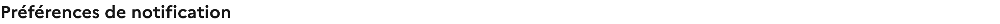

> Capture : _cf. rapport p.76_ · **Sévérité globale : 🟠 Majeur** · Pages : P09 · Fichier : `frontend/src/components/users/UserInfoTab.vue`

**Problème :**

- `11.10` – majeur : le champ ne reprend pas le texte descriptif de l'élément (le `hint` est relié par `aria-describedby` mais n'est pas intégré au nom accessible attendu).
- `12.8` – majeur : perte du focus après avoir actionné le champ « recevoir les notifications par email » (le `:disabled="isUpdating"` retire puis remet le contrôle, déplaçant le focus en début de page).

```vue
<div class="fr-mt-4w">
  <h2 class="fr-h6">Préférences de notification</h2>
  <DsfrToggleSwitch
    v-model="emailNotificationsEnabled"
    label="Recevoir les notifications par email"
    hint="Recevoir des notifications par email lorsque des changements sont apportés à vos applications suivies."
    data-testid="user-profile-email-notifications-checkbox"
    :disabled="isUpdating"
    @update:model-value="handleToggleEmailNotifications"
  />
</div>
```

**Solution :**

- Supprimer le `hint` (qui produit l'`aria-describedby`) et fournir le texte descriptif complet via `aria-label`. Ne plus désactiver le champ pendant la requête (ou re-positionner le focus dessus après l'opération) afin que le focus reste sur le contrôle après activation.

```vue
<script setup lang="ts">
// ...
import { ref, onMounted, nextTick, useTemplateRef } from "vue";

const toggleRef = useTemplateRef<HTMLElement>("toggleRef");

async function handleToggleEmailNotifications() {
  isUpdating.value = true;
  successMessage.value = "";
  errorMessage.value = "";
  const SUCCESS_MESSAGE_TIMEOUT = 3000;
  try {
    await userStore.updateEmailPreferences(emailNotificationsEnabled.value);
    successMessage.value =
      "Vos préférences de notification ont été mises à jour avec succès.";
    setTimeout(() => {
      successMessage.value = "";
    }, SUCCESS_MESSAGE_TIMEOUT);
  } catch (error) {
    console.error("Error updating email preferences:", error);
    errorMessage.value =
      "Erreur lors de la mise à jour de vos préférences. Veuillez réessayer.";
    emailNotificationsEnabled.value = !emailNotificationsEnabled.value;
  } finally {
    isUpdating.value = false;
    // 12.8 : conserver le focus sur le champ après l'opération
    await nextTick();
    toggleRef.value?.querySelector("input")?.focus();
  }
}
</script>

<template>
  <div class="fr-mt-4w">
    <h2 class="fr-h6">Préférences de notification</h2>
    <DsfrToggleSwitch
      ref="toggleRef"
      v-model="emailNotificationsEnabled"
      label="Recevoir les notifications par email"
      aria-label="Recevoir les notifications par email lorsque des changements sont apportés à vos applications suivies."
      data-testid="user-profile-email-notifications-checkbox"
      :disabled="isUpdating"
      @update:model-value="handleToggleEmailNotifications"
    />
  </div>
</template>
```

---

### RGAA-075 — Mes tokens | caractères obligatoires

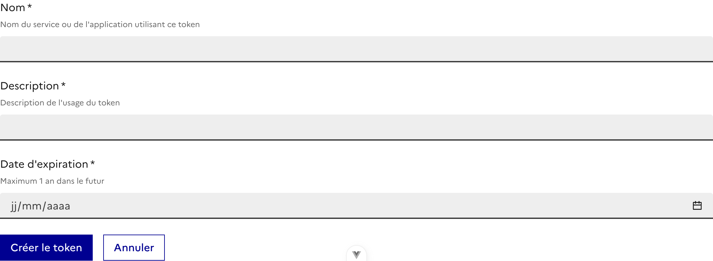

> Capture : _cf. rapport p.76_ · **Sévérité globale : 🟠 Majeur** · Pages : P09 · Fichier : `frontend/src/components/users/UserTokensTab.vue`

**Problème :**

- `11.10` – majeur : absence de texte expliquant le rôle de l'astérisque. Le formulaire de création présente trois champs `required` (Nom, Description, Date d'expiration), donc trois astérisques, sans aucune indication préalable.

```vue
<div v-if="showCreateForm" class="fr-card fr-p-3w fr-mb-3w">
  <h3 class="fr-h5 fr-mb-2w">Nouveau token</h3>
  <form @submit.prevent="createToken">
    <DsfrInputGroup
      v-model.trim="newToken.name"
      label="Nom"
      label-visible
      required
      hint="Nom du service ou de l'application utilisant ce token"
    />
    <!-- ... -->
  </form>
</div>
```

**Solution :**

- Ajouter un `<p>` indiquant le rôle de l'astérisque en tout début de formulaire.

```vue
<div v-if="showCreateForm" class="fr-card fr-p-3w fr-mb-3w">
  <h3 class="fr-h5 fr-mb-2w">Nouveau token</h3>
  <form @submit.prevent="createToken">
    <p class="fr-text--sm">* = champs obligatoires</p>
    <DsfrInputGroup
      v-model.trim="newToken.name"
      label="Nom"
      label-visible
      required
      hint="Nom du service ou de l'application utilisant ce token"
    />
    <!-- ... -->
  </form>
</div>
```

---

### RGAA-076 — Mes tokens | champs en erreur

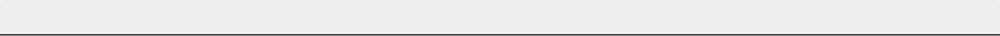

> Capture : _cf. rapport p.77_ · **Sévérité globale : 🟠 Majeur** · Pages : P09 · Fichier : `frontend/src/components/users/UserTokensTab.vue`

**Problème :**

- `11.10` – majeur : les messages d'erreur ne citent pas nommément les champs concernés. Le composant n'expose qu'un message global générique (`"Erreur lors de la création du token"`) et aucune validation par champ : les champs `Nom` et `Description` n'ont pas de message d'erreur nominatif.

```vue
<script setup lang="ts">
// ...
async function createToken() {
  isLoading.value = true;
  newlyCreatedToken.value = null;
  resetMessages();

  const response = await api.tokenControllerCreatePersonal({
    body: newToken.value,
  });
  if (response.error) {
    error.value = "Erreur lors de la création du token";
    isLoading.value = false;
    return;
  }
  // ...
}
</script>

<template>
  <DsfrInputGroup
    v-model.trim="newToken.name"
    label="Nom"
    label-visible
    required
    hint="Nom du service ou de l'application utilisant ce token"
  />
  <DsfrInputGroup
    v-model.trim="newToken.description"
    label="Description"
    label-visible
    required
    hint="Description de l'usage du token"
  />
</template>
```

**Solution :**

- Ajouter une validation par champ et passer un `error-message` nommant le champ à chaque `DsfrInputGroup` (« veuillez saisir le nom », idem pour « description »).

```vue
<script setup lang="ts">
// ...
const fieldErrors = ref<{
  name?: string;
  description?: string;
  expiresAt?: string;
}>({});

function validateForm(): boolean {
  fieldErrors.value = {};
  if (!newToken.value.name.trim())
    fieldErrors.value.name = "Veuillez saisir le nom";
  if (!newToken.value.description.trim())
    fieldErrors.value.description = "Veuillez saisir la description";
  return Object.keys(fieldErrors.value).length === 0;
}

async function createToken() {
  if (!validateForm()) return;
  // ... appel API inchangé
}
</script>

<template>
  <DsfrInputGroup
    v-model.trim="newToken.name"
    label="Nom"
    label-visible
    required
    hint="Nom du service ou de l'application utilisant ce token"
    :error-message="fieldErrors.name"
  />
  <DsfrInputGroup
    v-model.trim="newToken.description"
    label="Description"
    label-visible
    required
    hint="Description de l'usage du token"
    :error-message="fieldErrors.description"
  />
</template>
```

---

### RGAA-077 — Mes tokens | champ date

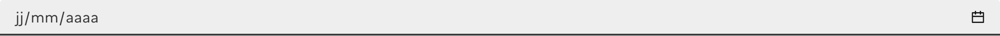

> Capture : _cf. rapport p.77_ · **Sévérité globale : 🟠 Majeur** · Pages : P09 · Fichier : `frontend/src/components/users/UserTokensTab.vue`
>
> 🎯 **Page-référence (grille)** : 11.11 est conforme sur **P05 et P11** → reprendre leur formulation de suggestion d'erreur (champ nommé + exemple de format de date).

**Problème :**

- `11.10` – majeur : absence de format de donnée sur l'étiquette du champ. Le champ « Date d'expiration » n'indique ni l'intervalle autorisé ni le format attendu (seul un `hint="Maximum 1 an dans le futur"` est présent).
- `11.11` – majeur : absence d'information sur la nature de l'erreur dans le formulaire (pas de message d'erreur ciblé pour la date).

```vue
<DsfrInputGroup
  v-model="newToken.expiresAt"
  label="Date d'expiration"
  label-visible
  required
  type="date"
  hint="Maximum 1 an dans le futur"
/>
```

**Solution :**

- Compléter l'étiquette/`hint` avec l'intervalle et le format attendu, et fournir un `error-message` détaillé donnant un exemple de syntaxe.

```vue
<script setup lang="ts">
// ... dans validateForm()
function validateExpiresAt(): void {
  const value = newToken.value.expiresAt;
  const min = new Date();
  min.setDate(min.getDate() + 1);
  const max = new Date();
  max.setFullYear(max.getFullYear() + 1);
  const d = value ? new Date(value) : null;
  if (!d || isNaN(d.getTime()) || d < min || d > max) {
    fieldErrors.value.expiresAt =
      "Veuillez saisir la date qui doit être comprise entre demain et 1 an maximum, format attendu : JJ/MM/AAAA";
  }
}
</script>

<template>
  <DsfrInputGroup
    v-model="newToken.expiresAt"
    label="Date d'expiration"
    label-visible
    required
    type="date"
    hint="La date ne peut être comprise qu'entre demain et 1 an maximum, format : JJ/MM/AAAA"
    :error-message="fieldErrors.expiresAt"
  />
</template>
```

---

### RGAA-078 — Mes tokens | message succès/erreur

> _Pas de capture — création de token non finalisable en automatisation (le champ date DSFR à 3 sous-champs jour/mois/année n'est pas remplissable) ; le message succès/erreur n'a pu être déclenché. Cf. rapport p.78._

> Capture : _cf. rapport p.78_ · **Sévérité globale : 🟠 Majeur** · Pages : P09 · Fichier : `frontend/src/components/users/UserTokensTab.vue`

**Problème :**

- `12.8` – majeur : absence de cohérence de tabulation après avoir validé la création du token ou révoqué un token. Après `createToken()` / `confirmRevokeToken()`, le message (`DsfrAlert`) apparaît mais le focus reste à son emplacement précédent (le bouton « Créer le token » disparaît avec le formulaire, le focus retombe sur `<body>`).

```vue
<script setup lang="ts">
// ...
async function createToken() {
  // ...
  newlyCreatedToken.value = response.data;
  successMessage.value = "Token créé avec succès";
  resetForm();
  showCreateForm.value = false;
  await fetchTokens();
  isLoading.value = false;
}
</script>

<template>
  <DsfrAlert
    v-if="newlyCreatedToken"
    type="success"
    title="Token créé avec succès"
    class="fr-mb-2w"
    closeable
    @close="dismissNewToken"
  >
    <!-- ... -->
  </DsfrAlert>
</template>
```

**Solution :**

- Après la création ou la révocation, positionner le focus au début du composant de message (« succès » ou « erreur »).

```vue
<script setup lang="ts">
import { ref, computed, onMounted, nextTick, useTemplateRef } from "vue";

const messageRef = useTemplateRef<HTMLElement>("messageRef");

async function focusMessage() {
  await nextTick();
  const el = messageRef.value;
  if (el) {
    el.setAttribute("tabindex", "-1");
    el.focus();
  }
}

async function createToken() {
  // ... succès
  newlyCreatedToken.value = response.data;
  successMessage.value = "Token créé avec succès";
  resetForm();
  showCreateForm.value = false;
  await fetchTokens();
  isLoading.value = false;
  await focusMessage();
}

async function confirmRevokeToken() {
  // ... succès / erreur
  await focusMessage();
}
</script>

<template>
  <!-- Conteneur des alertes, cible du focus -->
  <div ref="messageRef">
    <DsfrAlert
      v-if="error"
      type="error"
      :title="error"
      class="fr-mb-2w"
      closeable
      @close="error = null"
    />
    <DsfrAlert
      v-if="successMessage && !newlyCreatedToken"
      type="success"
      :title="successMessage"
      class="fr-mb-2w"
      closeable
      @close="successMessage = null"
    />
    <DsfrAlert
      v-if="newlyCreatedToken"
      type="success"
      title="Token créé avec succès"
      class="fr-mb-2w"
      closeable
      @close="dismissNewToken"
    >
      <!-- ... -->
    </DsfrAlert>
  </div>
</template>
```

---

### RGAA-079 — Mes tokens | bouton Copier

> _Pas de capture — le bouton « Copier » n'apparaît qu'après création réussie d'un token (non finalisable, voir RGAA-078). Cf. rapport p.78._

> Capture : _cf. rapport p.78_ · **Sévérité globale : 🟠 Majeur** · Pages : P09 · Fichier : `frontend/src/components/users/UserTokensTab.vue`

**Problème :**

- `7.1` – majeur : absence de pertinence de l'intitulé du bouton. Le bouton « Copier » de l'alerte « Token créé avec succès » ne précise pas ce qui est copié.

```vue
<div class="token-display fr-mb-1w">
  <code class="token-value">{{ newlyCreatedToken.password }}</code>
  <DsfrButton size="sm" secondary icon="ri-file-copy-line" @click="copyToClipboard(newlyCreatedToken.password)"> Copier </DsfrButton>
</div>
```

**Solution :**

- Ajouter `aria-label="Copier le token"` sur le bouton.

```vue
<div class="token-display fr-mb-1w">
  <code class="token-value">{{ newlyCreatedToken.password }}</code>
  <DsfrButton
    size="sm"
    secondary
    icon="ri-file-copy-line"
    aria-label="Copier le token"
    @click="copyToClipboard(newlyCreatedToken.password)"
  >
    Copier
  </DsfrButton>
</div>
```

---

### RGAA-080 — Mes abonnements | bouton Désabonner


> Capture : _cf. rapport p.79_ · **Sévérité globale : 🟠 Majeur** · Pages : P09 · Fichier : `frontend/src/components/users/UsrFollowTab.vue`

**Problème :**

- `7.1` – majeur : le `title` ne reprend pas l'intitulé du bouton. Le bouton « Désabonner » porte `title="Ne plus suivre cette application"`, qui ne reprend ni l'intitulé visible « Désabonner » ni le nom de l'application ciblée.

```vue
<DsfrButton
  class="fr-btn--secondary fr-btn--sm"
  :disabled="isUpdating"
  @click="unsubscribe(app.id)"
  title="Ne plus suivre cette application"
  data-testid="user-unsubscribe-button"
>
  Désabonner
</DsfrButton>
```

**Solution :**

- Remplacer le `title` pour qu'il reprenne le nom de l'application puis l'intitulé du bouton.

```vue
<DsfrButton
  class="fr-btn--secondary fr-btn--sm"
  :disabled="isUpdating"
  @click="unsubscribe(app.id)"
  :title="`${app.label} - Désabonner`"
  data-testid="user-unsubscribe-button"
>
  Désabonner
</DsfrButton>
```

---

### RGAA-081 — Mes abonnements | tableau de mise en forme

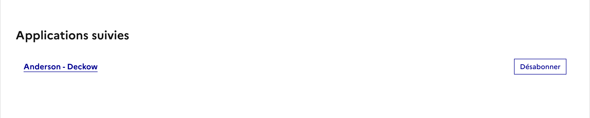

> Capture : _cf. rapport p.79_ · **Sévérité globale : 🟠 Majeur** · Pages : P09 · Fichier : `frontend/src/components/users/UsrFollowTab.vue`

**Problème :**

- `5.3` – majeur : absence de `role="presentation"` sur le tableau « Applications suivies », qui sert uniquement à disposer le nom de l'application et son bouton (tableau de mise en forme).
- `5.8` – majeur : présence d'éléments propres aux tableaux de données (`<caption>` via `title`, `<thead>` généré, `<th scope="row">`) dans ce tableau de mise en forme.

```vue
<DsfrTable title="Applications suivies" data-testid="user-followed-apps-table">
  <template #default>
    <tr v-if="userStore.user.followedApplications?.length === 0">
      <td colspan="2">Aucune application suivie</td>
    </tr>

    <tr v-for="app in userStore.user.followedApplications" :key="app.id" class="fr-mb-1w">
      <th scope="row" style="width: 100%">
        <RouterLink :to="{ name: 'application', params: { id: app.id } }" class="fr-link">
          {{ app.label }}
        </RouterLink>
      </th>
      <td style="white-space: nowrap">
        <DsfrButton
          class="fr-btn--secondary fr-btn--sm"
          :disabled="isUpdating"
          @click="unsubscribe(app.id)"
          title="Ne plus suivre cette application"
          data-testid="user-unsubscribe-button"
        >
          Désabonner
        </DsfrButton>
      </td>
    </tr>
  </template>
</DsfrTable>
```

**Solution :**

- Remplacer `DsfrTable` par un `<table role="presentation">` natif, sortir le titre dans un `<h2>` (au lieu de `<caption>`), et supprimer les `<th>`, le `<thead>` et les attributs `scope`. Toutes les cellules deviennent des `<td>`.

```vue
<div data-testid="user-followed-apps-table">
  <h2 class="fr-h5">Applications suivies</h2>
  <table role="presentation" class="fr-table">
    <tbody>
      <tr v-if="userStore.user.followedApplications?.length === 0">
        <td colspan="2">Aucune application suivie</td>
      </tr>

      <tr v-for="app in userStore.user.followedApplications" :key="app.id" class="fr-mb-1w">
        <td style="width: 100%">
          <RouterLink :to="{ name: 'application', params: { id: app.id } }" class="fr-link">
            {{ app.label }}
          </RouterLink>
        </td>
        <td style="white-space: nowrap">
          <DsfrButton
            class="fr-btn--secondary fr-btn--sm"
            :disabled="isUpdating"
            @click="unsubscribe(app.id)"
            :title="`${app.label} - Désabonner`"
            data-testid="user-unsubscribe-button"
          >
            Désabonner
          </DsfrButton>
        </td>
      </tr>
    </tbody>
  </table>
</div>
```

---

## Part 8a : Admin (P11)

### RGAA-083 — Modale « Permissions de l'utilisateur » (éléments sans valeur sémantique)

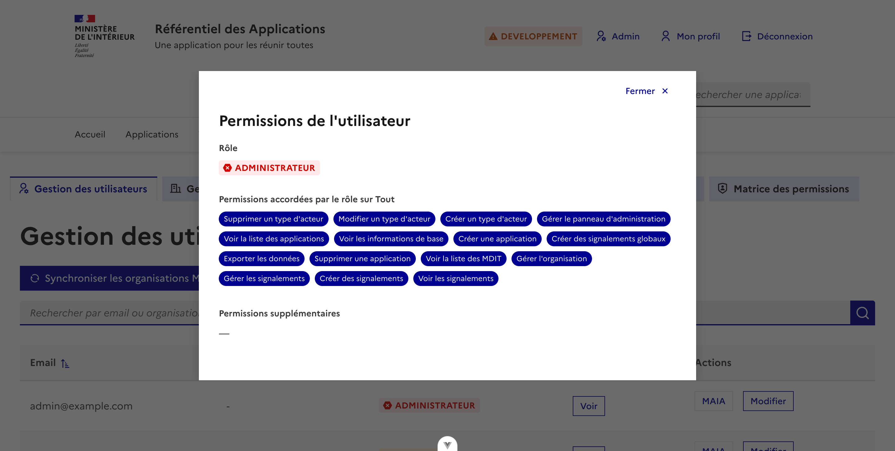

> Capture : _cf. rapport p.81_ · **Sévérité globale : 🟡 Mineur** · Pages : P11 · Fichier : `frontend/src/components/users/UserPermissions.vue` (+ `frontend/src/components/users/UserPermissionList.vue`)

**Problème :**

- `8.9` – mineur : Présence d'éléments sans valeur sémantique. La modale « Permissions de l'utilisateur » (ouverte depuis `UserPermissionsModal.vue` → `UserPermissions.vue`) affiche les badges de rôle et l'état « — » via des `<span>` utilisés comme blocs de texte. Remplacer ces `<span>` non sémantiques par des `<p>`.

Dans `UserPermissions.vue`, le badge de rôle est rendu dans un `<span>` :

```vue
<template>
  <div class="fr-mb-4w">
    <div class="fr-mb-3w">
      <p class="fr-text--sm fr-text--bold fr-mb-1w">Rôle</p>
      <span
        class="fr-badge fr-mr-1w"
        :class="RolesWordingBadgeClass[user.role]"
      >
        {{ RolesWording[user.role] }}
      </span>
    </div>
    <UserPermissionList
      :permissions="userPermissions"
      :label="`Permissions accordées par le rôle sur ${scopePermission}`"
    />
    <UserPermissionList
      :permissions="userAdditionalPermissions"
      label="Permissions supplémentaires"
    />
  </div>
</template>
```

Dans `UserPermissionList.vue`, l'état « aucune permission » est rendu dans un `<span>` :

```vue
<template>
  <div class="fr-mb-3w">
    <p class="fr-text--sm fr-text--bold fr-mb-1w">{{ props.label }}</p>
    <div v-if="props.permissions.length" class="fr-tags-group">
      <div
        v-for="perm in props.permissions"
        :key="perm"
        class="fr-flex fr-align-items-center"
        style="gap: 0.25rem"
      >
        <DsfrTag
          small
          class="fr-tag--dismiss"
          :label="PERMISSIONS_LABELS[perm]"
        />
      </div>
    </div>
    <span v-else class="fr-text--disabled">—</span>
  </div>
</template>
```

**Solution :**

- Remplacer les `<span>` employés comme contenu textuel autonome par des `<p>` à valeur sémantique. Le `<span>` du badge de rôle (qui porte le style `.fr-badge`) reste acceptable en tant que badge, mais on l'encapsule dans un `<p>` ou on bascule le bloc autonome « — » en `<p>`. Conserver les classes DSFR.

```vue
<!-- UserPermissions.vue -->
<template>
  <div class="fr-mb-4w">
    <div class="fr-mb-3w">
      <p class="fr-text--sm fr-text--bold fr-mb-1w">Rôle</p>
      <p>
        <span
          class="fr-badge fr-mr-1w"
          :class="RolesWordingBadgeClass[user.role]"
        >
          {{ RolesWording[user.role] }}
        </span>
      </p>
    </div>
    <UserPermissionList
      :permissions="userPermissions"
      :label="`Permissions accordées par le rôle sur ${scopePermission}`"
    />
    <UserPermissionList
      :permissions="userAdditionalPermissions"
      label="Permissions supplémentaires"
    />
  </div>
</template>
```

```vue
<!-- UserPermissionList.vue -->
<template>
  <div class="fr-mb-3w">
    <p class="fr-text--sm fr-text--bold fr-mb-1w">{{ props.label }}</p>
    <div v-if="props.permissions.length" class="fr-tags-group">
      <div
        v-for="perm in props.permissions"
        :key="perm"
        class="fr-flex fr-align-items-center"
        style="gap: 0.25rem"
      >
        <DsfrTag
          small
          class="fr-tag--dismiss"
          :label="PERMISSIONS_LABELS[perm]"
        />
      </div>
    </div>
    <p v-else class="fr-text--disabled">Aucune permission</p>
  </div>
</template>
```

---

### RGAA-084 — Onglets Utilisateurs / Tags / Sources (message de statut sur le nombre de résultats)


> Capture : _cf. rapport p.82-83_ · **Sévérité globale : 🟠 Majeur** · Pages : P11 · Fichier : `frontend/src/components/admin/AdminUsersTab.vue` · `frontend/src/components/admin/AdminTagsTab.vue` · `frontend/src/components/admin/AdminLabelSourcesTab.vue`

**Problème :**

- `7.5` – majeur : Le message d'alerte n'est pas restitué correctement aux technologies d'assistance concernant le nombre de résultats pendant la saisie d'un mail, organisation, nom, ou valeur. Les trois onglets filtrent un tableau via `DsfrSearchBar` + `watchDebounced`, mais le résultat (chargement / nombre de lignes) n'est annoncé par aucune région live.

Exemple actuel (`AdminUsersTab.vue`, identique en structure pour les deux autres onglets — pas de région `aria-live` couvrant le nombre de résultats) :

```vue
<template>
  <div>
    <h1 class="fr-h1" data-testid="admin-users-title">
      Gestion des utilisateurs
    </h1>
    <!-- ... -->
    <div class="fr-mb-4w">
      <DsfrSearchBar
        v-model.trim="searchQuery"
        label="Rechercher un utilisateur"
        placeholder="Rechercher par email ou organisation..."
        button-text="Rechercher"
        class="fr-col-12"
        data-testid="admin-user-search"
      />
    </div>

    <div
      v-if="isLoading"
      class="fr-alert fr-alert--info"
      data-testid="admin-users-loading"
    >
      <p>Chargement des utilisateurs...</p>
    </div>
    <div
      v-else-if="errorKeySet.size"
      class="fr-alert fr-alert--error"
      data-testid="admin-users-error"
    >
      <p v-for="errorKey in Array.from(errorKeySet.keys())" :key="errorKey">
        {{ errorMessages[errorKey] }}
      </p>
    </div>
    <div v-else>
      <RefAppTable :items="tableRows" ... />
    </div>
  </div>
</template>
```

**Solution :**

- Ajouter une `<div aria-live="polite" aria-atomic="true">` (visuellement masquée via `fr-sr-only`) qui injecte un `<p>` indiquant le chargement, puis le nombre de résultats de la page (« Résultat 1 à 3 ») ou l'absence de résultat (« Aucune donnée ne correspond à votre recherche : Résultat 0 à 0 »). Construire le message à partir de `firstIndex`, `itemsPerPage`, `data.total` et `isLoading`. À répliquer à l'identique dans `AdminTagsTab.vue` et `AdminLabelSourcesTab.vue` (en réutilisant leurs `firstIndex`, `itemsPerPage`, `data.total`, `isLoading`).

```vue
<script setup lang="ts">
// ... existant ...
const statusMessage = computed(() => {
  if (isLoading.value) return "Chargement des utilisateurs…";
  const total = data.value.total;
  if (total === 0)
    return "Aucune donnée ne correspond à votre recherche : Résultat 0 à 0";
  const from = firstIndex.value + 1;
  const to = Math.min(firstIndex.value + data.value.results.length, total);
  return `Résultat ${from} à ${to} sur ${total}`;
});
</script>

<template>
  <div>
    <!-- ... DsfrSearchBar ... -->

    <div
      aria-live="polite"
      aria-atomic="true"
      class="fr-sr-only"
      data-testid="admin-users-status"
    >
      <p>{{ statusMessage }}</p>
    </div>

    <!-- ... tableau ... -->
  </div>
</template>
```

---

### RGAA-085 — Modale « Modifier l'utilisateur » (champ sans étiquette)


> Capture : _cf. rapport p.84_ · **Sévérité globale : 🔴 Bloquant** · Pages : P11 · Fichier : `frontend/src/components/admin/UserActions.vue` (+ `frontend/src/components/common/OrganizationSearchSelect.vue`)

**Problème :**

- `11.1` – bloquant : Absence d'étiquette visible sur le champ. Dans la modale « Modifier l'utilisateur », le second `OrganizationSearchSelect` (périmètre / scope) reçoit un `:label="labelScope"`, mais `labelScope` vaut `RolesScopes[editingUserRole]`, qui est vide pour certains rôles → étiquette absente.
- `8.9` – mineur : Présence d'éléments `<label>` vides (le `<label>` du `DsfrInputGroup` interne reçoit une chaîne vide).

Code actuel (`UserActions.vue`) :

```vue
<script setup lang="ts">
const labelScope = computed(() => {
  return `${RolesScopes[editingUserRole.value]}`;
});
const isScopeDisabled = computed(() => {
  return editingUserRole.value === Roles.VISITOR;
});
</script>

<template>
  <!-- ... -->
  <OrganizationSearchSelect
    v-show="!isScopeDisabled"
    v-model="editingScopePermissions"
    class="fr-mb-2w"
    :label="labelScope"
    :initial-organization="user.scopeOrganization"
    data-testid="user-organization-search"
  />
</template>
```

Dans `OrganizationSearchSelect.vue`, le `searchLabel` retient `props.label` dès qu'il est défini (même vide), faute de quoi il tombe sur « Organisation » :

```vue
<script setup lang="ts">
const searchLabel = computed(() => {
  if (!!props.label) return props.label;
  return props.required ? "Organisation *" : "Organisation";
});
</script>
```

> Note : `!!props.label` est `false` pour une chaîne vide, donc le fallback « Organisation » s'applique déjà ici ; le bug réel est que `labelScope` produit une chaîne **non vide mais non explicite** (ex. valeur de scope brute) ou vide selon le rôle. La correction garantit une étiquette explicite et non vide dans les deux composants.

**Solution :**

- Donner à ce champ une étiquette explicite et toujours non vide, par ex. « Organisation de rattachement (périmètre) ». Côté `UserActions.vue`, fournir un libellé complet incluant le scope plutôt que le scope brut. Côté `OrganizationSearchSelect.vue`, durcir le fallback pour ignorer une étiquette vide/espaces.

```vue
<!-- UserActions.vue -->
<script setup lang="ts">
const labelScope = computed(() => {
  const scope = RolesScopes[editingUserRole.value];
  return scope
    ? `Organisation du périmètre (${scope})`
    : "Organisation du périmètre";
});
</script>

<template>
  <OrganizationSearchSelect
    v-show="!isScopeDisabled"
    v-model="editingScopePermissions"
    class="fr-mb-2w"
    :label="labelScope"
    :initial-organization="user.scopeOrganization"
    data-testid="user-organization-search-scope"
  />
</template>
```

```vue
<!-- OrganizationSearchSelect.vue -->
<script setup lang="ts">
const searchLabel = computed(() => {
  const label = props.label?.trim();
  if (label) return label;
  return props.required ? "Organisation *" : "Organisation";
});
</script>
```

---

### RGAA-086 — Modale « Modifier l'utilisateur » (regroupement de champs)


> Capture : _cf. rapport p.84_ · **Sévérité globale : 🟠 Majeur** · Pages : P11 · Fichier : `frontend/src/components/admin/UserActions.vue`

**Problème :**

- `11.5` – majeur : Absence de regroupement de champs pour les champs de même nature. La modale empile organisation, capacités, niveau de privilège et organisation de périmètre sans regroupement sémantique. Les `DsfrCheckboxSet` / `DsfrRadioButtonSet` portent déjà un `legend`, mais le bloc « organisation de rattachement + organisation de périmètre » n'est pas regroupé.

Code actuel (`UserActions.vue`) :

```vue
<template>
  <DsfrModal
    :opened="isEditModalOpen"
    title="Modifier l'utilisateur"
    data-testid="admin-edit-user-modal"
    @close="closeEditModal"
  >
    <p><strong>Utilisateur :</strong> {{ user.email }}</p>

    <OrganizationSearchSelect
      v-model="editingOrganizationId"
      class="fr-mb-2w"
      description="Recherchez et sélectionnez une organisation pour cet utilisateur"
      :initial-organization="user.organization"
      data-testid="user-organization-search"
    />
    <DsfrCheckboxSet ... legend="Capacités" ... />
    <DsfrRadioButtonSet ... legend="Niveau de privilège" ... />
    <OrganizationSearchSelect
      v-show="!isScopeDisabled"
      v-model="editingScopePermissions"
      :label="labelScope"
      ...
    />
    <!-- footer ... -->
  </DsfrModal>
</template>
```

**Solution :**

- Regrouper les champs « organisation » de même nature dans un `<fieldset>` avec `<legend>` (ou, si la mise en page DSFR l'impose, un conteneur `role="group"` + `aria-labelledby`). Idem pour le couple privilège/périmètre si pertinent.

```vue
<template>
  <DsfrModal
    :opened="isEditModalOpen"
    title="Modifier l'utilisateur"
    data-testid="admin-edit-user-modal"
    @close="closeEditModal"
  >
    <p><strong>Utilisateur :</strong> {{ user.email }}</p>

    <fieldset class="fr-fieldset">
      <legend class="fr-fieldset__legend">Organisations</legend>
      <OrganizationSearchSelect
        v-model="editingOrganizationId"
        class="fr-mb-2w"
        description="Recherchez et sélectionnez une organisation pour cet utilisateur"
        :initial-organization="user.organization"
        data-testid="user-organization-search"
      />
      <OrganizationSearchSelect
        v-show="!isScopeDisabled"
        v-model="editingScopePermissions"
        class="fr-mb-2w"
        :label="labelScope"
        :initial-organization="user.scopeOrganization"
        data-testid="user-organization-search-scope"
      />
    </fieldset>

    <!-- variante équivalente sans fieldset :
    <div role="group" aria-labelledby="edit-user-orga-legend">
      <p id="edit-user-orga-legend" class="fr-text--bold">Organisations</p>
      ... les deux OrganizationSearchSelect ...
    </div>
    -->

    <DsfrCheckboxSet ... legend="Capacités" ... />
    <DsfrRadioButtonSet ... legend="Niveau de privilège" ... />
    <!-- footer ... -->
  </DsfrModal>
</template>
```

---

### RGAA-087 — Modale « Modifier l'utilisateur » (message de statut sur les suggestions d'organisations)

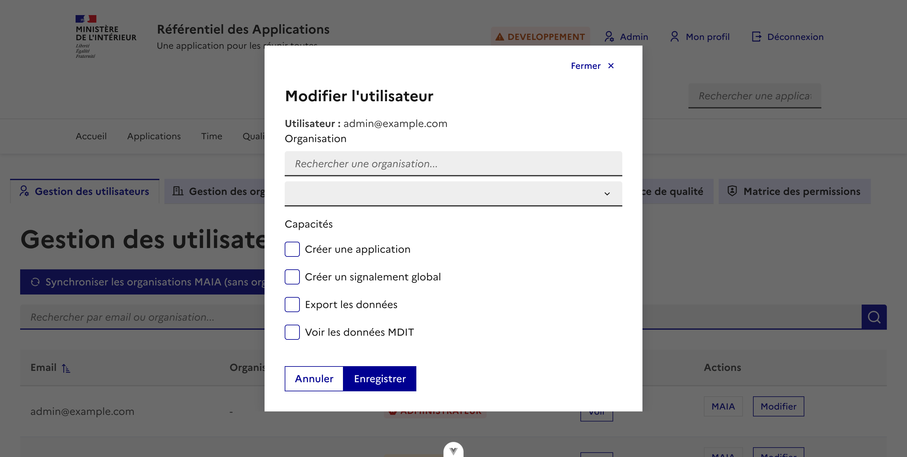

> Capture : _cf. rapport p.85_ · **Sévérité globale : 🟠 Majeur** · Pages : P11 · Fichier : `frontend/src/components/common/OrganizationSearchSelect.vue`

**Problème :**

- `7.5` – majeur : Absence de message de statut aux technologies d'assistance informant du nombre de suggestions d'organisations selon la saisie. Les messages « N résultats trouvés » et « Aucune organisation trouvée » existent visuellement mais ne sont pas dans une région live.

Code actuel (`OrganizationSearchSelect.vue`) :

```vue
<template>
  <!-- ... -->
  <div
    v-if="searchQuery && !isLoading && organizations.length > 0"
    class="fr-mt-1w"
  >
    <p class="fr-text--xs fr-text--mention-grey">
      {{ organizations.length }} résultat{{
        organizations.length > 1 ? "s" : ""
      }}
      trouvé{{ organizations.length > 1 ? "s" : "" }}
    </p>
  </div>

  <div v-if="isLoading" class="fr-mt-1w">
    <p class="fr-text--sm">Recherche en cours...</p>
  </div>

  <div v-else-if="searchQuery && organizations.length === 0" class="fr-mt-1w">
    <p class="fr-text--xs fr-text--mention-grey">Aucune organisation trouvée</p>
  </div>
</template>
```

**Solution :**

- Centraliser ces trois états dans une unique région `aria-live="polite" aria-atomic="true"` contenant un `<p>` dynamique (« Recherche en cours… » / « 50 résultats trouvés » / « Aucune organisation trouvée »). Calculer le texte dans un `computed`.

```vue
<script setup lang="ts">
const searchStatus = computed(() => {
  if (!searchQuery.value) return "";
  if (isLoading.value) return "Recherche en cours…";
  const n = organizations.value.length;
  if (n === 0) return "Aucune organisation trouvée";
  return `${n} résultat${n > 1 ? "s" : ""} trouvé${n > 1 ? "s" : ""}`;
});
</script>

<template>
  <!-- ... champ de recherche + select ... -->
  <div aria-live="polite" aria-atomic="true" class="fr-mt-1w">
    <p v-if="searchStatus" class="fr-text--xs fr-text--mention-grey">
      {{ searchStatus }}
    </p>
  </div>
</template>
```

---

### RGAA-088 — Modale « Modifier l'utilisateur » (bouton Enregistrer : tabulation + confirmation)


> Capture : _cf. rapport p.86_ · **Sévérité globale : 🟠 Majeur** · Pages : P11 · Fichier : `frontend/src/components/admin/UserActions.vue`

**Problème :**

- `12.8` – majeur : Absence de cohérence de l'ordre de tabulation après l'activation du bouton « Enregistrer » (la modale se ferme sans rendre le focus au bouton déclencheur).
- `7.5` – majeur : Le message de confirmation de mise à jour n'est pas correctement restitué par les TA (il passe uniquement par le toaster).

Code actuel (`UserActions.vue`) :

```vue
<script setup lang="ts">
async function openEditModal() {
  editingUserRole.value = props.user.role;
  // ...
  isEditModalOpen.value = true;
}

async function saveUser() {
  isSaving.value = true;
  try {
    const response = await api.userControllerUpdate({
      /* ... */
    });
    if (!response.error && response.data) {
      toaster.addSuccessMessage("Utilisateur mis à jour avec succès");
      closeEditModal();
      emit("userUpdated", response.data);
    } else {
      /* ... */
    }
  } finally {
    isSaving.value = false;
  }
}
</script>

<template>
  <DsfrButton
    label="Modifier"
    size="sm"
    secondary
    data-testid="admin-user-edit-btn"
    @click="openEditModal"
  />
  <DsfrModal
    :opened="isEditModalOpen"
    title="Modifier l'utilisateur"
    @close="closeEditModal"
  >
    <!-- ... -->
    <template #footer>
      <DsfrButton label="Annuler" secondary @click="closeEditModal" />
      <DsfrButton
        label="Enregistrer"
        :disabled="isSaving"
        data-testid="admin-save-perms-btn"
        @click="saveUser"
      />
    </template>
  </DsfrModal>
</template>
```

**Solution :**

- Après fermeture suite à l'enregistrement, déplacer le focus sur le bouton « Modifier » qui a ouvert la modale (référence via `ref` + `nextTick`).
- Annoncer la confirmation via une région `aria-live="polite" aria-atomic="true"` (« Utilisateur mis à jour avec succès ») en complément du toaster.

```vue
<script setup lang="ts">
import { nextTick, ref } from "vue";

const editBtn = ref<{ $el?: HTMLElement } | HTMLElement | null>(null);
const confirmationMessage = ref("");

function focusOpener() {
  nextTick(() => {
    const el =
      (editBtn.value as { $el?: HTMLElement })?.$el ??
      (editBtn.value as HTMLElement | null);
    el?.querySelector?.("button")?.focus?.() ??
      (el as HTMLButtonElement)?.focus?.();
  });
}

async function saveUser() {
  isSaving.value = true;
  try {
    const response = await api.userControllerUpdate({
      /* ... */
    });
    if (!response.error && response.data) {
      confirmationMessage.value = "Utilisateur mis à jour avec succès";
      toaster.addSuccessMessage("Utilisateur mis à jour avec succès");
      closeEditModal();
      emit("userUpdated", response.data);
      focusOpener();
    } else {
      /* ... */
    }
  } finally {
    isSaving.value = false;
  }
}
</script>

<template>
  <DsfrButton
    ref="editBtn"
    label="Modifier"
    size="sm"
    secondary
    data-testid="admin-user-edit-btn"
    @click="openEditModal"
  />

  <div
    aria-live="polite"
    aria-atomic="true"
    class="fr-sr-only"
    data-testid="admin-user-edit-status"
  >
    <p v-if="confirmationMessage">{{ confirmationMessage }}</p>
  </div>

  <DsfrModal
    :opened="isEditModalOpen"
    title="Modifier l'utilisateur"
    @close="closeEditModal"
  >
    <!-- ... footer inchangé ... -->
  </DsfrModal>
</template>
```

---

### RGAA-089 — Modale « Modifier / Créer un tag » (format de donnée + tabulation après Enregistrer)

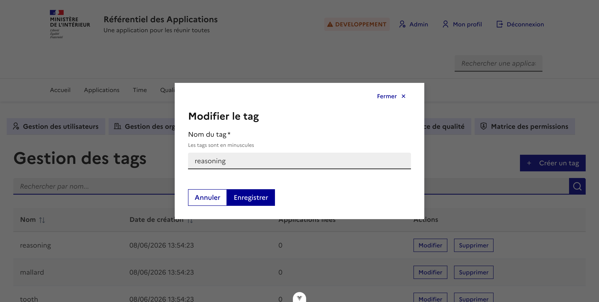

> Capture : _cf. rapport p.87_ · **Sévérité globale : 🟠 Majeur** · Pages : P11 · Fichier : `frontend/src/components/admin/TagActions.vue`

> Note : le rapport vise les modales « Modifier le tag » / « Créer un tag ». Dans le code, ces modales sont rendues par `TagActions.vue` (et non par `LabelModal.vue`, qui gère les « noms alternatifs »). Le ticket porte donc sur `TagActions.vue`.

**Problème :**

- `11.10` – majeur : Absence d'indication en amont sur le format de données attendu. Le champ affiche un `hint="Les tags sont en minuscules"` mais ne mentionne pas la longueur minimale (au moins 2 caractères).
- `12.8` – majeur : Absence de cohérence de l'ordre de tabulation après l'activation du bouton « Enregistrer » : en cas d'erreur de validation, le focus n'est pas porté sur le champ en erreur.

Code actuel (`TagActions.vue`) :

```vue
<script setup lang="ts">
async function saveTag() {
  isSaving.value = true;
  errorMessage.value = "";
  const response = !props.tag?.id
    ? await api.tagsControllerCreate({ body: { name: editingName.value } })
    : await api.tagsControllerUpdate({
        path: { id: props.tag.id },
        body: { name: editingName.value },
      });

  if (!response.response.ok) {
    if (response.response.status === 400) {
      const error = response.error as BadRequestResponse;
      errorMessage.value = error.message.join(", ");
    } else {
      errorMessage.value = "Erreur lors de la sauvegarde du tag";
    }
  } else {
    toaster.addSuccessMessage(
      !props.tag?.id ? "Tag créé avec succès" : "Tag mis à jour avec succès",
    );
    closeEditModal();
    emit("fetchTags");
  }
  isSaving.value = false;
}
</script>

<template>
  <DsfrInputGroup
    v-model="editingName"
    class="fr-mb-2w"
    label="Nom du tag"
    hint="Les tags sont en minuscules"
    label-visible
    required
    :error-message="errorMessage"
    data-testid="tag-name"
  />
  <!-- ... footer avec DsfrButton "Enregistrer" @click="saveTag" ... -->
</template>
```

**Solution :**

- Compléter le `hint` pour indiquer le format complet : « Les tags sont en minuscules et doivent contenir au moins 2 caractères ».
- Après l'activation d'« Enregistrer », si la réponse est en erreur (400), déplacer le focus sur le champ en erreur via une `ref` sur `DsfrInputGroup` + `nextTick`.

```vue
<script setup lang="ts">
import { nextTick, ref } from "vue";

const tagInput = ref<{ $el?: HTMLElement } | null>(null);

function focusTagField() {
  nextTick(() => {
    tagInput.value?.$el?.querySelector?.("input")?.focus();
  });
}

async function saveTag() {
  isSaving.value = true;
  errorMessage.value = "";
  const response = !props.tag?.id
    ? await api.tagsControllerCreate({ body: { name: editingName.value } })
    : await api.tagsControllerUpdate({
        path: { id: props.tag.id },
        body: { name: editingName.value },
      });

  if (!response.response.ok) {
    if (response.response.status === 400) {
      const error = response.error as BadRequestResponse;
      errorMessage.value = error.message.join(", ");
    } else {
      errorMessage.value = "Erreur lors de la sauvegarde du tag";
    }
    focusTagField();
  } else {
    toaster.addSuccessMessage(
      !props.tag?.id ? "Tag créé avec succès" : "Tag mis à jour avec succès",
    );
    closeEditModal();
    emit("fetchTags");
  }
  isSaving.value = false;
}
</script>

<template>
  <DsfrInputGroup
    ref="tagInput"
    v-model="editingName"
    class="fr-mb-2w"
    label="Nom du tag"
    hint="Les tags sont en minuscules et doivent contenir au moins 2 caractères"
    label-visible
    required
    :error-message="errorMessage"
    data-testid="tag-name"
  />
</template>
```

---

### RGAA-090 — Matrice des permissions (boutons « - / RO / RW »)

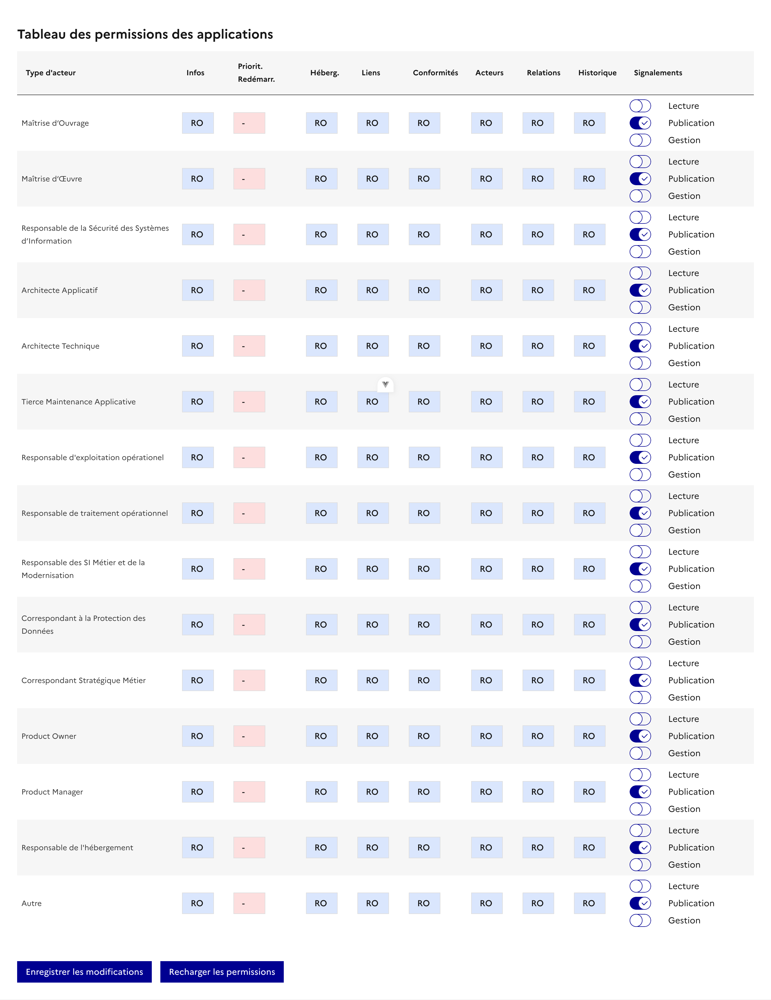

> Capture : _cf. rapport p.87-88_ · **Sévérité globale : 🟠 Majeur** · Pages : P11 · Fichier : `frontend/src/components/PermissionSelect.vue` (utilisé par `frontend/src/components/admin/AppPermsMatrix.vue` ; conteneur `frontend/src/components/admin/AdminPermsMatrixTab.vue`)

**Problème :**

- `7.1` – majeur : Les intitulés des boutons ne permettent pas de comprendre clairement l'action ou l'état associé aux valeurs « - », « RO » et « RW ». Chaque cellule de la matrice (`AppPermsMatrix.vue`) rend un `PermissionSelect` qui est un simple bouton bascule affichant `-` / `RO` / `RW`, sans `title` ni état explicite.

Code actuel (`PermissionSelect.vue`) :

```vue
<script setup lang="ts">
const permDict = {
  none: { label: "-", class: "permission-none" },
  Read: { label: "RO", class: "permission-Read" },
  Write: { label: "RW", class: "permission-Write" },
};
const permOrder = props.permOrder;
const foundIndex = permOrder.findIndex(
  (option) => option === (props.write ? "Write" : props.read ? "Read" : "none"),
);
const permIndex = ref(foundIndex === -1 ? 0 : foundIndex);

function togglePermission() {
  if (permIndex.value >= permOrder.length - 1) {
    permIndex.value = 0;
  } else {
    permIndex.value++;
  }
  emit("update:model-value", permOrder[permIndex.value]);
}
</script>

<template>
  <DsfrButton
    class="toggle-permission"
    tertiary
    small
    :class="permDict[permOrder[permIndex]].class ?? 'permission-error'"
    data-testid="permission-toggle"
    :data-state="permOrder[permIndex]"
    @click="togglePermission"
  >
    {{ permDict[permOrder[permIndex]].label ?? "?" }}
  </DsfrButton>
</template>
```

**Solution :**

- Ajouter un `title` (et `aria-label`) dynamique décrivant l'état courant et l'effet de l'activation, calculé à partir de la valeur courante et de la suivante dans `permOrder`. Par ex. « Sélection actuelle : Aucun droit (-), après activation : Lecture et écriture (RW) ». (Alternatives admises par le rapport : `<select>` natif à 3 options, ou dépliant accessible.)
- Compléter par une légende dans `AppPermsMatrix.vue` expliquant la signification de « - », « RO » et « RW » (recommandation rapport).

```vue
<!-- PermissionSelect.vue -->
<script setup lang="ts">
import { computed, ref } from "vue";

const permDict = {
  none: { label: "-", text: "Aucun droit (-)", class: "permission-none" },
  Read: { label: "RO", text: "Lecture seule (RO)", class: "permission-Read" },
  Write: {
    label: "RW",
    text: "Lecture et écriture (RW)",
    class: "permission-Write",
  },
} as const;

const current = computed(() => permOrder[permIndex.value]);
const next = computed(
  () => permOrder[(permIndex.value + 1) % permOrder.length],
);
const toggleTitle = computed(
  () =>
    `Sélection actuelle : ${permDict[current.value].text}, après activation : ${permDict[next.value].text}`,
);
</script>

<template>
  <DsfrButton
    class="toggle-permission"
    tertiary
    small
    :class="permDict[current].class ?? 'permission-error'"
    :title="toggleTitle"
    :aria-label="toggleTitle"
    data-testid="permission-toggle"
    :data-state="current"
    @click="togglePermission"
  >
    {{ permDict[current].label ?? "?" }}
  </DsfrButton>
</template>
```

```vue
<!-- AppPermsMatrix.vue : légende au-dessus ou en-dessous du DsfrTable -->
<template>
  <p class="fr-text--sm fr-mb-1w" data-testid="app-perms-legend">
    Légende : <strong>-</strong> aucun droit · <strong>RO</strong> lecture seule
    (Read Only) · <strong>RW</strong> lecture et écriture (Read/Write).
  </p>
  <DsfrTable
    title="Tableau des permissions des applications"
    data-testid="app-perms-table"
  >
    <!-- ... -->
  </DsfrTable>
</template>
```

---

## Part 8b : Modification (P06/P07), Time (P10) & contraste/reflow

### RGAA-064 — P06 Bouton « Appliquer »

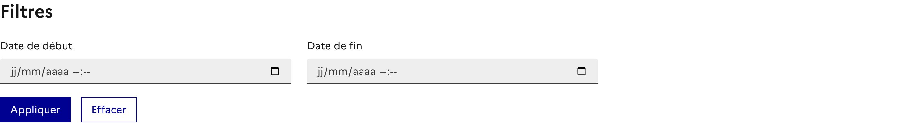

> Capture : _cf. rapport p.70_ · **Sévérité globale : 🟠 Majeur** · Pages : P06 · Fichier : `frontend/src/views/MetadataPage.vue`

**Problème :**

- `12.8` – majeur : Absence de cohérence de l'ordre de tabulation après l'activation du bouton « Appliquer ».
- `7.5` – majeur : Le message d'alerte n'est pas restitué correctement aux technologies d'assistance concernant le nombre de résultats.

Code actuel : le bouton `Appliquer` déclenche `applyFilters()` puis `fetchData()`, sans déplacer le focus ni exposer le nombre de résultats à un live region. La valeur `data.total` n'est affichée que dans la pagination.

```vue
<form class="fr-mb-4w" @submit.prevent="applyFilters">
  <h3>Filtres</h3>
  <!-- ... champs dates ... -->
  <div class="fr-btns-group fr-btns-group--inline">
    <DsfrButton
      type="submit"
      label="Appliquer"
      :disabled="isLoading"
      title="Appliquer les filtres"
      aria-label="Appliquer les filtres"
      data-testid="history-apply-filters"
    />
    <!-- ... Effacer ... -->
  </div>
</form>

<div v-else></div>
```

```ts
async function applyFilters() {
  currentPage.value = 0;
  await fetchData();
}
```

**Solution :**

- Après l'activation d'« Appliquer », déplacer le focus sur le tableau (ajouter un `ref` + `tabindex="-1"` sur le conteneur du tableau, `focus()` après `fetchData`).
- Ajouter une `<div aria-live="polite" aria-atomic="true">` qui reçoit un `<p>` annonçant le nombre de résultats après chaque application des filtres.

```vue
<script setup lang="ts">
// ... existant ...
const resultsAnnouncement = ref("");
const tableRegion = ref<HTMLElement | null>(null);

async function applyFilters() {
  currentPage.value = 0;
  await fetchData();
  resultsAnnouncement.value = `${data.value.total} résultat(s)`;
  // focus sur le tableau après mise à jour du DOM
  await nextTick();
  tableRegion.value?.focus();
}
</script>

<template>
  <!-- ... formulaire inchangé ... -->

  <!-- message de statut restitué aux TA -->
  <div
    aria-live="polite"
    aria-atomic="true"
    class="fr-sr-only"
    data-testid="history-results-status"
  >
    <p v-if="resultsAnnouncement">{{ resultsAnnouncement }}</p>
  </div>

  <div
    v-else
    ref="tableRegion"
    tabindex="-1"
    data-testid="history-table-region"
  >
    <RefAppTable ... />
    <PaginationFooter ... />
  </div>
</template>
```

(Penser à importer `nextTick` depuis `vue`.)

---

### RGAA-065 — P06 Champs dates en erreurs

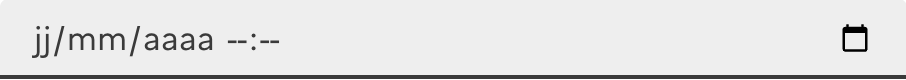

> Capture : _cf. rapport p.71_ · **Sévérité globale : 🟠 Majeur** · Pages : P06 · Fichier : `frontend/src/views/MetadataPage.vue`
>
> 🎯 **Page-référence (grille)** : 11.11 (suggestions d'erreur) est conforme sur **P05 et P11** → reprendre leur formulation (message nommant le champ + exemple de format).

**Problème :**

- `11.10` – majeur : Les messages d'erreurs ne citent pas nommément les champs concernés.
- `11.11` – majeur : Présence d'une suggestion d'erreur qui n'est pas explicite sur les champs dates.

Code actuel : les deux `DsfrInput` (« Date de début » / « Date de fin ») n'ont aucune validation ni `error-message`. La validité repose uniquement sur le contrôle natif `type="datetime-local"`, dont le message générique du navigateur ne nomme pas le champ ni ne donne d'exemple.

```vue
<div class="fr-col-12 fr-col-md-4">
  <DsfrInput
    v-model="createdAtGte"
    label="Date de début"
    label-visible
    type="datetime-local"
    data-testid="history-filter-date-from"
  />
</div>
<div class="fr-col-12 fr-col-md-4">
  <DsfrInput v-model="createdAtLte" label="Date de fin" label-visible type="datetime-local" data-testid="history-filter-date-to" />
</div>
```

**Solution :**

- Valider chaque champ à la soumission et fournir un `error-message` qui nomme le champ et donne un exemple de format attendu, pour les **deux** champs.

```vue
<script setup lang="ts">
// ... existant ...
const errors = ref<{ from?: string; to?: string }>({});

function isValidDateTime(v: string): boolean {
  return !v || !Number.isNaN(new Date(v).getTime());
}

async function applyFilters() {
  errors.value = {};
  if (!isValidDateTime(createdAtGte.value)) {
    errors.value.from =
      "Date de début – veuillez saisir une date et une heure valides, exemple : 23/05/2026";
  }
  if (!isValidDateTime(createdAtLte.value)) {
    errors.value.to =
      "Date de fin – veuillez saisir une date et une heure valides, exemple : 23/05/2026";
  }
  if (errors.value.from || errors.value.to) return;

  currentPage.value = 0;
  await fetchData();
}
</script>

<template>
  <DsfrInput
    v-model="createdAtGte"
    label="Date de début"
    label-visible
    type="datetime-local"
    :error-message="errors.from"
    data-testid="history-filter-date-from"
  />
  <!-- ... -->
  <DsfrInput
    v-model="createdAtLte"
    label="Date de fin"
    label-visible
    type="datetime-local"
    :error-message="errors.to"
    data-testid="history-filter-date-to"
  />
</template>
```

---

### RGAA-066 — P07 Hiérarchie des titres


> Capture : _cf. rapport p.72_ · **Sévérité globale : 🟠 Majeur** · Pages : P07 · Fichier : `frontend/src/views/MetadataDetailPage.vue`

**Problème :**

- `8.9` – majeur : Absence de contenu après le titre `<h3>`.

Code actuel : dans le bloc Description, un `<h3>` porte le titre de la modification (`formattedDescription.title`), mais le contenu qui suit (`description-details`) peut être vide quand `details` est un tableau vide — le `<h3>` se retrouve alors sans contenu rattaché et est détourné de sa fonction de titre.

```vue
<div class="fr-mb-3w">
  <h2 class="fr-h6">Description</h2>
  <div class="metadata-description" data-testid="metadata-description">
    <h3 class="fr-text--lg fr-mb-2w">{{ formattedDescription.title }}</h3>
    <div class="description-details">
      <p v-for="(detail, index) in formattedDescription.details" :key="index" class="detail-line">
        {{ detail }}
      </p>
    </div>
  </div>
</div>
```

**Solution :**

- La ligne de titre de la description n'introduit pas une nouvelle section : la remplacer par un `<p>` (mis en valeur visuellement via les classes utilitaires) plutôt que d'utiliser une balise `<h3>`. À défaut, garantir qu'un contenu suit toujours le titre.

```vue
<div class="fr-mb-3w">
  <h2 class="fr-h6">Description</h2>
  <div class="metadata-description" data-testid="metadata-description">
    <p class="fr-text--lg fr-text--bold fr-mb-2w">{{ formattedDescription.title }}</p>
    <div v-if="formattedDescription.details.length" class="description-details">
      <p v-for="(detail, index) in formattedDescription.details" :key="index" class="detail-line">
        {{ detail }}
      </p>
    </div>
  </div>
</div>
```

---

### RGAA-082 — P10 Image graphique interactif `<svg>`

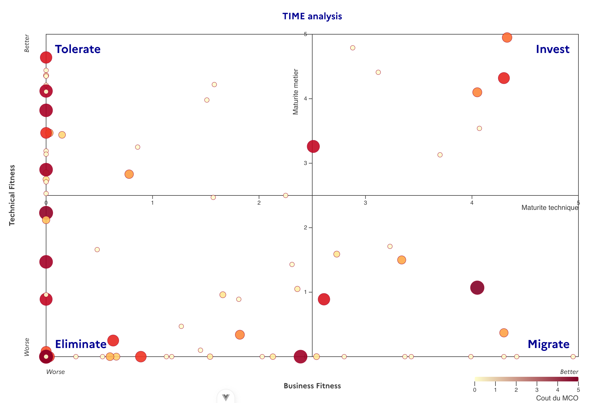

> Capture : _cf. rapport p.80_ · **Sévérité globale : 🟠 Majeur** · Pages : P10 · Fichier : `frontend/src/components/technical-debt/TechnicalDebtChart.vue` · `frontend/src/chart/time-chart.builder.ts` · `frontend/src/views/TimePage.vue`

**Problème :**

- `1.3` – majeur : Présence d'alternatives peu pertinentes sur les images porteuses d'informations.
- `1.6` – majeur : Le `<svg>` porteur d'information complexe n'a pas de description détaillée.
- `8.7` – majeur : Absence de signalement de changement de langue.

Code actuel : le `<svg>` a un simple `aria-label="Graphique de maturite TIME"` (alternative non pertinente pour un nuage de points complexe) et aucune description détaillée. De plus, tout le contenu textuel du graphe est en anglais non signalé (`TIME analysis`, `Tolerate`, `Invest`, `Eliminate`, `Migrate`, `Worse`, `Better`, `Business Fitness`, `Technical Fitness`, `Cout du MCO`) au sein d'une page en français.

```vue
<!-- TechnicalDebtChart.vue -->
<template>
  <div ref="containerRef" class="technical-debt-scatter">
    <svg
      v-if="props.data.length"
      ref="svgRef"
      role="img"
      aria-label="Graphique de maturite TIME"
    ></svg>
    <p
      v-else
      class="fr-text--sm fr-text--italic fr-mt-2w"
      data-testid="technical-debt-empty"
    >
      Aucune donnee TIME disponible pour vos applications autorisees.
    </p>
  </div>
</template>
```

```ts
// time-chart.builder.ts — libellés anglais non signalés
.text("TIME analysis");
// quadrants : "Tolerate" / "Invest" / "Eliminate" / "Migrate"
.text("Business Fitness");
.text("Technical Fitness");
.text("Worse"); / .text("Better");
.text("Cout du MCO");
```

**Solution :**

- Fournir une description détaillée du graphe via un **tableau récapitulatif/transcription** (une ligne par application : nom, maturité technique, maturité métier, coût MCO, quadrant TIME) rendu en HTML sous le `<svg>`, avec un bouton/lien adjacent y menant.
- Traduire les libellés du graphe **en français** dans `time-chart.builder.ts` (« Analyse TIME », « Tolérer » / « Investir » / « Éliminer » / « Migrer », « Pire » / « Mieux », « Pertinence métier », « Pertinence technique »). À défaut, si l'anglais est conservé, signaler le changement de langue avec `lang="en"` sur les `<text>` concernés.
- Si l'image est conservée, remplacer l'`aria-label` du `<svg>` par `aria-label="Voir la transcription de l'image ci-dessous"`.

```vue
<!-- TechnicalDebtChart.vue -->
<template>
  <div ref="containerRef" class="technical-debt-scatter">
    <template v-if="props.data.length">
      <svg
        ref="svgRef"
        role="img"
        aria-label="Voir la transcription de l'image ci-dessous"
      ></svg>

      <details class="fr-mt-2w" data-testid="technical-debt-transcription">
        <summary>Transcription du diagramme TIME</summary>
        <table class="fr-table">
          <caption>
            Maturité TIME par application
          </caption>
          <thead>
            <tr>
              <th scope="col">Application</th>
              <th scope="col">Maturité technique</th>
              <th scope="col">Maturité métier</th>
              <th scope="col">Coût du MCO</th>
            </tr>
          </thead>
          <tbody>
            <tr v-for="p in props.data" :key="p.label">
              <td>{{ p.shortName ?? p.label }}</td>
              <td>{{ p.technicalDebtInfo?.technicalMaturity ?? "-" }}</td>
              <td>{{ p.technicalDebtInfo?.businessMaturity ?? "-" }}</td>
              <td>{{ p.technicalDebtInfo?.costMaturity ?? "-" }}</td>
            </tr>
          </tbody>
        </table>
      </details>
    </template>
    <p
      v-else
      class="fr-text--sm fr-text--italic fr-mt-2w"
      data-testid="technical-debt-empty"
    >
      Aucune donnée TIME disponible pour vos applications autorisées.
    </p>
  </div>
</template>
```

```ts
// time-chart.builder.ts — libellés traduits
.text("Analyse TIME");
// quadrants : "Tolérer" / "Investir" / "Éliminer" / "Migrer"
.text("Pertinence métier");   // ex-"Business Fitness"
.text("Pertinence technique"); // ex-"Technical Fitness"
.text("Pire"); / .text("Mieux"); // ex-"Worse" / "Better"
.text("Coût du MCO");
```

---

### RGAA-001 — Contraste des textes

> _Pas de capture — contraste insuffisant visible surtout à l'état survol (hover) des libellés/tags ; non rendu fidèlement en capture statique. Cf. rapport p.14._

> Capture : _cf. rapport p.14_ · **Sévérité globale : 🟠 Majeur** · Pages : P06/P07/P11 · Fichier : `frontend/src/components/search/SidebarFilter.vue` · `frontend/src/views/MetadataPage.vue` · `frontend/src/views/MetadataDetailPage.vue`
>
> 🎯 **Page-référence (grille)** : 3.2 est conforme sur **8 des 11 pages** (couleurs DSFR) → problème circonscrit aux couleurs **custom** ; aligner les tags `.add`/`.update` et le `#555` au survol sur la palette DSFR.

**Problème :**

- `3.2` – majeur : Présence d'éléments textuels ayant un contraste insuffisant avec leur arrière-plan (4.5:1), notamment dans les états `hover`.

Couleurs custom hors variables DSFR repérées (contraste insuffisant ou à vérifier) :

```css
/* SidebarFilter.vue */
.sidebar-toggle {
  color: #555;
} /* gris sur fond blanc, à vérifier ; sur hover #f3f4f6 le ratio chute */
.sidebar-toggle:hover {
  background-color: #f3f4f6;
} /* texte #555 sur #f3f4f6 ≈ 4.4:1, sous le seuil 4.5:1 */
```

```css
/* main.css (SidebarFilter global rules) */
.tag-remove {
  color: #555;
} /* #555 sur fond clair, proche de la limite */
.tag-remove:hover {
  color: #d60000;
} /* rouge #d60000 sur fond clair : à vérifier (~4.3:1) */
```

```css
/* MetadataPage.vue / MetadataDetailPage.vue — tags couleur custom */
.add {
  background-color: #e6f8ea;
  color: #1aa779;
} /* vert #1aa779 sur #e6f8ea ≈ 2.3:1 — insuffisant */
.update {
  background-color: #f8f3e6;
  color: #a7791a;
} /* #a7791a sur #f8f3e6 ≈ 3.6:1 — insuffisant pour < 24px */
.delete {
  background-color: #f8e6e6;
  color: #a71a1a;
} /* #a71a1a sur #f8e6e6 ≈ 4.7:1 — limite OK */
```

**Solution :**

- Porter chaque couple texte/fond à **≥ 4.5:1** (ou **3:1** pour les textes ≥ 24px, ou ≥ 18,5px en gras). Privilégier les variables DSFR plutôt que des hex en dur.
- Assombrir notamment le vert et l'orange des tags, et le gris `#555` des contrôles de la sidebar (en particulier au survol).

```css
/* tags : couleurs assombries pour atteindre ≥ 4.5:1 */
.add {
  background-color: #e6f8ea;
  color: #0a6c4d;
}
.update {
  background-color: #f8f3e6;
  color: #6d4e0f;
}
.delete {
  background-color: #f8e6e6;
  color: #8e1212;
}

/* sidebar : gris plus foncé (#3a3a3a ≈ 9.5:1 sur fond clair) */
.sidebar-toggle,
.tag-remove {
  color: #3a3a3a;
}
.tag-remove:hover {
  color: var(--text-default-error);
} /* rouge DSFR conforme */
```

---

### RGAA-002 — Contraste des éléments graphiques


> Capture : _cf. rapport p.15_ · **Sévérité globale : 🟠 Majeur** · Pages : P04/P10/P11 · Fichier : `frontend/src/components/search/SidebarFilter.vue` · `frontend/src/chart/time-chart.builder.ts` · `frontend/src/composables/use-technical-debt-chart.ts`
>
> 🎯 **Page-référence (grille)** : 3.3 est conforme sur **8 des 11 pages** → problème limité aux bordures **custom** des filtres et à l'échelle de couleur du graphe Time.

**Problème :**

- `3.3` – majeur : Présence d'éléments graphiques ayant un contraste insuffisant avec leur arrière-plan (bordures de champs P04/P11, graphe Time P10).

Éléments graphiques en cause :

```css
/* SidebarFilter.vue — bordures claires sur fond blanc, < 3:1 */
.filter-block {
  border: 1px solid #e2e8f0;
} /* ≈ 1.2:1 vs blanc */
border-right: 1px solid #e5e7eb; /* ≈ 1.2:1 */
border-bottom: 1px solid #e5e7eb;
.sidebar-toggle {
  border: 1px solid #dcdfe3;
} /* ≈ 1.3:1 */
```

```ts
// time-chart.builder.ts — contour, axes et bordure des bulles
.attr("stroke", "currentColor").attr("stroke-width", 1);   // contour du plot
.attr("stroke", "#9F0126").attr("stroke-width", 0.6);      // bordure bulles, très fine
```

```ts
// use-technical-debt-chart.ts — échelle couleur des bulles
color: d3.scaleSequential(d3.interpolateYlOrRd).domain([0, 5]),
// l'extrémité jaune (valeurs basses) est quasi invisible sur le fond clair du graphe
```

**Solution :**

- Porter chaque élément graphique porteur d'information à **≥ 3:1** par rapport aux couleurs adjacentes.
- Bordures de champs : utiliser un gris DSFR plus foncé (ex. `var(--border-default-grey)` ou `#929292`).
- Graphe Time : épaissir le contour des bulles (≥ 1px) et conserver un stroke foncé `#9F0126` ; pour l'extrémité claire de l'échelle `interpolateYlOrRd`, soit relever la borne basse du domaine (démarrer au-delà du jaune pâle), soit ajouter un stroke garantissant 3:1 sur fond clair.

```css
/* SidebarFilter.vue — bordures contrastées */
.filter-block {
  border: 1px solid var(--border-default-grey);
}
.sidebar-toggle {
  border: 1px solid var(--border-default-grey);
}
/* séparateurs */
border-right: 1px solid var(--border-default-grey);
border-bottom: 1px solid var(--border-default-grey);
```

```ts
// time-chart.builder.ts — bordure de bulle plus visible
.attr("stroke", "#9F0126")
.attr("stroke-width", 1);
```

```ts
// use-technical-debt-chart.ts — éviter l'extrémité jaune trop claire
color: d3.scaleSequential(d3.interpolateYlOrRd).domain([-1.5, 5]),
```

---

### RGAA-003 — Redistribution des contenus (reflow 320px)

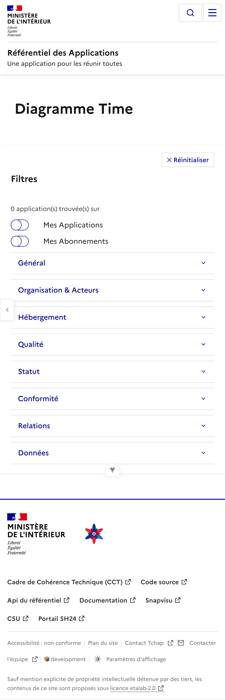

> Capture : _cf. rapport p.16_ · **Sévérité globale : 🔴 Bloquant** · Pages : P10 · Fichier : `frontend/src/views/TimePage.vue` · `frontend/src/components/technical-debt/TechnicalDebtChart.vue`

**Problème :**

- `10.11` – bloquant : Absence de certains contenus porteurs d'information ou de fonctionnalités en mode responsive (affichage 320px de largeur ou zoom 400 % depuis 1280px).

Code actuel : le layout passe en colonne sous 768px, mais le `<main>` impose `overflow-x: auto` et le SVG du graphe a une largeur fixe (dessiné par d3), ce qui crée un **double défilement** et masque des contenus à 320px. La transcription tabulaire n'existe pas encore (cf. RGAA-082).

```vue
<!-- TimePage.vue -->
<main
  class="main-content"
  id="main-content"
  data-testid="main-content"
  role="main"
>
  <h1 class="fr-h1" data-testid="time-title">Diagramme Time</h1>
  <section id="technical-debt-chart" class="chart-section" data-testid="technical-debt-chart-section">
    ...
    <TechnicalDebtChart v-else :data="technicalDebtPoints" />
  </section>
</main>
```

```css
.main-content {
  flex: 1;
  padding: 1rem 2rem;
  overflow-x: auto; /* provoque un défilement horizontal à 320px */
}
```

**Solution :**

- Redistribuer le contenu pour qu'il reste disponible à 320px sans double défilement : rendre le graphe responsive (viewBox d3 adaptatif) et, surtout, exposer la **transcription tabulaire** (RGAA-082) comme alternative pleinement fonctionnelle en dessous d'un seuil étroit, plutôt que de laisser un SVG scrollable horizontalement.
- Réduire le padding latéral et retirer le scroll horizontal forcé sous 320px.

```css
/* TimePage.vue */
.main-content {
  flex: 1;
  padding: 1rem 2rem;
}

@media (max-width: 480px) {
  .main-content {
    padding: 0.5rem 1rem;
    overflow-x: visible;
  }
}
```

```vue
<!-- TechnicalDebtChart.vue : SVG fluide + transcription toujours disponible en étroit -->
<svg
  ref="svgRef"
  role="img"
  aria-label="Voir la transcription de l'image ci-dessous"
  preserveAspectRatio="xMidYMid meet"
  class="td-svg"
></svg>
<!-- la <details> de transcription (cf. RGAA-082) reste accessible et lisible à 320px -->
```

```css
.td-svg {
  width: 100%;
  height: auto;
  max-width: 100%;
}
```

> Note : à 320px, le nuage de points devient illisible ; la **transcription** (RGAA-082) constitue le mécanisme garantissant que l'information reste disponible sans perte ni double défilement.

---
